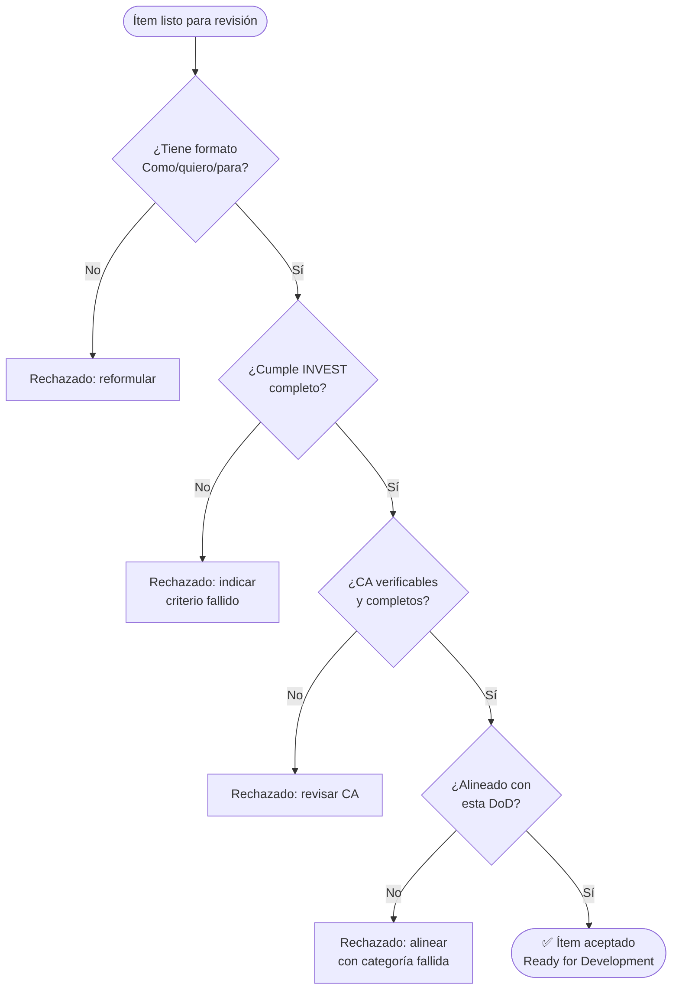

# Definición de Terminado (DoD) — DevTools-AI Repository

> **Fuente de verdad**: Este documento define los criterios mínimos que todo ítem del backlog debe
> cumplir para considerarse **Done**. El agente `Scrum Master` lo consulta para validar historias
> de usuario, épicas y tareas antes de aceptarlas en el sprint.
>
> **Versión**: 1.0.0 | **Vigente desde**: 2026-06-06

---

## Ámbito

Esta DoD aplica a todos los artefactos producidos en este repositorio:

- **Skills** (`SKILL.md` + `references/`)
- **Agentes** (`*.agent.md`)
- **Prompts** (`*.prompt.md`)
- **Instrucciones** (`*.instructions.md`)
- **Scripts de soporte** (`scripts/`)

---

## Criterios por Categoría

### 1. Calidad del Artefacto

| # | Criterio | Verificación |
|---|---|---|
| 1.1 | El artefacto tiene **un único propósito** (cumple SRP) | No hace más de una cosa |
| 1.2 | El `name` del frontmatter coincide exactamente con el nombre del directorio | `name: mi-skill` ↔ `mi-skill/` |
| 1.3 | El campo `description` contiene frases de activación y exclusiones explícitas | Patrón "Use when... / Do not use for..." |
| 1.4 | El artefacto tiene al menos **un ejemplo realista** de uso | No placeholders genéricos |
| 1.5 | Los campos `applyTo` o `tools` están mínimamente definidos | No vacíos sin justificación |

### 2. Documentación

| # | Criterio | Verificación |
|---|---|---|
| 2.1 | Cada skill incluye `references/overview.md` con diagrama **Mermaid** | `flowchart TD`, `sequenceDiagram` o `stateDiagram-v2` |
| 2.2 | El diagrama Mermaid refleja el flujo real del artefacto | Coincide con los pasos del `SKILL.md` |
| 2.3 | Los inputs y outputs están definidos con tabla o lista explícita | No descritos en prosa libre |
| 2.4 | Las dependencias con otros artefactos están documentadas | Skills upstream/downstream identificadas |

### 3. Calidad de Historias de Usuario (INVEST)

Todo ítem de backlog debe cumplir los 6 criterios INVEST antes de entrar al sprint:

| Criterio | Condición de rechazo |
|---|---|
| **Independiente** | Bloquea o es bloqueado por otra historia del mismo sprint |
| **Negociable** | Prescribe solución técnica en el cuerpo de la historia |
| **Valiosa** | No tiene usuario identificado ni beneficio de negocio explícito |
| **Estimable** | El equipo declara que no puede estimar con la información disponible |
| **Small** | Tiene más de 8 Criterios de Aceptación o cubre múltiples flujos |
| **Testeable** | Algún CA usa términos vagos: "rápido", "bien", "correctamente", "seguro" sin valores concretos |

> Un solo criterio fallido → **ítem rechazado**. Refinar antes de re-presentar.

### 4. Criterios de Aceptación

| # | Criterio | Ejemplo válido |
|---|---|---|
| 4.1 | Cada CA es verificable en binario (cumple / no cumple) | "Devuelve HTTP 200 con body `{ token, expiresAt }`" |
| 4.2 | Cubre el **happy path** principal | Flujo sin errores |
| 4.3 | Cubre al menos un **escenario de error o excepción** | Entrada inválida, timeout, permisos insuficientes |
| 4.4 | Incluye criterio de **pruebas automatizadas** | "Cobertura ≥ 80% de las ramas del componente" |
| 4.5 | Incluye criterio de **análisis estático** cuando aplica | "Pasa `detekt` / `SwiftLint` sin warnings de nivel error" |

### 5. Revisión y Proceso

| # | Criterio | Verificación |
|---|---|---|
| 5.1 | El ítem ha sido revisado por al menos **1 persona** distinta al autor | Aprobación en PR o sesión de refinación |
| 5.2 | El ítem está en el backlog del sistema de gestión del equipo | `Jira`, `Azure DevOps` o `GitHub Issues` |
| 5.3 | No existen preguntas abiertas sin respuesta en el ítem | Dudas resueltas o documentadas como supuesto aceptado |
| 5.4 | Las dependencias externas están identificadas y aceptadas | Bloqueantes conocidos registrados como impedimentos |

### 6. Scripts y Automatización (cuando aplica)

| # | Criterio | Verificación |
|---|---|---|
| 6.1 | Los scripts tienen comentarios en los bloques no evidentes | Al menos cabecera de propósito y sección de parámetros |
| 6.2 | Los scripts tienen manejo de errores explícito | `set -e`, `trap`, exit codes documentados |
| 6.3 | Los scripts son idempotentes o documentan por qué no pueden serlo | Re-ejecución no produce efectos secundarios |
| 6.4 | No hay credenciales o rutas absolutas hardcodeadas | Parametrizados por variable de entorno o argumento |

---

## Proceso de Validación

---

## Excepciones

Las excepciones a esta DoD deben ser:

1. **Explícitas**: documentadas en el ítem con justificación.
2. **Temporales**: con fecha o condición de revisión.
3. **Aceptadas por el equipo**: consenso mínimo entre autor y revisor.

Los spikes de investigación tienen su propia mini-DoD:
- Objetivo de aprendizaje definido.
- Timebox acordado.
- Entregable: decisión documentada o prototipo desechable.

---

## Relación con otros artefactos

| Artefacto | Cómo usa esta DoD |
|---|---|
| `Scrum Master` agent | La consulta para validar cada ítem antes de aceptarlo |
| `scrum-master-create-us` skill | Incorpora los CA técnicos (4.4, 4.5) en cada historia generada |
| `scrum-master-create-epics` skill | Verifica que cada épica tenga criterios de éxito medibles (alineados con 4.1) |
| `constitution.md` | Esta DoD implementa el principio V — "Calidad verificable" |
