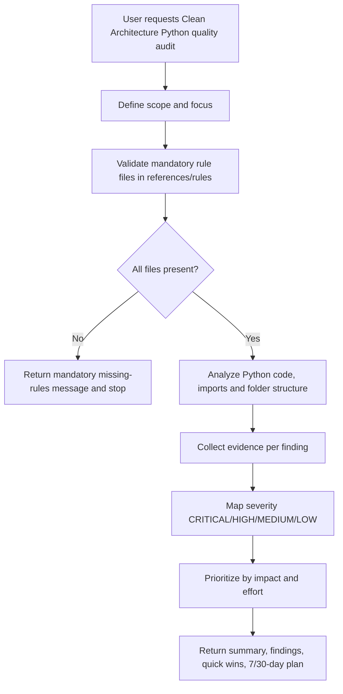

# Clean Architecture Python Quality Skill — Overview

## Purpose

Audit Python project code quality against Clean Architecture principles with strict rule validation, evidence-based findings, severity prioritization, and actionable remediation planning.

## Workflow

## Rule files

- .github/skills/clean-architecture-python-quality/references/rules/python-clean-arch-rules-critical.md
- .github/skills/clean-architecture-python-quality/references/rules/python-clean-arch-rules-high.md
- .github/skills/clean-architecture-python-quality/references/rules/python-clean-arch-rules-medium.md
- .github/skills/clean-architecture-python-quality/references/rules/python-clean-arch-rules-low.md
