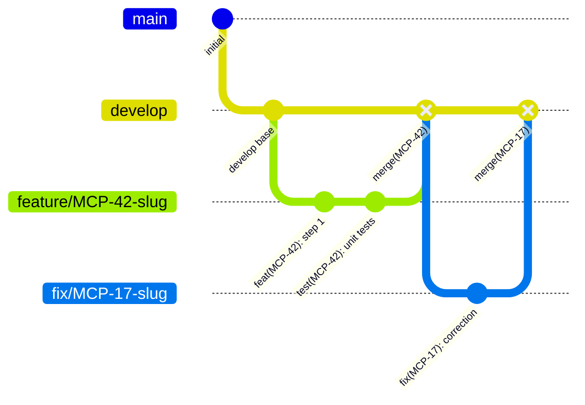

# Branching Flow — MCP Server ShareResources

## Flujo de ramas



## Reglas visuales

```
develop
  │
  ├── feature/MCP-<ticket>-<slug>
  │     ├── feat(MCP-XX): commit atómico 1
  │     ├── feat(MCP-XX): commit atómico 2
  │     └── test(MCP-XX): unit tests
  │           │
  │           └── merge --no-ff → develop
  │
  ├── fix/MCP-<ticket>-<slug>
  │     └── fix(MCP-XX): corrección
  │           │
  │           └── merge --no-ff → develop
  │
  └── bugfix/MCP-<ticket>-<slug>
        └── fix(MCP-XX): bugfix
              │
              └── merge --no-ff → develop
```

## Ciclo completo

```
git checkout develop
git pull origin develop
git checkout -b feature/MCP-42-slug
  │
  ├── [implementar]
  ├── [clean-code-guardian]
  ├── [unit tests]
  ├── [code review]
  ├── git add <ficheros>
  └── git commit -m "feat(MCP-42): ..."
        │
        git checkout develop
        git merge --no-ff feature/MCP-42-slug -m "merge(MCP-42): ..."
        git push origin develop
        git branch -d feature/MCP-42-slug
```
