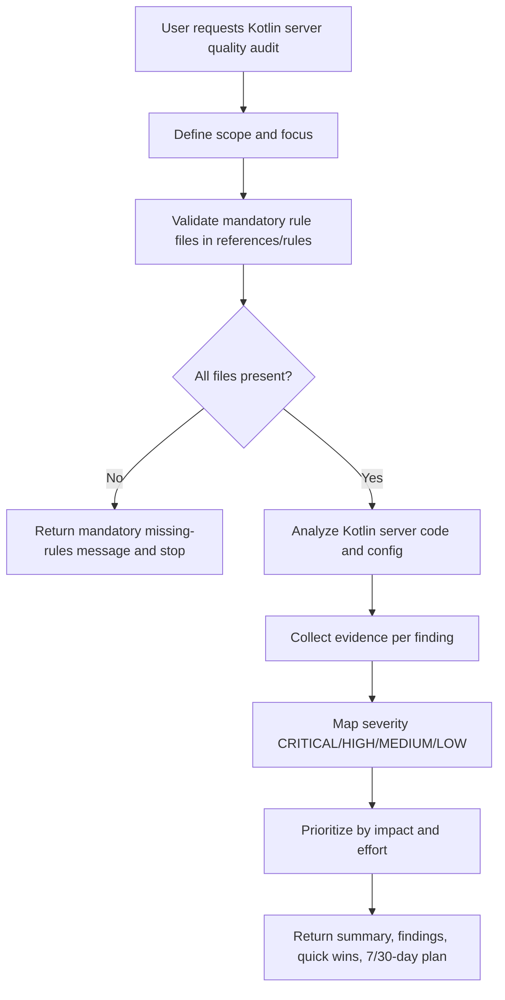

# Kotlin Server Quality Skill — Overview

## Purpose

Audit Kotlin server code quality with strict rule validation, evidence-based findings, severity prioritization, and actionable remediation planning.

## Workflow

## Rule files

- .github/skills/kotlin-server-quality-skill/references/rules/copilot-kotlin-server-rules-critical.md
- .github/skills/kotlin-server-quality-skill/references/rules/copilot-kotlin-server-rules-high.md
- .github/skills/kotlin-server-quality-skill/references/rules/copilot-kotlin-server-rules-medium.md
- .github/skills/kotlin-server-quality-skill/references/rules/copilot-kotlin-server-rules-low.md
