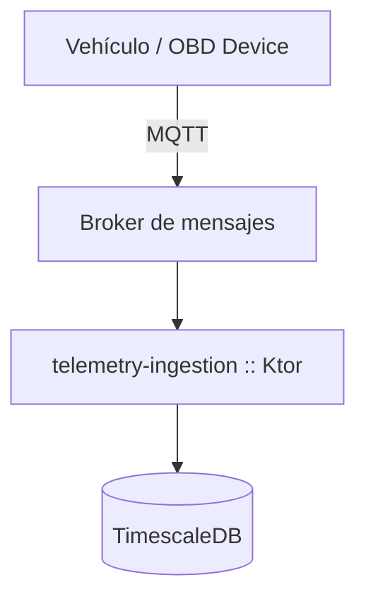

# scrum-master-create-epics

## Propósito

Transformar visiones de producto, documentos de requisitos (PRD) o cualquier descripción de alto nivel
en **Épicas de Scrum detalladas**, que:

- Articulen el **valor de negocio** de forma explícita.
- Estén ancladas al **Product Goal** del sprint/release.
- Definan el **alcance técnico** con suficiente profundidad para facilitar el desglose posterior en
  Historias de Usuario bajo el estándar **INVEST**.
- Puedan complementarse con diagramas de arquitectura cuando la complejidad técnica lo justifique.

---

## Cuándo usar esta skill

- El usuario aporta un PRD, un documento de visión, una feature request o una descripción de negocio.
- El equipo necesita estructurar el trabajo en épicas antes de la refinación del backlog.
- Se requiere alineamiento entre valor de negocio y decisiones de arquitectura a nivel épica.
- El objetivo es preparar el **Backlog de Producto** para descomposición posterior en Historias de Usuario.

## Cuándo NO usar esta skill

- Para escribir Historias de Usuario individuales (usar la skill adecuada de US-writing).
- Para planificación de sprints o estimación de esfuerzo.
- Para coaching general de Scrum o definición de marcos ágiles.
- Para generar código fuente a partir de una épica.

---

## Entradas esperadas

| Campo | Descripción | Requerido |
|---|---|---|
| **Visión / PRD** | Texto libre, documento o fragmento con la descripción del producto o feature | Sí |
| **Product Goal** | Objetivo de producto al que deben contribuir las épicas (si existe) | Recomendado |
| **Contexto técnico** | Stack, arquitectura existente, restricciones técnicas relevantes | Opcional |
| **Número de épicas estimado** | Rango orientativo si el usuario lo conoce | Opcional |

---

## Restricciones y convenciones

- Cada épica cubre **un dominio funcional cohesivo**; evitar épicas que crucen múltiples bounded contexts.
- El **Título** de la épica sigue el formato: `[Verbo de negocio] [Objeto] para [Beneficiario]`.
  - Ejemplo: `Gestionar pagos recurrentes para usuarios premium`.
- Las épicas **no contienen soluciones técnicas prescriptivas** salvo en el bloque *Alcance Técnico*.
- Los **Criterios de Éxito** son medibles (métricas, KPIs o condiciones de aceptación verificables).
- Si la épica requiere cambios arquitecturales significativos, **se incluye un diagrama Mermaid** en la sección *Alcance Técnico*.

---

## Flujo de trabajo paso a paso

### 1. Analizar el documento de entrada

- Leer el PRD o visión completa antes de proceder.
- Identificar los **dominios funcionales** principales (agrupaciones naturales de valor).
- Detectar dependencias entre dominios y restricciones técnicas mencionadas.
- Confirmar el **Product Goal** si no está explícito; proponer uno si falta.

### 2. Definir el mapa de épicas

- Enumerar los dominios identificados y proponer un título de épica por dominio.
- Verificar que el conjunto de épicas **cubre completamente** la visión sin solapamientos.
- Confirmar con el usuario el número y agrupación de épicas antes de redactar.

### 3. Redactar cada épica con la plantilla estándar

Para cada épica, producir el bloque completo según la **Estructura de Épica** definida abajo.

### 4. Validar la cohesión del conjunto

- Verificar que todas las épicas apuntan al mismo **Product Goal**.
- Verificar que cada épica es suficientemente grande para contener 3–8 Historias de Usuario.
- Verificar que los **Criterios de Éxito** son medibles y no ambiguos.
- Señalar épicas candidatas a ser divididas o fusionadas.

### 5. Sugerir artefactos complementarios

- Si alguna épica implica cambios de arquitectura significativos, ofrecer un diagrama Mermaid o
  indicar que se recomienda un diagrama `draw.io` para revisión del equipo técnico.
- Proponer el orden de priorización inicial basado en valor/riesgo.

---

## Estructura de Épica (plantilla obligatoria)

```markdown
## EPIC-XX — [Título en formato: Verbo + Objeto + Beneficiario]

### Justificación de Negocio
> Explica **por qué** esta épica aporta valor y a quién beneficia.
> Relaciona con el Product Goal y con métricas de negocio si es posible.

### Alcance Técnico
> Describe los sistemas, servicios o capas afectados.
> Incluye:
> - Módulos o bounded contexts involucrados.
> - Integraciones externas relevantes.
> - Restricciones técnicas o deuda técnica que condicione la implementación.
>
> **Diagrama de arquitectura** *(incluir si hay cambios estructurales)*:
> ```mermaid
> flowchart TD
>   A[Componente origen] --> B[Servicio afectado]
>   B --> C[Almacenamiento / API externa]
> ```

### Criterios de Éxito
> Lista de condiciones medibles que indican que la épica está completa.
> - [ ] Criterio 1: [métrica o condición verificable]
> - [ ] Criterio 2: ...
> - [ ] Criterio N: ...

### Notas para el desglose en Historias de Usuario
> Sugerencias sobre cómo dividir la épica respetando el principio **INVEST**:
> - Independent: ...
> - Negotiable: ...
> - Valuable: ...
> - Estimable: ...
> - Small: ...
> - Testable: ...
```

---

## Directrices de formato para la salida

- Usar encabezados Markdown: `#` para el documento, `##` para cada épica, `###` para sus secciones.
- Usar **negrita** para los términos críticos de Scrum: **Epic**, **Product Goal**, **INVEST**, **Definition of Ready**.
- Usar listas numeradas para secuencias lógicas; listas con viñetas para enumeraciones no ordenadas.
- Los diagramas Mermaid se insertan en bloques de código con la anotación ` ```mermaid `.
- La longitud recomendada por épica es de 150–400 palabras; no incluir detalles de implementación de bajo nivel.

---

## Salida esperada

Un documento Markdown con:

1. **Encabezado de contexto**: Product Goal confirmado y resumen del PRD analizado (2–3 frases).
2. **Listado de épicas**: Cada épica con su bloque completo según la plantilla.
3. **Mapa de dependencias** *(si aplica)*: Diagrama Mermaid mostrando relaciones entre épicas.
4. **Recomendaciones de priorización**: Tabla o lista ordenada por valor/riesgo.

---

## Ejemplo realista

**Entrada del usuario:**
> Tenemos una app de gestión de flotas de vehículos. Queremos añadir un módulo de telemetría
> en tiempo real que recoja datos del vehículo (velocidad, consumo, alertas de motor),
> los procese en backend y los muestre en un dashboard para operadores de flota.
> El backend es Kotlin + Ktor. La app móvil es Android (Jetpack Compose). Queremos también
> notificaciones push cuando un vehículo supere umbrales críticos.

**Salida esperada (fragmento)**:

```markdown
# Épicas — Módulo de Telemetría en Tiempo Real

**Product Goal:** Permitir a los operadores de flota monitorizar el estado de los vehículos en tiempo
real para reducir incidencias no planificadas en un 30 % en los primeros 6 meses.

---

## EPIC-01 — Ingestar telemetría de vehículos para el backend de flotas

### Justificación de Negocio
Actualmente no existe pipeline de datos en tiempo real. Sin esta épica, las demás no tienen datos
que procesar ni mostrar. Aporta la base técnica del Product Goal.

### Alcance Técnico
Afecta al backend Ktor (nuevo módulo `telemetry-ingestion`), al broker de mensajes (Kafka o MQTT)
y a la capa de persistencia (TimescaleDB o InfluxDB).



### Criterios de Éxito
- [ ] El sistema procesa ≥ 1 000 mensajes/segundo sin pérdida de datos.
- [ ] La latencia end-to-end (vehículo → base de datos) es < 2 segundos en p95.
- [ ] Los datos se persisten con retención configurable (mínimo 90 días).

### Notas para el desglose en Historias de Usuario
- **Independent**: La ingesta puede desarrollarse sin el dashboard ni las notificaciones.
- **Valuable**: Cada US debe entregar un endpoint funcional o un paso del pipeline verificable.
- **Testable**: Cada US incluye tests de integración con el broker simulado.
```

---

## Estándares de calidad

- Las épicas resultantes deben superar la **Definition of Ready** del equipo antes de pasar a refinación.
- Cada épica debe poderse descomponer en un mínimo de 3 Historias de Usuario independientes.
- Los **Criterios de Éxito** deben ser verificables por el Product Owner sin conocimiento técnico profundo.
- Si el PRD de entrada es ambiguo en algún dominio, el agente **pregunta al usuario** antes de redactar
  esa épica; no inventa requisitos.
