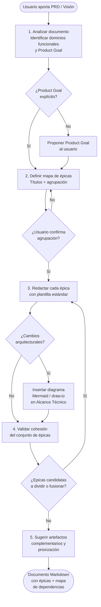
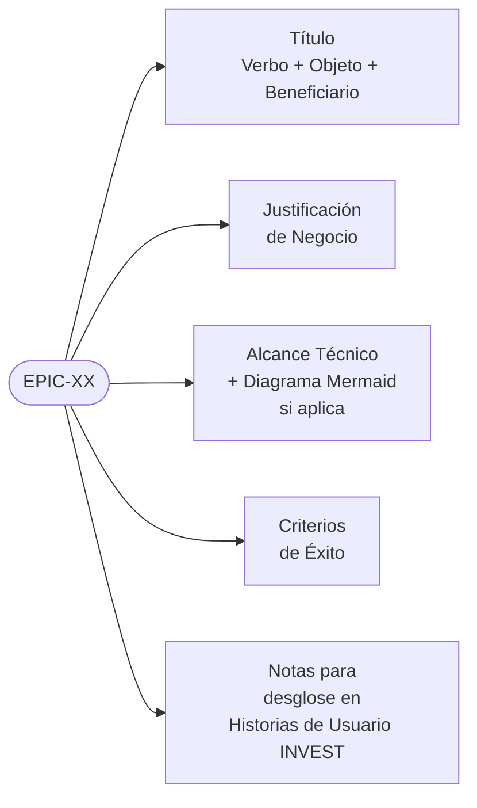

# scrum-master-create-epics — Workflow Overview

This skill converts a product vision or PRD into structured Scrum Epics.

---

## Workflow

---

## Archivos generados

| Archivo | Propósito |
|---|---|
| `SKILL.md` | Instrucciones completas para el agente |
| `references/overview.md` | Este documento — diagrama del workflow |

---

## Estructura de cada épica

---

## Principios clave

- **Una épica = un dominio funcional cohesivo**
- Cada épica contribuye al **Product Goal**
- Los **Criterios de Éxito** son siempre medibles
- El desglose respeta el estándar **INVEST**
- Diagrama de arquitectura incluido cuando hay cambios estructurales significativos
