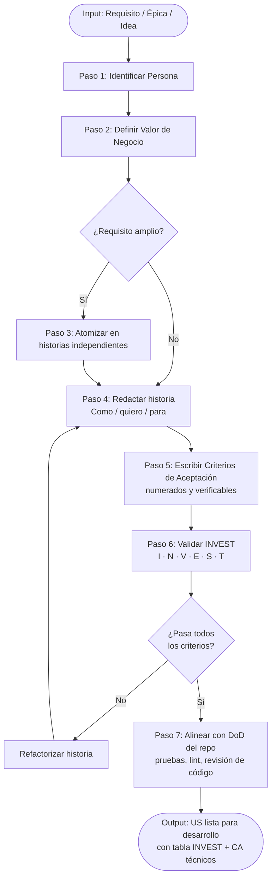
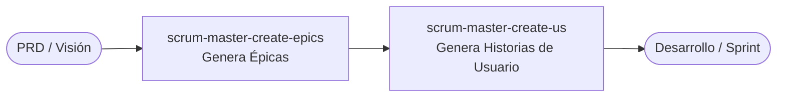

# scrum-master-create-us — Workflow Overview

## Descripción

Esta skill transforma requisitos funcionales, ideas de negocio o épicas en Historias de Usuario
atómicas y listas para el desarrollo, validadas contra el estándar INVEST y alineadas con la
Definición de Terminado (DoD) del repositorio.

---

## Diagrama de flujo

---

## Flujo resumido

| Paso | Acción | Salida |
|---|---|---|
| 1 | Identificar persona beneficiaria | `Como [persona]` |
| 2 | Definir valor de negocio | `para [beneficio]` |
| 3 | Atomizar si el requisito es amplio | Lista de historias independientes |
| 4 | Redactar en formato estándar | Cuerpo de la historia |
| 5 | Escribir CA numerados y verificables | Criterios de aceptación |
| 6 | Validar contra INVEST | Tabla INVEST por historia |
| 7 | Alinear con DoD del repositorio | CA técnicos añadidos |

---

## Relación con otras skills

- **`scrum-master-create-epics`**: skill upstream — transforma visión de producto en Épicas.
- **`scrum-master-create-us`**: esta skill — desglosa Épicas o requisitos en Historias de Usuario.
- El output de `scrum-master-create-epics` es un input válido para `scrum-master-create-us`.
