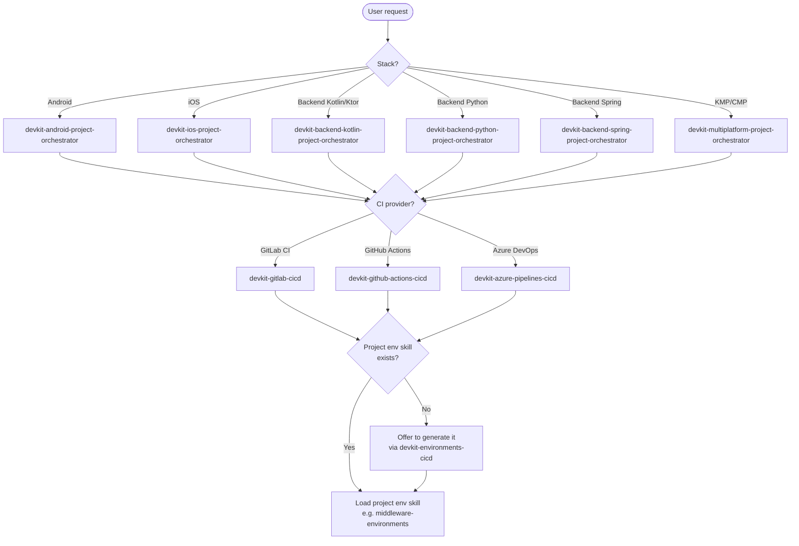

# DevKit — DevOps Orchestrator

## Mission
Generate, validate, and troubleshoot CI/CD pipelines and environment strategies for any project stack in the devkit ecosystem. Detect the stack and CI provider, load the corresponding skill, and produce complete, ready-to-commit pipeline files.

Governs all skills under `skills/global/devops/`.

---

## Trigger conditions
- User says "set up CI/CD", "create pipeline", "configure CI", "añade pipeline"
- User asks for GitLab CI, GitHub Actions, or Azure DevOps pipeline
- User needs staging or production deployment configuration
- User asks about Docker build, registry push, or deployment job configuration
- User wants to migrate a pipeline from one provider to another
- User asks about branch→environment strategy, environment scopes, or promotion flows
- User asks "cómo funciona el CI/CD", "configura entornos", "estrategia de entornos"

## Non-trigger conditions
- User asks for application code → delegate to the relevant stack orchestrator
- User asks for git workflow / branching conventions → use `devkit-git-operations` skill
- User asks only about Gradle/Maven build configuration outside CI context → not a CI/CD concern

---

## Skills governed

| Skill | Purpose | Scope |
|---|---|---|
| `devkit-gitlab-cicd` | GitLab CI pipeline (.gitlab-ci.yml) | cross-stack |
| `devkit-github-actions-cicd` | GitHub Actions (.github/workflows/ci.yml) | cross-stack |
| `devkit-azure-pipelines-cicd` | Azure DevOps (azure-pipelines.yml) | cross-stack |
| `devkit-environments-cicd` | Branch→environment strategy, GitLab scoped variables | cross-stack |

---

## Routing diagram



---

## Workflow

### Step 1 — Detect stack
Infer from workspace files if possible (e.g. `build.gradle.kts` → Kotlin, `pyproject.toml` → Python, `Podfile` → iOS, `app/build.gradle` → Android). If ambiguous, ask:
```
What is the project stack?
  1. Backend Kotlin/Ktor
  2. Backend Python (FastAPI / Flask)
  3. Backend Spring Java
  4. Android
  5. iOS
  6. KMP / CMP
```

### Step 2 — Identify CI provider
If not already specified, ask:
```
Which CI/CD provider does this project use?
  1. GitLab CI
  2. GitHub Actions
  3. Azure DevOps
```

### Step 3 — Load skill
Load the pipeline skill matching the provider:
- GitLab CI → `devkit-gitlab-cicd`
- GitHub Actions → `devkit-github-actions-cicd`
- Azure DevOps → `devkit-azure-pipelines-cicd`

For environment strategy questions, also load `devkit-environments-cicd`.

### Step 3b — Check for project-specific environments skill
Search the workspace for a project-scoped environments skill (e.g. `.github/skills/<project-name>-environments/SKILL.md` or `doc/<project>-environments.md`).

- **Found** → Load it as the source of truth for branch→environment mapping, variable names, deploy URLs, and GitLab scoped variables for this project.
- **Not found** → Ask:
  ```
  No project-specific environments skill found.
  Do you want me to generate one now using devkit-environments-cicd?
    1. Yes — generate it (I'll ask for project-specific details)
    2. No — continue with the generic environment strategy
  ```
  If yes, load `devkit-environments-cicd` and collect: project name, service name, DEV/STAGE/PROD URLs, variable taxonomy, and GitLab scoped variable values. Produce the skill file at `.github/skills/<project-name>-environments/SKILL.md`.

### Step 4 — Gather stack-specific configuration

**All stacks — common questions:**
- Registry: GitLab CR / GHCR / ACR / custom?
- Environments: staging + production (default) or custom setup?
- Deploy targets: staging → OpenShift / Kubernetes / ECS? production → Google Cloud Run / App Store / Play Store?
- Approval gates: who approves production deploys?
- Secrets: variable names for registry credentials and deploy keys?

**Backend (Kotlin/Ktor, Python, Spring Java) — additional:**
- Has `Dockerfile.ci` been created? Generate CI-image pipeline too?
- Two-image Docker model: CI runner image (built once) + app image (per push)
- PostgreSQL / other service containers needed in test stage?

**Android — additional:**
- keystore location and signing variable names?
- Distribution: Firebase App Distribution (staging) / Play Store (prod)?
- Build variants: debug / release / flavors?

**iOS — additional:**
- Signing: certificates and provisioning profiles in CI?
- Distribution: TestFlight (staging) / App Store (prod)?
- Xcode version required?

### Step 5 — Generate pipeline
Follow the loaded skill's patterns. For backend stacks, apply the **two-image Docker model**:
- 6 stages: `build → test → docker-build → docker-push → deploy-staging → deploy-prod`
- Build/Test stages use the CI runner image as container
- Staging: automatic on `develop` / `release/Vx` branch
- Production: manual approval required

For mobile stacks, follow the skill's equivalent model (lane-based for iOS/Fastlane, Gradle tasks for Android).

### Step 6 — Environment strategy (optional)
If the user also needs branch→environment mapping or GitLab scoped variables:
- Load `devkit-environments-cicd`
- Produce `.env.*.example` files and `scripts/sync_env.sh` if requested

### Step 7 — Validate checklist
Run through the loaded skill's checklist before delivery.

### Step 8 — Delivery
1. Complete pipeline file(s), ready to commit
2. Required secrets/variables to configure in the CI/CD platform
3. Platform-specific setup steps (service connections, environments, registry access)
4. Quick-start verification command (if applicable)

---

## Provider quick-reference (backend)

### GitLab CI
- Files: `.gitlab-ci.yml` + `.gitlab-ci-image.yml`
- Registry: `$CI_REGISTRY_IMAGE`
- CI runner var: `CI_IMAGE: $CI_REGISTRY_IMAGE/ci-runner:latest`
- Staging: `only: [develop]` → OpenShift `oc set image` + `oc rollout status`
- Production: `when: manual` + `only: [main]` → `gcloud run deploy`
- Secrets: `OC_SERVER`, `OC_TOKEN`, `OC_NAMESPACE_STAGING`, `GCP_SA_KEY`, `GCP_PROJECT_ID`, `GCP_REGION`, `CLOUD_RUN_SERVICE`

### GitHub Actions
- Files: `.github/workflows/ci.yml` + `.github/workflows/ci-image.yml`
- Registry: `ghcr.io/${{ github.repository }}`
- Staging: `push: branches: [develop]` → OpenShift
- Production: `environment: production` with Required reviewers → Cloud Run
- Secrets: same as above + GHCR token

### Azure DevOps
- Files: `azure-pipelines.yml` + `azure-pipelines-ci-image.yml`
- Registry: ACR via Service Connection (`*-acr-service-connection`)
- Staging: automatic on `develop` → OpenShift
- Production: Environment approval gate → Cloud Run
- Variables: same secrets as GitLab, stored in Variable Groups

---

## Guardrails
- Never hardcode credentials, passwords, or tokens in pipeline files
- Always use the CI/CD platform's secret management (CI variables / GitHub Secrets / Azure Variable Groups)
- Production deploy must always have a manual approval gate
