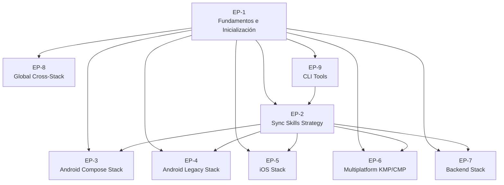

# Épicas — DevTools-AI

> Ciclo de producto completo para construir el repositorio centralizado  
> de agentes, skills y prompts multi-stack.

---

## Visión general

---

## EP-1 — Fundamentos e Inicialización del Repositorio

**Objetivo**: Crear la estructura base, governance y herramientas mínimas para que el repo sea operable.

| ID | Descripción | Prioridad |
|---|---|---|
| US-001 | Inicialización del repositorio y estructura de directorios | P0 |
| US-002 | Constitution, governance y README principal | P0 |
| US-003 | Template base para skills (SKILL.md + references/overview.md) | P0 |
| US-004 | Template base para agentes (.agent.md) | P0 |
| US-005 | Pre-commit hooks y script de validación de skills | P1 |
| US-006 | Setup local del desarrollador (setup.sh) | P1 |

**Referencia**: Estructura base tomada de `bankinter-devtools/` ([ver repo](../../../bankinter-devtools/))

---

## EP-2 — Sync Skills Strategy

**Objetivo**: Definir e implementar el mecanismo por el que proyectos consumidores importan artefactos desde este repo central.

| ID | Descripción | Prioridad |
|---|---|---|
| US-010 | Definición de la estrategia sync_skills (decisión arquitectónica) | P0 |
| US-011 | Implementación del CLI `devtools sync` — modo git-submodule | P1 |
| US-012 | Implementación del CLI `devtools sync` — modo copy-on-demand | P1 |
| US-013 | Manifest de versión por proyecto consumidor (`devtools.manifest.json`) | P1 |
| US-014 | Detección y reporte de incompatibilidades en sincronización | P2 |
| US-015 | Documentación de integración para proyectos consumidores | P1 |

**Referencia**: Inspirado en `bankinter-devtools/cli-tools/` y `.specify/integrations/`

---

## EP-3 — Stack Android Compose

**Objetivo**: Poblar el repo con agentes, skills y prompts para proyectos Kotlin + Jetpack Compose.

| ID | Descripción | Prioridad |
|---|---|---|
| US-020 | Migrar skill `migrate-xml-views-to-jetpack-compose` (desde awesome-copilot) | P0 |
| US-021 | Crear skill `jetpack-compose-patterns` | P1 |
| US-022 | Crear skill `android-navigation-compose` (Navigation 3) | P1 |
| US-023 | Crear skill `android-hilt-injection` | P2 |
| US-024 | Crear skill `android-unit-testing-compose` | P2 |
| US-025 | Crear agente `android-compose-expert` | P1 |
| US-026 | Crear instrucciones `android-compose.instructions.md` | P0 |

**Referencia**: Skills fuente en `mycardiochef/.github/skills/` + awesome-copilot

---

## EP-4 — Stack Android Legacy (XML Views + Java)

**Objetivo**: Cubrir proyectos Android legacy con XML Views y Java.

| ID | Descripción | Prioridad |
|---|---|---|
| US-030 | Crear skill `android-xml-java-patterns` | P1 |
| US-031 | Crear skill `android-legacy-migration-plan` (XML→Compose) | P2 |
| US-032 | Crear agente `android-legacy-expert` | P2 |
| US-033 | Crear instrucciones `android-legacy.instructions.md` | P1 |

---

## EP-5 — Stack iOS (Swift + SwiftUI + UIKit)

**Objetivo**: Cubrir proyectos iOS modernos y legacy.

| ID | Descripción | Prioridad |
|---|---|---|
| US-040 | Migrar skills iOS de `bankinter-devtools/skills/ios/` | P0 |
| US-041 | Crear skill `swiftui-patterns` | P1 |
| US-042 | Crear skill `uikit-patterns` (legacy iOS) | P2 |
| US-043 | Crear agente `ios-swiftui-expert` | P1 |
| US-044 | Crear agente `ios-uikit-expert` | P2 |
| US-045 | Crear instrucciones `ios-swiftui.instructions.md` | P0 |
| US-046 | Crear instrucciones `ios-uikit.instructions.md` | P1 |

**Referencia**: `bankinter-devtools/agents/ios/` y `bankinter-devtools/skills/ios/`

---

## EP-6 — Stack Multiplatform (KMP + CMP)

**Objetivo**: Cubrir Kotlin Multiplatform y Compose Multiplatform.

| ID | Descripción | Prioridad |
|---|---|---|
| US-050 | Crear skill `kmp-shared-module-patterns` | P1 |
| US-051 | Crear skill `cmp-ui-patterns` (Compose Multiplatform) | P2 |
| US-052 | Crear agente `kmp-expert` | P1 |
| US-053 | Crear instrucciones `kmp.instructions.md` | P1 |
| US-054 | Crear instrucciones `cmp.instructions.md` | P2 |

---

## EP-7 — Stack Backend

**Objetivo**: Cubrir backend Kotlin/Ktor, Python y Spring Java.

| ID | Descripción | Prioridad |
|---|---|---|
| US-060 | Migrar skills backend de `mycardiochef/.github/skills/` al namespace `backend/kotlin-ktor/` | P0 |
| US-061 | Migrar agentes backend de `mycardiochef/.github/agents/` | P0 |
| US-062 | Migrar `copilot-instructions.md` Ktor como `backend-kotlin.instructions.md` | P0 |
| US-063 | Crear skill `backend-python-fastapi-patterns` | P2 |
| US-064 | Crear skill `backend-spring-java-patterns` | P2 |
| US-065 | Crear agente `backend-python-expert` | P2 |
| US-066 | Crear agente `backend-spring-expert` | P2 |

**Referencia directa**: `mycardiochef/middleware/.github/` — ver [skills](../../../mycardiochef/middleware/.github/skills/), [agents](../../../mycardiochef/middleware/.github/agents/)

---

## EP-8 — Global Cross-Stack

**Objetivo**: Skills y agentes reutilizables en cualquier stack.

| ID | Descripción | Prioridad |
|---|---|---|
| US-070 | Migrar skill `clean-code-guardian` (global) desde mycardiochef | P0 |
| US-071 | Migrar skill `git-workflow` (global) | P0 |
| US-072 | Migrar skill `mr-description-generator` (global) | P0 |
| US-073 | Migrar skill `feature-lifecycle` (global) | P1 |
| US-074 | Crear agente `project-orchestrator` (global) | P0 |
| US-075 | Crear agente `qa-testcase` (global) | P1 |
| US-076 | Crear instrucciones globales `global.instructions.md` | P0 |

**Referencia**: `mycardiochef/.github/skills/` + `bankinter-devtools/agents/global/`

---

## EP-9 — CLI Tools

**Objetivo**: Herramientas de línea de comando para operar el repo (scaffold, sync, validate).

| ID | Descripción | Prioridad |
|---|---|---|
| US-080 | Estructura del CLI `devtools` (Python, entry points) | P0 |
| US-081 | Comando `devtools scaffold skill <name> <namespace>` | P1 |
| US-082 | Comando `devtools validate skill <path>` | P1 |
| US-083 | Comando `devtools sync <project-path>` | P1 |
| US-084 | Comando `devtools list` (inventario de artefactos) | P2 |
| US-085 | Migrar CLI tools de `bankinter-devtools/cli-tools/` como base | P0 |

**Referencia**: `bankinter-devtools/cli-tools/` — ver [bin](../../../bankinter-devtools/cli-tools/bin/)

---

## Resumen de prioridades

| Prioridad | Descripción | Criterio |
|---|---|---|
| **P0** | Bloqueante | Sin esto el repo no es operable ni distribuible |
| **P1** | Alta | Core del valor diferencial para los stacks principales |
| **P2** | Media | Stacks secundarios o mejoras de calidad |
| **P3** | Baja | Nice-to-have, backlog futuro |
