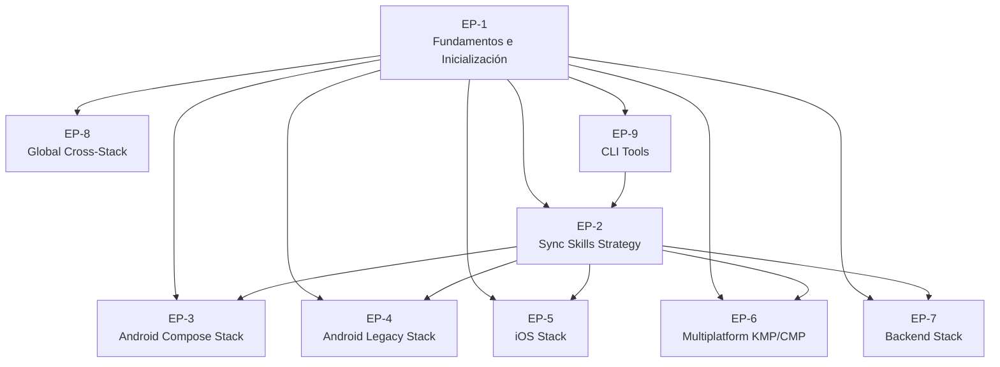

# Épicas — DevTools-AI

> Ciclo de producto completo para construir el repositorio centralizado  
> de agentes, skills y prompts multi-stack.

---

## Visión general

---

## EP-1 — Habilitar contribución colaborativa en el repositorio DevTools-AI

**Valor de negocio**: Permitir que cualquier ingeniero de la organización contribuya artefactos de automatización IA sin necesitar conocimiento previo de la estructura del repositorio, reduciendo el tiempo de onboarding de 2 días a menos de 1 hora.

**Beneficiarios**: Contributors internos, equipos de producto que necesitan automatización custom.

**Criterios de Éxito**:
1. Un contributor nuevo puede clonar el repo, ejecutar `./setup.sh` y crear su primera skill en menos de 60 minutos sin soporte humano.
2. El 100% de los artefactos creados pasan validación automática en pre-commit.
3. El README responde las 3 preguntas clave (qué es, cómo usarlo, cómo contribuir) en menos de 5 minutos de lectura.

**Alcance Técnico**:
- Estructura de directorios namespaced por stack (Android, iOS, Backend, Multiplatform, Global)
- Templates reutilizables para skills y agentes con todas las secciones obligatorias
- Scripts de validación y pre-commit hooks
- Documentación de governance (`constitution.md`, README principal)

**Historias de Usuario**:
| ID     | Descripción                                                   | Prioridad |
| ------ | ------------------------------------------------------------- | --------- |
| US-001 | Inicializar estructura de directorios namespaced              | P0        |
| US-002 | Documentar governance y quick-start en README                 | P0        |
| US-003 | Crear templates validables para skills y agentes              | P0        |
| US-004 | Implementar validación automática en pre-commit               | P1        |
| US-005 | Script de setup local del desarrollador                       | P1        |

**Referencia**: Estructura base adaptada de `bankinter-devtools/` ([ver repo](../../../bankinter-devtools/))

---

## EP-2 — Distribuir artefactos de automatización IA sin duplicación

**Valor de negocio**: Permitir que proyectos consumidores importen artefactos de este repositorio central sin copiarlos manualmente, eliminando la duplicación de código y reduciendo el tiempo de actualización de 2 horas por proyecto a menos de 5 minutos.

**Beneficiarios**: Equipos de producto que consumen skills/agentes, mantenedores de proyectos multi-repo.

**Criterios de Éxito**:
1. Un proyecto puede sincronizar 10 skills en menos de 5 minutos con un solo comando `devtools sync`.
2. Las actualizaciones de artefactos en el repo central se propagan automáticamente a consumidores en menos de 1 día.
3. El sistema detecta y reporta incompatibilidades de versión antes de aplicar cambios (0 rupturas inesperadas).

**Alcance Técnico**:
- CLI `devtools sync` con soporte para git-submodule y copy-on-demand
- Manifest de versión por proyecto consumidor (`devtools.manifest.json`)
- Mecanismo de detección de breaking changes y reporte de incompatibilidades
- Documentación de integración para proyectos consumidores

**Historias de Usuario**:
| ID     | Descripción                                                            | Prioridad |
| ------ | ---------------------------------------------------------------------- | --------- |
| US-010 | Diseñar estrategia de sincronización (ADR documentada)                 | P0        |
| US-011 | Implementar `devtools sync` modo git-submodule                         | P1        |
| US-012 | Implementar `devtools sync` modo copy-on-demand                        | P1        |
| US-013 | Generar y validar manifest de versión por proyecto                     | P1        |
| US-086 | Detectar y reportar incompatibilidades en sincronización               | P2        |
| US-015 | Documentar integración para proyectos consumidores                     | P1        |

**Referencia**: Inspirado en `bankinter-devtools/cli-tools/` y `.specify/integrations/`

---

## EP-3 — Stack Android Compose

**Objetivo**: Poblar el repo con agentes, skills y prompts para proyectos Kotlin + Jetpack Compose.

| ID     | Descripción                                                                 | Prioridad |
| ------ | --------------------------------------------------------------------------- | --------- |
| US-020 | Migrar skill `migrate-xml-views-to-jetpack-compose` (desde awesome-copilot) | P0        |
| US-021 | Crear skill `jetpack-compose-patterns`                                      | P1        |
| US-022 | Crear skill `android-navigation-compose` (Navigation 3)                     | P1        |
| US-023 | Crear skill `android-hilt-injection`                                        | P2        |
| US-024 | Crear skill `android-unit-testing-compose`                                  | P2        |
| US-025 | Crear agente `android-compose-expert`                                       | P1        |
| US-026 | Crear instrucciones `android-compose.instructions.md`                       | P0        |

**Referencia**: Skills fuente en `mycardiochef/.github/skills/` + awesome-copilot

---

## EP-4 — Stack Android Legacy (XML Views + Java)

**Objetivo**: Cubrir proyectos Android legacy con XML Views y Java.

| ID     | Descripción                                               | Prioridad |
| ------ | --------------------------------------------------------- | --------- |
| US-030 | Crear skill `android-xml-java-patterns`                   | P1        |
| US-031 | Crear skill `android-legacy-migration-plan` (XML→Compose) | P2        |
| US-032 | Crear agente `android-legacy-expert`                      | P2        |
| US-033 | Crear instrucciones `android-legacy.instructions.md`      | P1        |

---

## EP-5 — Stack iOS (Swift + SwiftUI + UIKit)

**Objetivo**: Cubrir proyectos iOS modernos y legacy.

| ID     | Descripción                                           | Prioridad |
| ------ | ----------------------------------------------------- | --------- |
| US-040 | Migrar skills iOS de `bankinter-devtools/skills/ios/` | P0        |
| US-041 | Crear skill `swiftui-patterns`                        | P1        |
| US-042 | Crear skill `uikit-patterns` (legacy iOS)             | P2        |
| US-043 | Crear agente `ios-swiftui-expert`                     | P1        |
| US-044 | Crear agente `ios-uikit-expert`                       | P2        |
| US-045 | Crear instrucciones `ios-swiftui.instructions.md`     | P0        |
| US-046 | Crear instrucciones `ios-uikit.instructions.md`       | P1        |

**Referencia**: `bankinter-devtools/agents/ios/` y `bankinter-devtools/skills/ios/`

---

## EP-6 — Stack Multiplatform (KMP + CMP)

**Objetivo**: Cubrir Kotlin Multiplatform y Compose Multiplatform.

| ID     | Descripción                                           | Prioridad |
| ------ | ----------------------------------------------------- | --------- |
| US-050 | Crear skill `kmp-shared-module-patterns`              | P1        |
| US-051 | Crear skill `cmp-ui-patterns` (Compose Multiplatform) | P2        |
| US-052 | Crear agente `kmp-expert`                             | P1        |
| US-053 | Crear instrucciones `kmp.instructions.md`             | P1        |
| US-054 | Crear instrucciones `cmp.instructions.md`             | P2        |

---

## EP-7 — Stack Backend

**Objetivo**: Cubrir backend Kotlin/Ktor, Python y Spring Java.

| ID     | Descripción                                                                                 | Prioridad |
| ------ | ------------------------------------------------------------------------------------------- | --------- |
| US-060 | Migrar skills backend de `mycardiochef/.github/skills/` al namespace `backend/kotlin-ktor/` | P0        |
| US-061 | Migrar agentes backend de `mycardiochef/.github/agents/`                                    | P0        |
| US-062 | Migrar `copilot-instructions.md` Ktor como `backend-kotlin.instructions.md`                 | P0        |
| US-063 | Crear skill `backend-python-fastapi-patterns`                                               | P2        |
| US-064 | Crear skill `backend-spring-java-patterns`                                                  | P2        |
| US-065 | Crear agente `backend-python-expert`                                                        | P2        |
| US-066 | Crear agente `backend-spring-expert`                                                        | P2        |

**Referencia directa**: `mycardiochef/middleware/.github/` — ver [skills](../../../mycardiochef/middleware/.github/skills/), [agents](../../../mycardiochef/middleware/.github/agents/)

---

## EP-8 — Global Cross-Stack

**Objetivo**: Skills y agentes reutilizables en cualquier stack.

| ID     | Descripción                                                    | Prioridad |
| ------ | -------------------------------------------------------------- | --------- |
| US-070 | Migrar skill `clean-code-guardian` (global) desde mycardiochef | P0        |
| US-071 | Migrar skill `git-workflow` (global)                           | P0        |
| US-072 | Migrar skill `mr-description-generator` (global)               | P0        |
| US-073 | Migrar skill `feature-lifecycle` (global)                      | P1        |
| US-074 | Crear agente `project-orchestrator` (global)                   | P0        |
| US-075 | Crear agente `qa-testcase` (global)                            | P1        |
| US-076 | Crear instrucciones globales `global.instructions.md`          | P0        |

**Referencia**: `mycardiochef/.github/skills/` + `bankinter-devtools/agents/global/`

---

## EP-9 — CLI Tools

**Objetivo**: Herramientas de línea de comando para operar el repo (scaffold, sync, validate).

| ID     | Descripción                                                   | Prioridad |
| ------ | ------------------------------------------------------------- | --------- |
| US-080 | Estructura del CLI `devtools` (Python, entry points)          | P0        |
| US-081 | Comando `devtools scaffold skill <name> <namespace>`          | P1        |
| US-082 | Comando `devtools validate skill <path>`                      | P1        |
| US-083 | Comando `devtools sync <project-path>`                        | P1        |
| US-084 | Comando `devtools list` (inventario de artefactos)            | P2        |
| US-085 | Migrar CLI tools de `bankinter-devtools/cli-tools/` como base | P0        |

**Referencia**: `bankinter-devtools/cli-tools/` — ver [bin](../../../bankinter-devtools/cli-tools/bin/)

---

## Resumen de prioridades

| Prioridad | Descripción | Criterio                                               |
| --------- | ----------- | ------------------------------------------------------ |
| **P0**    | Bloqueante  | Sin esto el repo no es operable ni distribuible        |
| **P1**    | Alta        | Core del valor diferencial para los stacks principales |
| **P2**    | Media       | Stacks secundarios o mejoras de calidad                |
| **P3**    | Baja        | Nice-to-have, backlog futuro                           |
