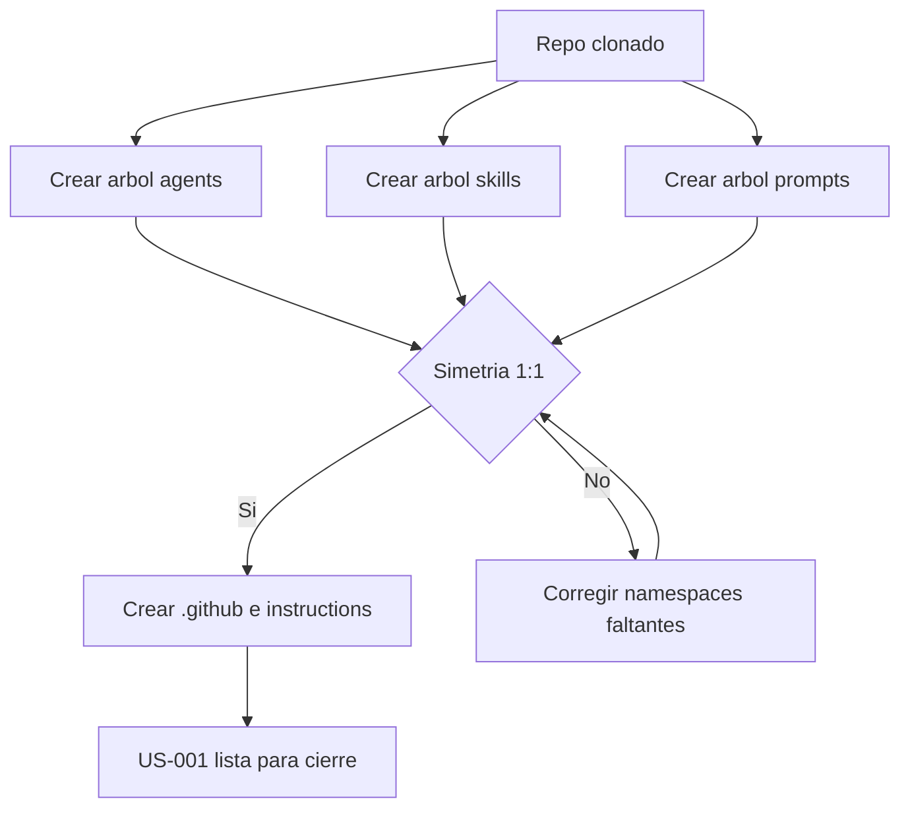

# US-001 — Inicializar estructura de directorios simétrica por stack

**Como** contributor del repositorio DevTools-AI,  
**quiero** encontrar todos los namespaces de stacks desde el primer commit en una topología estable y consistente,  
**para** añadir artefactos en la ubicación correcta sin consultar documentación adicional ni depender de terceros.

---

## Criterios de Aceptación

1. Dado un clon limpio del repositorio, cuando ejecuto `tree -L 3`, entonces existen en raíz los directorios `agents/`, `skills/`, `prompts/` e `instructions/`.
2. Dado el árbol creado, cuando inspecciono `agents/`, `skills/` y `prompts/`, entonces existen los stacks `global`, `android/{compose,legacy,kmp}`, `ios/{swiftui,uikit}`, `multiplatform/{kmp,cmp}`, `backend/{kotlin-ktor,python,spring-java}`.
3. Dado cualquier namespace existente en `agents/`, cuando busco su ruta equivalente en `skills/` y `prompts/`, entonces la ruta existe en ambos directorios (simetría 1:1).
4. Dado la estructura en `.github/`, cuando inspecciono sus contenidos, entonces existe `copilot-instructions.md` como entry point global y existe `.github/agents/` con los orquestadores `project-orchestrator.agent.md` y `feature-lifecycle.agent.md`.
5. Dado el árbol creado, cuando inspecciono cada directorio hoja de `agents/`, `skills/` y `prompts/`, entonces cada directorio hoja contiene un archivo `.gitkeep` versionado en Git.
6. Dado `instructions/`, cuando abro los archivos por stack, entonces existen al menos: `global.instructions.md`, `android-compose.instructions.md`, `android-legacy.instructions.md`, `ios-swiftui.instructions.md`, `ios-uikit.instructions.md`, `kmp.instructions.md`, `cmp.instructions.md` y `backend-kotlin.instructions.md`.
7. Dado `cli-tools/`, cuando inspecciono su estructura, entonces existe `bin/` y `devtools/{sync_skills,validate_skill,scaffold}`.
8. Dado un árbol incorrecto donde falta al menos un namespace en alguno de los tres directorios (`agents/`, `skills/`, `prompts/`), cuando ejecuto la validación de simetría acordada por el equipo, entonces la verificación falla con resultado no conforme.

---

## Notas Técnicas

Estructura objetivo:

```text
devtools/
├── .github/
│   ├── copilot-instructions.md
│   └── agents/
│       ├── project-orchestrator.agent.md
│       └── feature-lifecycle.agent.md
├── agents/
│   ├── global/
│   ├── android/{compose,legacy,kmp}/
│   ├── ios/{swiftui,uikit}/
│   ├── multiplatform/{kmp,cmp}/
│   └── backend/{kotlin-ktor,python,spring-java}/
├── skills/ (misma jerarquía que agents/)
├── prompts/ (misma jerarquía que agents/)
├── instructions/
│   ├── global.instructions.md
│   ├── android-compose.instructions.md
│   ├── android-legacy.instructions.md
│   ├── ios-swiftui.instructions.md
│   ├── ios-uikit.instructions.md
│   ├── kmp.instructions.md
│   ├── cmp.instructions.md
│   └── backend-kotlin.instructions.md
├── cli-tools/
│   ├── bin/
│   └── devtools/{sync_skills,validate_skill,scaffold}/
├── docs/
│   ├── CONTRIBUTING.md
│   ├── architecture/
│   └── stacks/
├── scripts/
│   ├── validate-skill.sh
│   └── setup.sh
└── README.md
```

Supuestos:

- Python 3.11+ disponible en entorno local del contributor.
- La tabla de stacks definida en `constitution.md` está ratificada para Sprint 0.

Dependencias previas:

- Ninguna.

---

## Validación INVEST

| Criterio | Estado | Observación |
|---|---|---|
| **Independiente** | ✅ | No requiere otra US para crear la estructura mínima |
| **Negociable** | ✅ | Define resultado esperado, no impone script/herramienta concreta |
| **Valiosa** | ✅ | Evita errores de ubicación de artefactos desde el primer commit |
| **Estimable** | ✅ | Alcance delimitado a estructura + stubs + simetría |
| **Small** | ✅ | Tamaño acotado para un único incremento de Sprint 0 |
| **Testeable** | ✅ | Criterios verificables con inspección de árbol y validación de simetría |

---

## Épica Relacionada

EP-1 — Habilitar contribución colaborativa en el repositorio DevTools-AI

---

## Prioridad

**P0 (Bloqueante)** — Sin esta estructura no se puede contribuir de forma consistente en agentes, skills y prompts.



## Definition of Ready

- [x] Repositorio git inicializado con remote configurado.
- [x] Tabla de namespaces de `constitution.md` ratificada.
- [x] Criterios de aceptación verificables en binario (cumple/no cumple).
