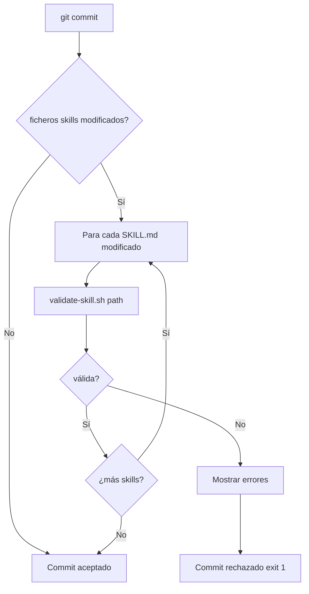

# US-004 — Prevenir skills mal formadas con validación automática

**Como** contributor del repositorio,  
**quiero** que un pre-commit rechace automáticamente skills mal formadas y que un único comando configure mi entorno,  
**para** mantener la calidad del catálogo sin revisión manual y arrancar a contribuir en menos de 5 minutos.

---

## Criterios de Aceptación

1. Dado que modifico un archivo en `skills/my-skill/SKILL.md`, cuando ejecuto `git commit`, el pre-commit valida automáticamente la skill antes de aceptar el commit.
2. El script `scripts/validate-skill.sh` verifica: (1) `SKILL.md` existe, (2) frontmatter YAML tiene `name` y `description`, (3) secciones "When to use" y "When NOT to use" presentes, (4) `references/overview.md` existe, (5) `references/overview.md` contiene bloque ` ```mermaid `.
3. Si una skill falla validación, el commit se rechaza con mensaje descriptivo indicando exactamente qué campo o sección falta.
4. Ejecutar `./setup.sh` sin argumentos configura el entorno en menos de 2 minutos: (1) verifica Python >= 3.11, (2) instala CLI con `pip install -e cli-tools/`, (3) configura hooks con `git config core.hooksPath .githooks`, (4) da permisos de ejecución a scripts.
5. Ejecutar `validate-skill.sh skills/_TEMPLATE/` devuelve exit code 0 (los templates pasan validación).
6. El pre-commit solo valida skills modificadas en el commit actual (detectadas con `git diff --cached --name-only`).
7. Ejecutar `./setup.sh` imprime resumen al final: "✓ Python 3.11+", "✓ CLI instalado", "✓ Hooks configurados".
8. Los scripts tienen manejo de errores: `set -euo pipefail` en bash, mensajes descriptivos sin stack traces técnicos.

---

## 3. Dependencias y restricciones
- **Dependencias funcionales/técnicas**: US-001 (directorios), US-003 (templates que el validador debe aceptar)
- **Riesgos aplicables**: Si el validador es demasiado estricto bloqueará la migración masiva de US-007/009
- **Pendientes de validación**: ¿Se validan también los `.agent.md` en pre-commit?
- **Bloqueantes**: Ninguno

## Notas Técnicas

**Referencia fuente**:
- `bankinter-devtools/scripts/validate-skill.sh`
- `bankinter-devtools/.githooks/pre-push`
- `bankinter-devtools/setup.sh`

**Estructura de archivos**:
```
scripts/
  validate-skill.sh
.githooks/
  pre-commit
setup.sh
```

**Decisiones abiertas**: ¿Se validan también los `.agent.md` en pre-commit o solo skills?

**Supuestos**: Python 3.11+ disponible en entorno del contributor.

---

## Validación INVEST

| Criterio | ✅ / ⚠️ | Observación |
|---|---|---|
| **Independiente** | ✅ | Depende de US-001 y US-003, pero no bloquea otras US |
| **Negociable** | ✅ | Validaciones específicas ajustables; setup.sh pasos negociables |
| **Valiosa** | ✅ | Previene 100% de PRs con skills mal formadas |
| **Estimable** | ✅ | 2 scripts bash + 1 hook: 6-8 horas |
| **Small** | ✅ | 8 CA, cubre flujo validación + setup |
| **Testeable** | ✅ | Todos los CA verificables ejecutando comandos |

---

## Épica Relacionada

EP-1 — Habilitar contribución colaborativa en el repositorio DevTools-AI

---

## Prioridad

**P1** (Alta) — Sin validación, calidad del catálogo depende de revisión manual.

## 5. Checklist de calidad
- **CRITICAL**
  - [ ] `validate-skill.sh` sale con exit 1 si falta cualquier sección obligatoria
  - [ ] `validate-skill.sh` sale con exit 0 sobre el template de US-003
  - [ ] Pre-commit solo valida ficheros del diff actual (no todos los skills)
- **HIGH**
  - [ ] `setup.sh` es idempotente (ejecutarlo dos veces no rompe nada)
  - [ ] `setup.sh` verifica Python >= 3.11 antes de instalar
- **MEDIUM**
  - [ ] Mensaje de error del validador indica exactamente qué sección falta
- **LOW**
  - [ ] setup.sh imprime resumen con ✓/✗ por paso

## 6. Casos de prueba
- **Funcionales**:
  - Skill con SKILL.md correcto + overview.md con mermaid → exit 0
  - Skill sin `## When NOT to use` → exit 1 con mensaje "Sección ausente"
  - Skill sin `references/overview.md` → exit 1
  - Skill con overview.md sin bloque mermaid → exit 1
  - `setup.sh` en máquina limpia → instala CLI, configura hooks, sin errores
  - `setup.sh` segunda vez → sin errores, sin duplicar configuración
- **Reglas de negocio**: Solo SKILL.md se valida en pre-commit; agentes no (por ahora)
- **Errores**: Si Python < 3.11, setup.sh sale con mensaje claro y exit 1

## 7. Diagrama de flujo


## 8. Notas y Definition of Ready
- **Decisiones abiertas**: ¿Se validan también agentes en pre-commit?
- **Supuestos**: El script usa bash estándar disponible en macOS y Linux
- **Dependencias previas**: US-001 (estructura), US-003 (templates como casos de prueba)
- **Definition of Ready**:
  - [ ] US-001 y US-003 completadas
  - [ ] Lista definitiva de secciones obligatorias de SKILL.md acordada
  - [ ] Decisión tomada sobre validación de agentes en pre-commit
