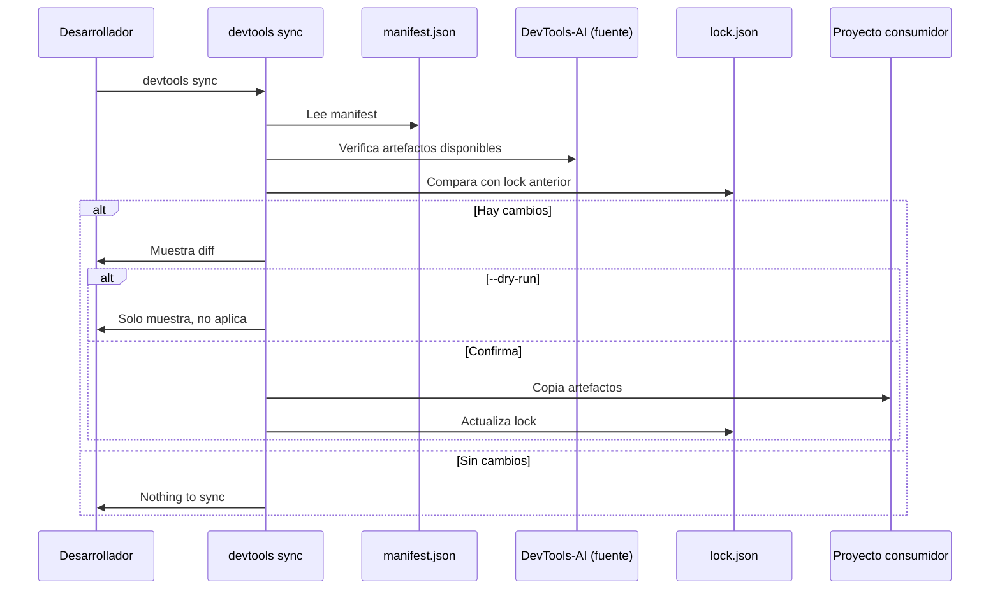

# US-006 — Sincronizar artefactos sin duplicación manual

**Como** desarrollador de un proyecto consumidor,  
**quiero** ejecutar `devtools sync` para importar artefactos desde DevTools-AI según un manifest,  
**para** no copiar manualmente skills/agentes y recibir actualizaciones automáticamente.

---

## Requerimientos de inicio

| ID | Requerimiento | Estado | Tipo | Evidencia/Nota |
|---|---|---|---|---|
| RQ-001 | `devtools.manifest.json` en el proyecto consumidor | Necesario | Funcional | Formato definido en sync-strategy.md |
| RQ-002 | Source de artefactos accesible (local path o git URL) | Necesario | Funcional | Modo local primero; git en sprint siguiente |
| RQ-003 | Destino `.github/` o path configurado en manifest | Necesario | Funcional | Cada tipo de artefacto tiene su destination |

## Criterios de Aceptación

1. Ejecutar `devtools sync` en la raíz de un proyecto consumidor lee el archivo `devtools.manifest.json` y copia los artefactos especificados al destino configurado.
2. El comando genera o actualiza `devtools.lock.json` con: SHA del artefacto copiado, timestamp de sincronización, path de destino.
3. Ejecutar `devtools sync --dry-run` muestra qué artefactos se copiarían sin aplicar cambios reales.
4. Si el destino tiene cambios locales no commiteados, el comando pregunta al usuario antes de sobreescribir (prompt "¿Sobrescribir cambios locales? [y/N]").
5. Si un artefacto en el manifest no existe en el source, el comando imprime warning pero continúa con los demás (no falla fatalmente).
6. Si `devtools.manifest.json` tiene JSON inválido, el comando muestra error descriptivo indicando línea y campo problemático.
7. Si no hay cambios desde la última sincronización, el comando imprime "✓ Todo sincronizado, nada que hacer" y sale con exit code 0.
8. El manifest soporta formato definido en `sync-strategy.md`: `version`, `source`, `sync`, `artifacts[]`.

---

## Notas Técnicas

**Formato `devtools.manifest.json`** (ver `sync-strategy.md` para spec completa):
```json
{
  "version": "1.0.0",
  "source": { "type": "local", "path": "/ruta/a/devtools-ai" },
  "sync": { "mode": "copy", "destination_base": ".github" },
  "artifacts": [
    {
      "namespace": "global",
      "items": ["clean-code-guardian", "git-workflow"],
      "type": "skills",
      "destination": "skills/global"
    }
  ]
}
```

**Fuente de referencia**: `bankinter-devtools/cli-tools/sync_skills/`

**Decisiones abiertas**: ¿El lock.json va en .gitignore del consumidor o se commitea?

**Supuestos**: Modo `copy` local primero; modo `git-submodule` en US futura.

---

## Validación INVEST

| Criterio | ✅ / ⚠️ | Observación |
|---|---|---|
| **Independiente** | ✅ | Depende de US-005 (CLI base), pero no bloquea otras migraciones |
| **Negociable** | ✅ | Formato del lock.json ajustable |
| **Valiosa** | ✅ | Reduce tiempo de sincronización de 2h manual a <5 min automático |
| **Estimable** | ✅ | Parser JSON + copia + lock: 8-12 horas |
| **Small** | ✅ | 8 CA, cubre flujo completo de sync |
| **Testeable** | ✅ | Todos los CA verificables con manifest de prueba |

---

## Épica Relacionada

EP-2 — Distribuir artefactos de automatización IA sin duplicación

---

## Prioridad

**P1** (Alta) — Habilita distribución de artefactos a proyectos consumidores.

## 3. Dependencias y restricciones
- **Dependencias funcionales/técnicas**: US-005 (CLI base); `sync-strategy.md` como especificación
- **Riesgos aplicables**: Si el proyecto consumidor modifica artefactos sincronizados, se pierde en el siguiente sync
- **Pendientes de validación**: ¿El lock.json va en .gitignore del consumidor o se commitea?
- **Bloqueantes**: US-005 debe estar completada

## 4. Solución funcional

**Formato `devtools.manifest.json`** (ver `sync-strategy.md` para spec completa):
```json
{
  "version": "1.0.0",
  "source": { "type": "local", "path": "/ruta/a/devtools-ai" },
  "sync": { "mode": "copy", "destination_base": ".github" },
  "artifacts": [
    {
      "namespace": "global",
      "items": ["clean-code-guardian", "git-workflow"],
      "type": "skills",
      "destination": "skills/global"
    }
  ]
}
```

**Formato `devtools.lock.json`**:
```json
{
  "synced_at": "2026-06-06T10:00:00Z",
  "artifacts": [
    {
      "artifact": "skills/global/clean-code-guardian",
      "source_sha": "a1b2c3d4",
      "destination": ".github/skills/global/clean-code-guardian",
      "synced_at": "2026-06-06T10:00:00Z"
    }
  ]
}
```

**Comandos**:
- `devtools sync` — sync con manifest en cwd
- `devtools sync --manifest <path>` — manifest explícito
- `devtools sync --dry-run` — muestra diff sin aplicar
- `devtools sync --force` — sobreescribe sin preguntar
- `devtools sync --status` — muestra estado actual vs source

## 5. Checklist de calidad
- **CRITICAL**
  - [ ] `devtools sync` copia artefactos correctamente al destination
  - [ ] `devtools.lock.json` se genera/actualiza tras cada sync
  - [ ] Si hay cambios locales en destino, pregunta antes de sobreescribir
- **HIGH**
  - [ ] `--dry-run` muestra qué cambiaría sin modificar nada
  - [ ] Error claro si source path no existe
- **MEDIUM**
  - [ ] `--status` muestra diferencias entre lock y source actual
- **LOW**
  - [ ] Resumen final con número de artefactos sincronizados

## 6. Casos de prueba
- **Funcionales**:
  - Manifest válido + source existe → artefactos copiados al destino correcto
  - `--dry-run` → muestra lista de cambios, no modifica ficheros
  - Manifest con artefacto inexistente en source → warning, resto se sincroniza
  - Destino con cambios locales + sin `--force` → pregunta confirmación
  - Segunda ejecución sin cambios en source → "Nothing to sync"
- **Errores**: Manifest JSON inválido → error con línea del problema

## 7. Diagrama de flujo


## 8. Notas y Definition of Ready
- **Decisiones abiertas**: ¿lock.json va en .gitignore del consumidor?
- **Supuestos**: Modo local (path absoluto) se implementa primero; git URL en iteración siguiente
- **Dependencias previas**: US-005 (CLI base con subcomando sync stub)
- **Definition of Ready**:
  - [ ] US-005 completada (subcomando `sync` stub existe)
  - [ ] Formato de manifest.json aprobado (ver sync-strategy.md)
  - [ ] Decisión sobre lock.json en .gitignore tomada
