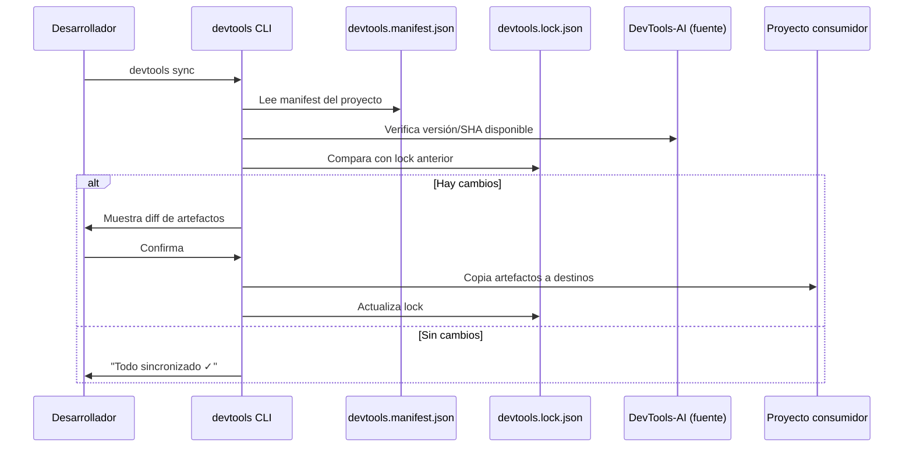

# Sync Skills Strategy — DevTools-AI

> Decisión arquitectónica sobre cómo los proyectos consumidores importan  
> artefactos (agentes, skills, prompts, instrucciones) desde este repositorio central.

---

## Contexto y problema

Tenemos un repositorio central con todos los artefactos IA. Los proyectos consumidores necesitan acceder a ellos. Las opciones son:

1. Copiar manualmente → deriva garantizada
2. Git submodule → dificultad operativa alta
3. Git subtree → merge complejo, historial contaminado  
4. Copy-on-demand via CLI → simple, controlado, versionado
5. Symlinks → frágil en CI/CD y Windows
6. Package manager (npm/pip con private registry) → overkill para el tamaño actual

---

## Decisión: CLI copy-on-demand con manifest

**Modo principal**: `devtools sync --manifest devtools.manifest.json`  
**Modo alternativo**: git submodule para proyectos que necesiten live-sync

### Rationale

| Criterio | copy-on-demand | git submodule | symlinks |
|---|---|---|---|
| Simplicidad para el desarrollador | ✅ Alto | ⚠️ Medio | ✅ Alto |
| Funciona en CI/CD | ✅ Siempre | ⚠️ Requiere config | ❌ Frágil |
| Versionado explícito | ✅ manifest | ✅ SHA | ❌ No |
| Detección de conflictos | ✅ Con lock | ⚠️ Git merge | ❌ No |
| Funciona sin red | ✅ (post-sync) | ❌ | ✅ |
| Customización local | ✅ Después de sync | ❌ | ⚠️ |

---

## Flujo de sincronización



---

## Estructura del manifest (`devtools.manifest.json`)

```json
{
  "version": "1.0.0",
  "source": {
    "type": "local",
    "path": "/ruta/absoluta/a/devtools-ai"
  },
  "sync": {
    "mode": "copy",
    "destination_base": ".github"
  },
  "artifacts": [
    {
      "namespace": "global",
      "items": ["clean-code-guardian", "git-workflow", "mr-description-generator"],
      "type": "skills",
      "destination": "skills/global"
    },
    {
      "namespace": "android/compose",
      "items": ["migrate-xml-to-compose", "jetpack-compose-patterns"],
      "type": "skills",
      "destination": "skills/android/compose"
    },
    {
      "namespace": "backend/kotlin-ktor",
      "items": ["logging-kotlin", "unit-testing-kotlin"],
      "type": "skills",
      "destination": "skills/backend/kotlin-ktor"
    },
    {
      "namespace": "global",
      "items": ["project-orchestrator", "qa-testcase"],
      "type": "agents",
      "destination": "agents"
    },
    {
      "type": "instructions",
      "items": ["android-compose.instructions.md", "global.instructions.md"],
      "destination": ".github/instructions"
    }
  ]
}
```

---

## Estructura del lock (`devtools.lock.json`)

```json
{
  "synced_at": "2026-06-06T10:00:00Z",
  "source_version": "1.2.0",
  "source_sha": "abc123def456",
  "artifacts": [
    {
      "artifact": "skills/global/clean-code-guardian",
      "source_sha": "a1b2c3d4",
      "destination": ".github/skills/global/clean-code-guardian",
      "synced_at": "2026-06-06T10:00:00Z"
    }
  ]
}
```

---

## Comandos disponibles

```bash
# Sincronizar todos los artefactos del manifest
devtools sync

# Sincronizar con manifest explícito
devtools sync --manifest path/to/devtools.manifest.json

# Ver qué cambiaría sin aplicar (dry-run)
devtools sync --dry-run

# Forzar re-sincronización aunque no haya cambios
devtools sync --force

# Sincronizar solo un namespace
devtools sync --namespace android/compose

# Ver estado actual vs source
devtools sync --status
```

---

## Reglas de sincronización

### Qué se sincroniza
- `skills/<namespace>/<skill-name>/` → completo (SKILL.md + references/ + scripts/)
- `agents/<namespace>/<agent>.agent.md`
- `prompts/<namespace>/<prompt>.md`
- `instructions/<name>.instructions.md`

### Qué NO se sincroniza
- `docs/` — es interno del repo fuente
- `cli-tools/` — se instala via `pip install`, no se copia
- `scripts/` — se instala via `setup.sh`
- `.github/` raíz del repo fuente — cada proyecto tiene el suyo

### Política de conflictos
- Si el archivo destino existe y fue modificado localmente → pregunta antes de sobreescribir
- Si `--force` está activo → sobreescribe sin preguntar
- Si el archivo no existe en destino → crea sin preguntar

---

## Integración en proyectos consumidores

### Setup inicial en el proyecto consumidor

```bash
# 1. Instalar CLI (una vez por máquina)
pip install -e /ruta/a/devtools-ai/cli-tools/

# 2. Crear manifest en el proyecto
devtools init

# 3. Primera sincronización
devtools sync
```

### Añadir al CI/CD (opcional, para verificación)

```yaml
# .github/workflows/check-sync.yml
- name: Verify devtools sync is up-to-date
  run: devtools sync --dry-run --fail-on-diff
```

---

## Modo alternativo: git submodule

Para proyectos que necesiten siempre la última versión del repo fuente:

```bash
# En el proyecto consumidor
git submodule add https://github.com/org/devtools-ai .devtools
git submodule update --init --recursive

# En copilot-instructions.md del proyecto
# Referenciar skills via .devtools/skills/...
```

**Cuándo usar submodule en lugar de copy**:
- El equipo tiene acceso directo al repo fuente
- Se quiere live-sync sin necesidad de ejecutar `devtools sync`
- El CI/CD ya gestiona submodules

---

## Versionado semántico del repo fuente

El repo central usa tags semánticos:

| Tag | Significado |
|---|---|
| `v1.0.0` | Release estable |
| `v1.1.0` | Nuevas skills/agentes (retrocompatible) |
| `v2.0.0` | Breaking change (renombrado de namespace, eliminación) |

El manifest puede fijar una versión:

```json
{
  "source": {
    "type": "git",
    "url": "https://github.com/org/devtools-ai",
    "ref": "v1.2.0"
  }
}
```

---

## US relacionadas

- **US-010**: Decisión arquitectónica (este documento)
- **US-011**: CLI `devtools sync` modo copy
- **US-012**: CLI `devtools sync` modo symlink
- **US-013**: Manifest y lock structure
- **US-083**: Implementación completa del comando sync
