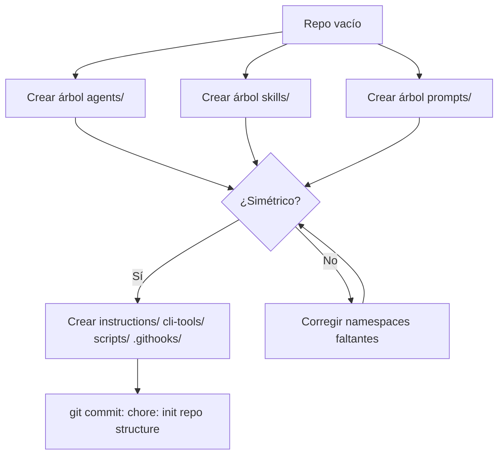

# US-001 — Inicializar estructura de directorios

## Contexto de la necesidad
El repositorio DevTools-AI necesita una estructura de directorios namespaced como punto de partida para que cualquier contributor pueda añadir artefactos en el namespace correcto desde el primer commit, sin tener que decidir dónde van.

## 1. Encabezado y trazabilidad
- **ID US**: US-001
- **Título usuario**: Inicializar estructura de directorios del repositorio
- **Descripción usuario**: Como contributor del repositorio DevTools-AI, quiero encontrar todos los directorios de namespaces creados desde el primer commit, para poder añadir artefactos sin ambigüedad sobre dónde van.
- **Épica relacionada**: EP-1 — Fundamentos e Inicialización
- **Prioridad sugerida**: Alta (P0 — bloqueante para todo lo demás)
- **Criterios funcionales trazados**:
  - Estructura `agents/`, `skills/`, `prompts/` con namespaces idénticos
  - Namespaces: `global/`, `android/{compose,legacy,kmp}`, `ios/{swiftui,uikit}`, `multiplatform/{kmp,cmp}`, `backend/{kotlin-ktor,python,spring-java}`
  - Directorio `instructions/` para ficheros `.instructions.md`
  - Directorio `cli-tools/` con estructura Python mínima

## 2. Cobertura funcional
- **Flujo principal**:
  1. Ejecutar `./setup.sh` o scaffold manual
  2. Verificar que todos los namespaces existen en `agents/`, `skills/`, `prompts/`
  3. Confirmar que cada directorio hoja tiene `.gitkeep`
- **Entradas**: Repositorio vacío o recién clonado
- **Validaciones**: Ningún namespace puede faltar; simetría obligatoria entre `agents/`, `skills/`, `prompts/`
- **Salidas**: Repositorio con estructura navegable completa
- **Casos límite**: Si ya existen algunos directorios, no sobreescribir contenido existente

## 3. Dependencias y restricciones
- **Dependencias funcionales/técnicas**: Ninguna — primer ticket del proyecto
- **Riesgos aplicables**: Sin estructura base, todas las US siguientes están bloqueadas
- **Pendientes de validación**: Confirmar si `prompts/` necesita mismos sub-namespaces que `skills/`
- **Bloqueantes**: Ninguno

## 4. Solución funcional
- **Estructura a crear**:
```
agents/ skills/ prompts/
  ├── global/
  ├── android/{compose,legacy,kmp}
  ├── ios/{swiftui,uikit}
  ├── multiplatform/{kmp,cmp}
  └── backend/{kotlin-ktor,python,spring-java}
instructions/
  └── global.instructions.md   (stub)
cli-tools/
  ├── pyproject.toml
  └── devtools/__init__.py
scripts/
  └── validate-skill.sh        (stub → US-004)
.githooks/
  └── pre-commit               (stub → US-004)
docs/implementation/user-stories/
setup.sh                       (stub → US-004)
README.md                      (stub → US-002)
.github/copilot-instructions.md (stub → US-002)
```

## 5. Checklist de calidad
- **CRITICAL**
  - [ ] Namespaces de `agents/`, `skills/`, `prompts/` son idénticos entre sí
  - [ ] Cada directorio hoja tiene `.gitkeep`
- **HIGH**
  - [ ] `cli-tools/pyproject.toml` declara el entry point `devtools`
  - [ ] `instructions/global.instructions.md` existe aunque sea stub
- **MEDIUM**
  - [ ] La estructura refleja exactamente `constitution.md`
- **LOW**
  - [ ] Los stubs tienen comentario `# TODO: completar en US-XXX`

## 6. Casos de prueba
- **Funcionales**:
  - `tree agents/ -L 3` muestra los 10 namespaces esperados
  - `tree skills/ -L 3` es idéntico a `tree agents/ -L 3` en namespaces
  - `git status` muestra todos los `.gitkeep` trackeados
- **Reglas de negocio**:
  - No puede existir un namespace en `skills/` que no exista en `agents/`
- **Errores**: Si falta Python 3.11+, `pyproject.toml` advierte en install

## 7. Diagrama de flujo


## 8. Notas y Definition of Ready
- **Decisiones abiertas**: ¿`prompts/` es plano o jerárquico?
- **Supuestos**: Los namespaces no cambian durante Sprint 0
- **Dependencias previas**: Ninguna
- **Definition of Ready**:
  - [ ] Repositorio git inicializado con remote configurado
  - [ ] Tabla de namespaces de `constitution.md` ratificada
