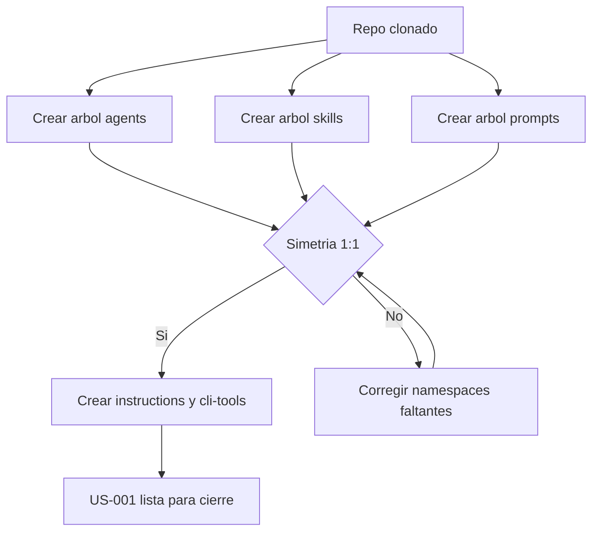

# US-001 — Inicializar estructura de directorios simétrica por stack

**Como** contributor del repositorio DevTools-AI,  
**quiero** encontrar todos los namespaces de stacks creados desde el primer commit,  
**para** añadir artefactos en la ubicación correcta sin consultar documentación adicional ni depender de terceros.

---

## Criterios de Aceptación

1. Dado un clon limpio del repositorio, cuando ejecuto `tree .github -L 3`, entonces existen `agents/`, `skills/` y `prompts/` con subdirectorios para estos stacks: `global`, `android/{compose,legacy,kmp}`, `ios/{swiftui,uikit}`, `multiplatform/{kmp,cmp}`, `backend/{kotlin-ktor,python,spring-java}`.
2. Dado el árbol creado, cuando inspecciono cada directorio hoja en `.github/agents`, `.github/skills` y `.github/prompts`, entonces cada directorio hoja contiene un archivo `.gitkeep` versionado en Git.
3. Dado cualquier namespace existente en `.github/agents`, cuando busco su ruta equivalente en `.github/skills` y `.github/prompts`, entonces la ruta existe en ambos directorios (simetría 1:1).
4. Dado la estructura base del repositorio, cuando inspecciono `cli-tools/`, entonces existe `pyproject.toml` con el entry point `devtools` declarado y existe `cli-tools/devtools/__init__.py`.
5. Dado `.github/instructions/`, cuando abro `global.instructions.md`, entonces el archivo existe con contenido stub `# TODO: completar en US-XXX`.
6. Dado un árbol incorrecto donde falta al menos un namespace en uno de los tres directorios (`agents/`, `skills/`, `prompts/`), cuando ejecuto la verificación de simetría acordada por el equipo en refinación, entonces la validación falla con resultado no conforme.
7. Dado la US completada, cuando se revisa en sesión de refinación, entonces no quedan decisiones abiertas sobre la topología de `prompts/` para Sprint 0 (se adopta estructura jerárquica simétrica).

---

## Notas Técnicas

Estructura objetivo:

```text
.github/
├── agents/
│   ├── global/
│   ├── android/{compose,legacy,kmp}/
│   ├── ios/{swiftui,uikit}/
│   ├── multiplatform/{kmp,cmp}/
│   └── backend/{kotlin-ktor,python,spring-java}/
├── skills/ (misma estructura que agents/)
├── prompts/ (misma estructura que agents/)
├── instructions/
│   └── global.instructions.md (stub)
└── dod.md

cli-tools/
├── pyproject.toml
└── devtools/__init__.py

scripts/
└── validate-skill.sh (stub, alcance de US-004)

docs/implementation/
└── user-stories/
```

Supuestos:

- Python 3.11+ disponible en entorno local del contributor.
- La tabla de stacks definida en `constitution.md` está ratificada para Sprint 0.

Dependencias previas:

- Ninguna.

---

## Validación INVEST

| Criterio | Estado | Observación |
|---|---|---|
| **Independiente** | ✅ | No requiere otra US para crear la estructura mínima |
| **Negociable** | ✅ | Define resultado esperado, no impone script/herramienta concreta |
| **Valiosa** | ✅ | Evita errores de ubicación de artefactos desde el primer commit |
| **Estimable** | ✅ | Alcance delimitado a estructura + stubs + simetría |
| **Small** | ✅ | Tamaño acotado para un único incremento de Sprint 0 |
| **Testeable** | ✅ | Criterios verificables con inspección de árbol y validación de simetría |

---

## Épica Relacionada

EP-1 — Habilitar contribución colaborativa en el repositorio DevTools-AI

---

## Prioridad

**P0 (Bloqueante)** — Sin esta estructura no se puede contribuir de forma consistente en skills, agentes ni prompts.



## Definition of Ready

- [x] Repositorio git inicializado con remote configurado.
- [x] Tabla de namespaces de `constitution.md` ratificada.
- [x] Criterios de aceptación verificables en binario (cumple/no cumple).
