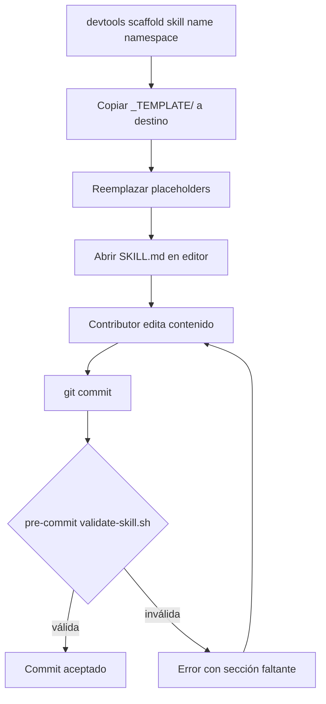

# US-003 — Templates base de skills y agentes

## Contexto de la necesidad
Para mantener la calidad del catálogo, los contributors necesitan un punto de partida (template) al crear una nueva skill o agente. Sin templates, cada artefacto sigue una estructura diferente, rompiendo la experiencia de los consumidores y dificultando la validación automática.

## 1. Encabezado y trazabilidad
- **ID US**: US-003
- **Título usuario**: Templates base para skills y agentes
- **Descripción usuario**: Como contributor creando una nueva skill o agente, quiero un template completo como punto de partida, para generar artefactos consistentes sin partir de cero.
- **Épica relacionada**: EP-1 — Fundamentos e Inicialización
- **Prioridad sugerida**: Alta (P0)
- **Criterios funcionales trazados**:
  - `skills/_TEMPLATE/SKILL.md` con todas las secciones obligatorias
  - `skills/_TEMPLATE/references/overview.md` con Mermaid placeholder
  - `agents/_TEMPLATE.agent.md` con frontmatter y secciones estándar
  - El validador de US-004 debe aceptar estos templates sin errores

## Requerimientos de inicio

| ID | Requerimiento | Estado | Tipo | Evidencia/Nota |
|---|---|---|---|---|
| RQ-001 | SKILL.md debe tener frontmatter YAML con `name` y `description` | Necesario | Funcional | Requerido por validate-skill.sh (US-004) |
| RQ-002 | Secciones obligatorias: When to use, When NOT to use, Inputs, Steps, Outputs, Validation, Examples | Necesario | Funcional | Basado en skill-generator global (~/.copilot/skills/skill-generator/) |
| RQ-003 | overview.md debe contener bloque Mermaid | Necesario | Funcional | Requerido por validate-skill.sh |
| RQ-004 | _TEMPLATE.agent.md debe tener `description` y `handoffs` en frontmatter | Necesario | Funcional | Patrón mycardiochef/.github/agents/_TEMPLATE.agent.md |

## 2. Cobertura funcional
- **Flujo principal**:
  1. Contributor ejecuta `devtools scaffold skill my-skill android/compose`
  2. CLI copia `skills/_TEMPLATE/` a `skills/android/compose/my-skill/`
  3. Reemplaza placeholders `[Name]`, `[namespace]`
  4. Contributor edita SKILL.md con contenido real
  5. Pre-commit valida antes del commit
- **Entradas**: Nombre de skill y namespace destino
- **Validaciones**: El template en sí no debe fallar `validate-skill.sh`
- **Salidas**: Directorio `skills/<namespace>/<name>/` con SKILL.md + references/overview.md
- **Casos límite**: Si el nombre ya existe en el namespace, advertir sin sobreescribir

## 3. Dependencias y restricciones
- **Dependencias funcionales/técnicas**: US-001 (directorios existen); US-004 usa estos templates como referencia de validación
- **Riesgos aplicables**: Si el template cambia, las skills existentes deben revisarse
- **Pendientes de validación**: ¿Se necesita template separado para skills con `scripts/`?
- **Bloqueantes**: Ninguno

## 4. Solución funcional

**Secciones obligatorias de `skills/_TEMPLATE/SKILL.md`**:
- frontmatter YAML (name, description)
- `## When to use` — triggers
- `## When NOT to use` — non-triggers
- `## Inputs`
- `## Steps`
- `## Expected outputs`
- `## Validation` — checklist
- `## Examples` — ejemplo realista con prompt y acción

**Secciones de `agents/_TEMPLATE.agent.md`**:
- frontmatter: description, handoffs (array con label, agent, prompt)
- `## Pre-Execution Checks`
- `## Outline` (pasos numerados)
- `## Expected output`

**Fuentes de referencia**:
- `mycardiochef/.github/skills/clean-code-guardian/SKILL.md` — ejemplo skill compleja
- `mycardiochef/.github/agents/_TEMPLATE.agent.md` — template agente existente

## 5. Checklist de calidad
- **CRITICAL**
  - [ ] `skills/_TEMPLATE/SKILL.md` pasa `validate-skill.sh` sin errores
  - [ ] `skills/_TEMPLATE/references/overview.md` contiene bloque mermaid
  - [ ] `agents/_TEMPLATE.agent.md` tiene frontmatter con description y handoffs
- **HIGH**
  - [ ] Todos los placeholders marcados con `[UpperCase]` fáciles de localizar
  - [ ] Template de SKILL.md incluye ejemplo realista (no solo "example placeholder")
- **MEDIUM**
  - [ ] Template de agente incluye al menos un handoff de ejemplo
- **LOW**
  - [ ] Comentarios en templates explican cada sección

## 6. Casos de prueba
- **Funcionales**:
  - Copiar `skills/_TEMPLATE/` a `skills/global/test-skill/` → `validate-skill.sh` → exit 0
  - `agents/_TEMPLATE.agent.md` tiene YAML frontmatter válido (parseable)
- **Reglas de negocio**:
  - Un template sin "When NOT to use" debe fallar el validador
- **Errores**: Si overview.md no tiene mermaid, validador indica exactamente qué falta

## 7. Diagrama de flujo

## 8. Notas y Definition of Ready
- **Decisiones abiertas**: ¿El template de agente necesita sección "When NOT to use"?
- **Supuestos**: Los templates son estáticos, no generados dinámicamente
- **Dependencias previas**: US-001 completada
- **Definition of Ready**:
  - [ ] US-001 completada
  - [ ] Secciones obligatorias de SKILL.md acordadas con el equipo
  - [ ] Criterios del validador (US-004) definidos aunque no implementado
