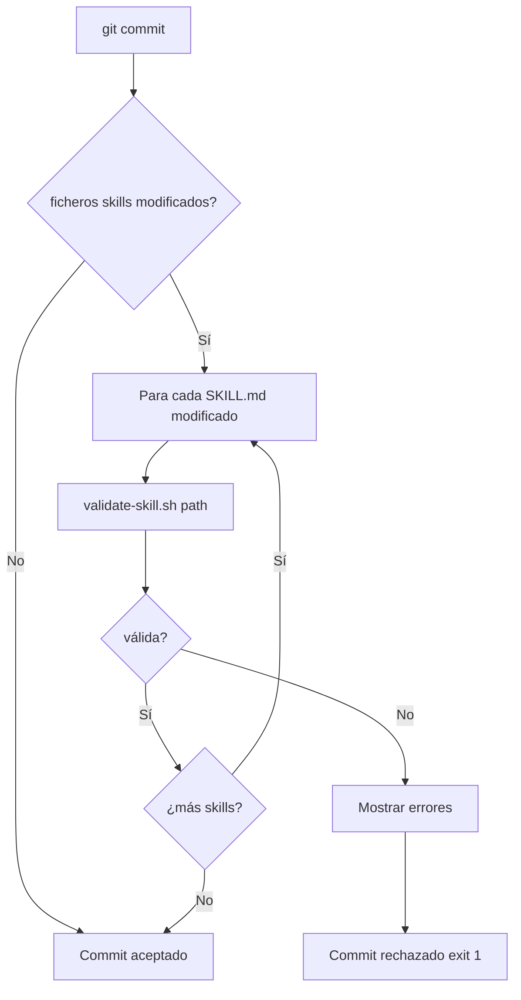

# US-004 — Pre-commit, validación y setup local

## Contexto de la necesidad
Para garantizar la calidad del catálogo sin depender de revisión manual en cada PR, se necesitan scripts de validación automática que rechacen skills mal formadas antes de que lleguen a la rama principal, y un setup.sh que configure el entorno del contributor en un solo paso.

## 1. Encabezado y trazabilidad
- **ID US**: US-004
- **Título usuario**: Pre-commit hooks, validación de skills y setup local del desarrollador
- **Descripción usuario**: Como contributor del repositorio, quiero que un pre-commit rechace automáticamente skills mal formadas y que un único comando configure mi entorno, para mantener calidad sin revisión manual y arrancar en minutos.
- **Épica relacionada**: EP-1 — Fundamentos e Inicialización
- **Prioridad sugerida**: Alta (P1)
- **Criterios funcionales trazados**:
  - `scripts/validate-skill.sh` valida frontmatter, secciones y overview.md Mermaid
  - `.githooks/pre-commit` llama al validador para skills modificadas
  - `setup.sh` instala hooks, CLI y verifica dependencias
  - Referencia: `bankinter-devtools/.githooks/pre-push` y `bankinter-devtools/scripts/validate-skill.sh`

## 2. Cobertura funcional
- **Flujo principal**:
  1. Contributor hace `git commit` con cambios en `skills/`
  2. Pre-commit detecta ficheros `skills/**/SKILL.md` modificados
  3. Para cada uno llama `validate-skill.sh <path>`
  4. Si alguno falla, el commit se rechaza con mensaje descriptivo
  5. Si todos pasan, el commit se acepta
- **Entradas**: Path a un directorio de skill
- **Validaciones del script**:
  1. `SKILL.md` existe en el path
  2. Frontmatter YAML tiene claves `name` y `description`
  3. Sección `## When to use` presente
  4. Sección `## When NOT to use` presente
  5. `references/overview.md` existe
  6. `references/overview.md` contiene bloque ` ```mermaid `
- **Salidas**: Exit 0 (válida) o Exit 1 con mensaje detallado de qué falta
- **Casos límite**: Skills sin cambios no se validan (solo diff del commit)

## 3. Dependencias y restricciones
- **Dependencias funcionales/técnicas**: US-001 (directorios), US-003 (templates que el validador debe aceptar)
- **Riesgos aplicables**: Si el validador es demasiado estricto bloqueará la migración masiva de US-007/009
- **Pendientes de validación**: ¿Se validan también los `.agent.md` en pre-commit?
- **Bloqueantes**: Ninguno

## 4. Solución funcional

**`scripts/validate-skill.sh`** — lógica:
```bash
#!/usr/bin/env bash
set -euo pipefail
SKILL_DIR="$1"
ERRORS=0

# 1. Verificar SKILL.md
[ -f "$SKILL_DIR/SKILL.md" ] || { echo "✗ SKILL.md no encontrado en $SKILL_DIR"; ERRORS=$((ERRORS+1)); }
# 2. Verificar frontmatter (name y description)
# 3. Verificar secciones obligatorias
for section in "When to use" "When NOT to use"; do
  grep -q "## $section" "$SKILL_DIR/SKILL.md" || { echo "✗ Sección '$section' ausente"; ERRORS=$((ERRORS+1)); }
done
# 4. Verificar overview.md con mermaid
[ -f "$SKILL_DIR/references/overview.md" ] || { echo "✗ references/overview.md no encontrado"; ERRORS=$((ERRORS+1)); }
grep -q '```mermaid' "$SKILL_DIR/references/overview.md" || { echo "✗ Bloque mermaid ausente en overview.md"; ERRORS=$((ERRORS+1)); }

[ $ERRORS -eq 0 ] && echo "✓ $SKILL_DIR válida" || exit 1
```

**`setup.sh`** — comportamiento:
```bash
#!/usr/bin/env bash
set -euo pipefail
echo "=== DevTools-AI Setup ==="
# 1. Verificar Python >= 3.11
# 2. pip install -e cli-tools/
# 3. git config core.hooksPath .githooks
# 4. chmod +x scripts/*.sh .githooks/*
# 5. Imprimir resumen de instalado
```

**Referencia fuente**:
- `bankinter-devtools/scripts/validate-skill.sh`
- `bankinter-devtools/.githooks/pre-push`
- `bankinter-devtools/setup.sh`

## 5. Checklist de calidad
- **CRITICAL**
  - [ ] `validate-skill.sh` sale con exit 1 si falta cualquier sección obligatoria
  - [ ] `validate-skill.sh` sale con exit 0 sobre el template de US-003
  - [ ] Pre-commit solo valida ficheros del diff actual (no todos los skills)
- **HIGH**
  - [ ] `setup.sh` es idempotente (ejecutarlo dos veces no rompe nada)
  - [ ] `setup.sh` verifica Python >= 3.11 antes de instalar
- **MEDIUM**
  - [ ] Mensaje de error del validador indica exactamente qué sección falta
- **LOW**
  - [ ] setup.sh imprime resumen con ✓/✗ por paso

## 6. Casos de prueba
- **Funcionales**:
  - Skill con SKILL.md correcto + overview.md con mermaid → exit 0
  - Skill sin `## When NOT to use` → exit 1 con mensaje "Sección ausente"
  - Skill sin `references/overview.md` → exit 1
  - Skill con overview.md sin bloque mermaid → exit 1
  - `setup.sh` en máquina limpia → instala CLI, configura hooks, sin errores
  - `setup.sh` segunda vez → sin errores, sin duplicar configuración
- **Reglas de negocio**: Solo SKILL.md se valida en pre-commit; agentes no (por ahora)
- **Errores**: Si Python < 3.11, setup.sh sale con mensaje claro y exit 1

## 7. Diagrama de flujo


## 8. Notas y Definition of Ready
- **Decisiones abiertas**: ¿Se validan también agentes en pre-commit?
- **Supuestos**: El script usa bash estándar disponible en macOS y Linux
- **Dependencias previas**: US-001 (estructura), US-003 (templates como casos de prueba)
- **Definition of Ready**:
  - [ ] US-001 y US-003 completadas
  - [ ] Lista definitiva de secciones obligatorias de SKILL.md acordada
  - [ ] Decisión tomada sobre validación de agentes en pre-commit
