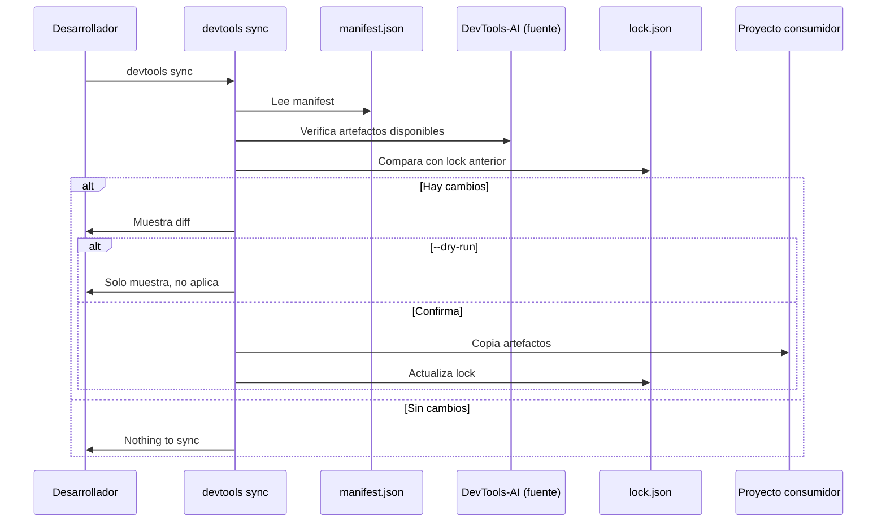

# US-006 — Implementar devtools sync copy-on-demand

## Contexto de la necesidad
Los proyectos consumidores necesitan importar artefactos (skills, agentes, instrucciones) desde este repositorio central de forma controlada, versionada y sin duplicación manual. La estrategia está documentada en `sync-strategy.md`; esta US la implementa.

## 1. Encabezado y trazabilidad
- **ID US**: US-006
- **Título usuario**: Comando devtools sync con manifest y lock
- **Descripción usuario**: Como desarrollador de un proyecto consumidor, quiero ejecutar `devtools sync` para importar los artefactos que necesito según un manifest, para no copiar manualmente ni perder actualizaciones futuras.
- **Épica relacionada**: EP-2 — Sync Skills Strategy
- **Prioridad sugerida**: Alta (P1)
- **Criterios funcionales trazados**:
  - `devtools sync` lee `devtools.manifest.json` y copia artefactos al destino
  - Genera/actualiza `devtools.lock.json` con SHA y timestamp
  - Soporta `--dry-run` (muestra qué cambiaría sin aplicar)
  - No sobreescribe sin confirmación si hay cambios locales
  - Referencia: `sync-strategy.md` + `bankinter-devtools/cli-tools/sync_skills/`

## Requerimientos de inicio

| ID | Requerimiento | Estado | Tipo | Evidencia/Nota |
|---|---|---|---|---|
| RQ-001 | `devtools.manifest.json` en el proyecto consumidor | Necesario | Funcional | Formato definido en sync-strategy.md |
| RQ-002 | Source de artefactos accesible (local path o git URL) | Necesario | Funcional | Modo local primero; git en sprint siguiente |
| RQ-003 | Destino `.github/` o path configurado en manifest | Necesario | Funcional | Cada tipo de artefacto tiene su destination |

## 2. Cobertura funcional
- **Flujo principal**:
  1. Desarrollador ejecuta `devtools sync` en raíz del proyecto consumidor
  2. CLI lee `devtools.manifest.json`
  3. Para cada artefacto en `artifacts[]`, copia desde source al destination
  4. Genera/actualiza `devtools.lock.json`
  5. Muestra resumen de artefactos sincronizados
- **Entradas**: `devtools.manifest.json`, source path, destination paths
- **Validaciones**:
  - Si destination tiene cambios locales → preguntar antes de sobreescribir
  - Si source no existe → error claro con path esperado
  - Si manifest es inválido → error con línea y campo problemático
- **Salidas**: Artefactos copiados al destino + `devtools.lock.json` actualizado
- **Casos límite**:
  - Artefacto en manifest que no existe en source → warning, no error fatal
  - Sincronización sin cambios → "Todo sincronizado, nada que hacer"

## 3. Dependencias y restricciones
- **Dependencias funcionales/técnicas**: US-005 (CLI base); `sync-strategy.md` como especificación
- **Riesgos aplicables**: Si el proyecto consumidor modifica artefactos sincronizados, se pierde en el siguiente sync
- **Pendientes de validación**: ¿El lock.json va en .gitignore del consumidor o se commitea?
- **Bloqueantes**: US-005 debe estar completada

## 4. Solución funcional

**Formato `devtools.manifest.json`** (ver `sync-strategy.md` para spec completa):
```json
{
  "version": "1.0.0",
  "source": { "type": "local", "path": "/ruta/a/devtools-ai" },
  "sync": { "mode": "copy", "destination_base": ".github" },
  "artifacts": [
    {
      "namespace": "global",
      "items": ["clean-code-guardian", "git-workflow"],
      "type": "skills",
      "destination": "skills/global"
    }
  ]
}
```

**Formato `devtools.lock.json`**:
```json
{
  "synced_at": "2026-06-06T10:00:00Z",
  "artifacts": [
    {
      "artifact": "skills/global/clean-code-guardian",
      "source_sha": "a1b2c3d4",
      "destination": ".github/skills/global/clean-code-guardian",
      "synced_at": "2026-06-06T10:00:00Z"
    }
  ]
}
```

**Comandos**:
- `devtools sync` — sync con manifest en cwd
- `devtools sync --manifest <path>` — manifest explícito
- `devtools sync --dry-run` — muestra diff sin aplicar
- `devtools sync --force` — sobreescribe sin preguntar
- `devtools sync --status` — muestra estado actual vs source

## 5. Checklist de calidad
- **CRITICAL**
  - [ ] `devtools sync` copia artefactos correctamente al destination
  - [ ] `devtools.lock.json` se genera/actualiza tras cada sync
  - [ ] Si hay cambios locales en destino, pregunta antes de sobreescribir
- **HIGH**
  - [ ] `--dry-run` muestra qué cambiaría sin modificar nada
  - [ ] Error claro si source path no existe
- **MEDIUM**
  - [ ] `--status` muestra diferencias entre lock y source actual
- **LOW**
  - [ ] Resumen final con número de artefactos sincronizados

## 6. Casos de prueba
- **Funcionales**:
  - Manifest válido + source existe → artefactos copiados al destino correcto
  - `--dry-run` → muestra lista de cambios, no modifica ficheros
  - Manifest con artefacto inexistente en source → warning, resto se sincroniza
  - Destino con cambios locales + sin `--force` → pregunta confirmación
  - Segunda ejecución sin cambios en source → "Nothing to sync"
- **Errores**: Manifest JSON inválido → error con línea del problema

## 7. Diagrama de flujo


## 8. Notas y Definition of Ready
- **Decisiones abiertas**: ¿lock.json va en .gitignore del consumidor?
- **Supuestos**: Modo local (path absoluto) se implementa primero; git URL en iteración siguiente
- **Dependencias previas**: US-005 (CLI base con subcomando sync stub)
- **Definition of Ready**:
  - [ ] US-005 completada (subcomando `sync` stub existe)
  - [ ] Formato de manifest.json aprobado (ver sync-strategy.md)
  - [ ] Decisión sobre lock.json en .gitignore tomada
