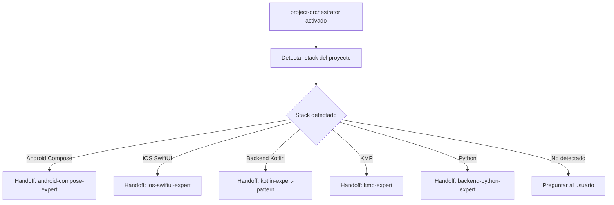

# US-010 — Delegar tareas automáticamente según el stack

**Como** usuario del repositorio en cualquier stack,  
**quiero** un agente orquestador que detecte mi stack y tarea y delegue al agente o skill correcto,  
**para** no necesitar memorizar qué skill invocar manualmente.

---

## Criterios de Aceptación

1. El agente `agents/global/project-orchestrator.agent.md` detecta el stack del proyecto activo buscando archivos característicos: `build.gradle.kts` → Android, `Package.swift` → iOS, `Application.kt` con `embeddedServer` → Backend Kotlin, `pyproject.toml` → Python.
2. El orquestador detecta el tipo de tarea (feature, fix, review, test, migration, MR) y delega al agente de stack correcto o invoca la skill adecuada.
3. Los handoffs del orquestador referencian todos los agentes de stack: `android-compose-expert`, `ios-swiftui-expert`, `kmp-expert`, agentes backend.
4. El agente `agents/global/qa-testcase.agent.md` genera casos de prueba (funcionales, edge cases, errores) adaptados al framework del stack (JUnit, XCTest, pytest).
5. El archivo `instructions/global.instructions.md` existe con `applyTo: "**"` (aplica a todos los archivos).
6. Las instrucciones globales incluyen: (1) nomenclatura de commits, (2) convenciones MR/PR, (3) referencia al agente orquestador, (4) referencia a `skills/global/`.
7. Las instrucciones globales tienen menos de 200 líneas (reglas básicas, no exhaustivas).
8. Ejecutar `@project-orchestrator` en un proyecto Android delega correctamente al agente Android (verificable manualmente).

---

## Notas Técnicas

**Detección de stack en el orquestador** (heurística):
- `build.gradle.kts` + `AndroidManifest.xml` → Android
- `Package.swift` / `.xcodeproj` → iOS
- `build.gradle.kts` con `kotlin("multiplatform")` → KMP
- `Application.kt` con `embeddedServer` → Backend Kotlin
- `pyproject.toml` / `main.py` → Python
- `pom.xml` con `spring-boot` → Spring Java

**Fuente de referencia**: `mycardiochef/.github/agents/project-orchestrator.agent.md`

**Decisiones abiertas**: ¿El orquestador necesita leer un archivo de configuración del proyecto para detectar el stack?

**Supuestos**: Heurística de detección cubre el 90% de casos; proyectos ambiguos requieren especificación manual.

---

## Validación INVEST

| Criterio | ✅ / ⚠️ | Observación |
|---|---|---|
| **Independiente** | ✅ | Depende de US-001; referencia agentes que se crean en US paralelas pero no los bloquea |
| **Negociable** | ✅ | Heurística de detección ajustable |
| **Valiosa** | ✅ | Reduce fricción del usuario: no necesita saber qué agente usar |
| **Estimable** | ✅ | Creación de 2 agentes + instrucciones: 6-8 horas |
| **Small** | ✅ | 8 CA, cubre orquestador + qa-testcase + instrucciones |
| **Testeable** | ✅ | Todos los CA verificables con pruebas manuales en proyectos tipo |

---

## Épica Relacionada

EP-8 — Global Cross-Stack

---

## Prioridad

**P0** (Bloqueante) — Orquestador es punto de entrada principal del repositorio.

## 3. Dependencias y restricciones
- **Dependencias funcionales/técnicas**: US-001 (namespace global existe); US-008/009 (agentes y skills que el orquestador referencia)
- **Riesgos aplicables**: Si se añaden stacks nuevos, el orquestador debe actualizarse
- **Pendientes de validación**: ¿El orquestador necesita leer un fichero de configuración del proyecto para detectar el stack, o lo infiere del workspace?
- **Bloqueantes**: Ninguno

## 4. Solución funcional

**Detección de stack en el orquestador**:
- Buscar `build.gradle.kts` / `AndroidManifest.xml` → Android
- Buscar `Package.swift` / `.xcodeproj` → iOS
- Buscar `build.gradle.kts` con `kotlin("multiplatform")` → KMP
- Buscar `Application.kt` con `embeddedServer` o `ktor` → Backend Kotlin
- Buscar `main.py` / `pyproject.toml` / `requirements.txt` → Python
- Buscar `pom.xml` con `spring-boot` → Spring Java

**Handoffs del orquestador** (ejemplos):
```yaml
handoffs:
  - label: Android Compose Expert
    agent: android-compose-expert
    prompt: "Continúa con el contexto de Android Compose"
  - label: iOS SwiftUI Expert
    agent: ios-swiftui-expert
    prompt: "Continúa con el contexto de iOS SwiftUI"
  - label: Backend Kotlin Expert
    agent: kotlin-expert-pattern
    prompt: "Continúa con el contexto de Ktor"
```

## 5. Checklist de calidad
- **CRITICAL**
  - [ ] `agents/global/project-orchestrator.agent.md` existe con lógica de detección de stack
  - [ ] `agents/global/qa-testcase.agent.md` existe
  - [ ] `instructions/global.instructions.md` existe con contenido no vacío
- **HIGH**
  - [ ] Orquestador tiene handoffs a todos los agentes de stack disponibles
  - [ ] Detección de stack cubre los 7 casos definidos
- **MEDIUM**
  - [ ] qa-testcase adaptado a múltiples frameworks de testing
- **LOW**
  - [ ] Instrucciones globales tienen menos de 100 líneas (concisas)

## 6. Casos de prueba
- **Funcionales**:
  - Invocar orquestador en proyecto Android → delega a android-compose-expert
  - Invocar orquestador en proyecto Ktor → delega a kotlin-expert-pattern
  - Invocar qa-testcase con una US → genera casos de prueba estructurados
- **Errores**: Stack no detectado → orquestador pide al usuario que especifique el stack

## 7. Diagrama de flujo


## 8. Notas y Definition of Ready
- **Decisiones abiertas**: ¿El orquestador lee un fichero `.devtools-stack` del proyecto para bypass de detección?
- **Supuestos**: La detección por ficheros es suficientemente precisa para el 90% de los casos
- **Dependencias previas**: US-001; recomendado US-007 y US-008 completadas
- **Fuentes**:
  - `mycardiochef/.github/agents/project-orchestrator.agent.md`
  - `mycardiochef/.github/agents/qa-testcase-agent.agent.md`
- **Definition of Ready**:
  - [ ] US-001 completada
  - [ ] Lista de stacks a detectar acordada
  - [ ] Decisión sobre fichero `.devtools-stack` tomada
