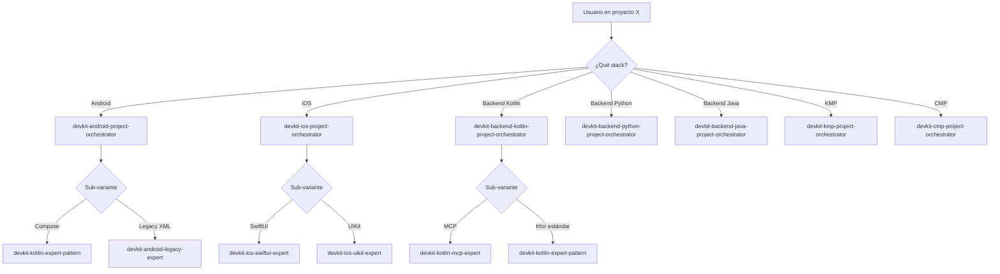
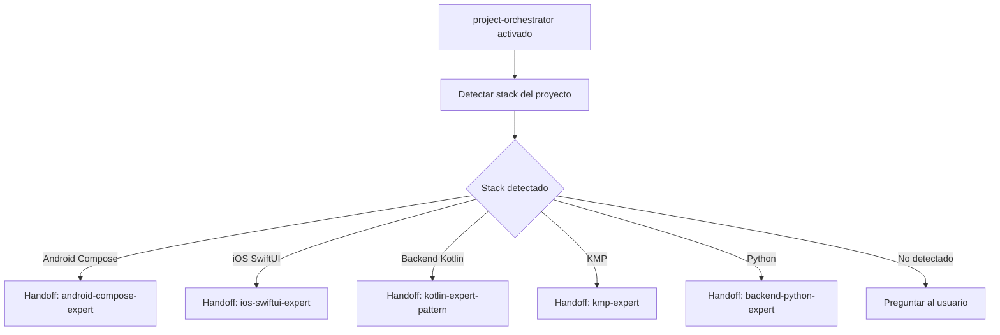

# US-010 — Orchestrators especializados por stack y naming devkit-

**Como** usuario del repositorio en cualquier stack,  
**quiero** orchestrators especializados por tecnología y un naming consistente `devkit-` en todos los artefactos,  
**para** invocar el agente correcto para mi stack sin ambigüedad y distinguir este kit de otros proyectos.

---

## Épica Relacionada

EP-8 — Global Cross-Stack

## Prioridad

**P0** (Bloqueante) — El orquestador es el punto de entrada principal; el naming es la convención fundacional.

---

## 1. Convención de naming `devkit-`

Todos los artefactos del repositorio adoptan el prefijo `devkit-`. Esto aplica **retroactivamente** a los artefactos existentes (US-008, US-009) y a todos los nuevos.

| Tipo | Patrón | Ejemplo |
|---|---|---|
| Agentes | `devkit-<stack>-<rol>.agent.md` | `devkit-android-project-orchestrator.agent.md` |
| Skills (carpeta) | `devkit-<nombre>/` | `devkit-clean-code-guardian/` |
| Instructions | `devkit-<stack>.instructions.md` | `devkit-android-compose.instructions.md` |
| Prompts | `devkit-<nombre>.prompt.md` | `devkit-feature-kickoff.prompt.md` |
| Scripts | `devkit-<nombre>.sh` | `devkit-validate-skill.sh` |
| CLI | `devkit` (comando raíz) | `devkit sync`, `devkit validate` |

**Regla**: El prefijo identifica el kit completo. Proyectos externos (ej: `bk-` para Bankinter) tienen su propio prefijo.

---

## 2. Criterios de Aceptación

### Naming retroactivo (CRITICAL)
1. Todos los agentes existentes en `agents/` tienen el prefijo `devkit-`.
2. Todos los skill-folders en `skills/` tienen el prefijo `devkit-`.
3. Todos los archivos en `instructions/` tienen el prefijo `devkit-`.
4. El script `scripts/validate-skill.sh` se renombra a `scripts/devkit-validate-skill.sh`.
5. Las referencias internas entre artefactos se actualizan para reflejar los nuevos nombres.

### Orchestrators especializados (CRITICAL)
6. Existen 7 orchestrators especializados, uno por stack, en la carpeta de su stack:

| Archivo | Ruta |
|---|---|
| `devkit-android-project-orchestrator.agent.md` | `agents/android/` |
| `devkit-ios-project-orchestrator.agent.md` | `agents/ios/` |
| `devkit-backend-kotlin-project-orchestrator.agent.md` | `agents/backend/kotlin-ktor/` |
| `devkit-backend-python-project-orchestrator.agent.md` | `agents/backend/python/` |
| `devkit-backend-java-project-orchestrator.agent.md` | `agents/backend/spring-java/` |
| `devkit-kmp-project-orchestrator.agent.md` | `agents/multiplatform/kmp/` |
| `devkit-cmp-project-orchestrator.agent.md` | `agents/multiplatform/cmp/` |

7. Cada orchestrator detecta sub-variantes de su stack:
   - Android: detecta Compose vs Legacy (XML/Java) por presencia de `@Composable` en fuentes.
   - iOS: detecta SwiftUI vs UIKit por presencia de `SwiftUI` import vs `UIKit`.
   - Backend Kotlin: detecta si hay MCP (`io.modelcontextprotocol`) o Ktor estándar.
   - KMP: detecta si tiene módulo `androidApp`, `iosApp`, o solo shared.
8. Cada orchestrator tiene handoffs a los agentes especializados de su stack.
9. Cada orchestrator incluye la tabla de tareas que puede delegar: feature, fix, review, test, MR.

### Instructions globales (HIGH)
10. El archivo `instructions/devkit-global.instructions.md` existe con `applyTo: "**"`.
11. Las instrucciones globales incluyen exactamente 5 secciones:
    1. Convención de naming `devkit-`
    2. Nomenclatura de commits (conventional commits)
    3. Convenciones MR/PR
    4. Guía de cuándo invocar cada orchestrator (tabla stack → agente)
    5. Referencia a `skills/global/`
12. Las instrucciones globales tienen menos de 200 líneas.

---

## 3. Inventario de renaming retroactivo

### Agentes existentes (`agents/backend/kotlin-ktor/`)
| Nombre actual | Nombre nuevo |
|---|---|
| `devops-agent.agent.md` | `devkit-devops.agent.md` |
| `kotlin-expert-pattern.agent.md` | `devkit-kotlin-expert-pattern.agent.md` |
| `kotlin-mcp-expert.agent.md` | `devkit-kotlin-mcp-expert.agent.md` |
| `kotlin-server-quality.agent.md` | `devkit-kotlin-server-quality.agent.md` |
| `payload-logging-trace.agent.md` | `devkit-payload-logging-trace.agent.md` |
| `x-correlation-id-strategy.agent.md` | `devkit-x-correlation-id-strategy.agent.md` |

### Skills globales existentes (`skills/global/`)
| Nombre actual | Nombre nuevo |
|---|---|
| `clean-code-guardian/` | `devkit-clean-code-guardian/` |
| `feature-lifecycle/` | `devkit-feature-lifecycle/` |
| `git-workflow/` | `devkit-git-workflow/` |
| `mr-description-generator/` | `devkit-mr-description-generator/` |

### Skills backend kotlin existentes (`skills/backend/kotlin-ktor/`)
| Nombre actual | Nombre nuevo |
|---|---|
| `kotlin-mcp-server-generator/` | `devkit-kotlin-mcp-server-generator/` |
| `ktor-auth-flow/` | `devkit-ktor-auth-flow/` |
| `logging-kotlin/` | `devkit-logging-kotlin/` |
| `postgresql-crud/` | `devkit-postgresql-crud/` |
| `unit-testing-kotlin/` | `devkit-unit-testing-kotlin/` |
| `webscraping-contract/` | `devkit-webscraping-contract/` |

### Skills android existentes
| Nombre actual | Nombre nuevo |
|---|---|
| `android/compose/jetpack-compose-patterns/` | `devkit-jetpack-compose-patterns/` |
| `android/compose/migrate-xml-to-compose/` | `devkit-migrate-xml-to-compose/` |
| `android/legacy/xml-java-patterns/` | `devkit-xml-java-patterns/` |

### Instructions existentes (`instructions/`)
| Nombre actual | Nombre nuevo |
|---|---|
| `android-compose.instructions.md` | `devkit-android-compose.instructions.md` |
| `android-legacy.instructions.md` | `devkit-android-legacy.instructions.md` |
| `backend-kotlin.instructions.md` | `devkit-backend-kotlin.instructions.md` |
| `cmp.instructions.md` | `devkit-cmp.instructions.md` |
| `global.instructions.md` | `devkit-global.instructions.md` |
| `ios-swiftui.instructions.md` | `devkit-ios-swiftui.instructions.md` |
| `ios-uikit.instructions.md` | `devkit-ios-uikit.instructions.md` |
| `kmp.instructions.md` | `devkit-kmp.instructions.md` |

### Scripts existentes (`scripts/`)
| Nombre actual | Nombre nuevo |
|---|---|
| `validate-skill.sh` | `devkit-validate-skill.sh` |

---

## 4. Notas Técnicas

**Detección de sub-variantes** (heurística por orchestrator):
- Android Compose: `grep -r "@Composable" src/` o `import androidx.compose` en fuentes
- Android Legacy: presencia de `res/layout/*.xml` sin Composables
- iOS SwiftUI: `import SwiftUI` en archivos `.swift`
- iOS UIKit: `import UIKit` sin `import SwiftUI`
- Backend Kotlin MCP: dependencia `io.modelcontextprotocol` en `build.gradle.kts`
- Backend Kotlin Ktor: `embeddedServer` o plugin `io.ktor.server` en `build.gradle.kts`
- KMP completo: módulos `androidApp` + `iosApp` en settings

**Supuesto**: Si el orquestador no puede determinar la sub-variante, pregunta al usuario antes de delegar.

---

## 5. Validación INVEST

| Criterio | ✅ / ⚠️ | Observación |
|---|---|---|
| **Independiente** | ✅ | US-008/009 ya cerradas; renaming no bloquea a nadie |
| **Negociable** | ✅ | Número de orchestrators y heurísticas ajustables |
| **Valiosa** | ✅ | Naming consistente + entrada clara por stack |
| **Estimable** | ⚠️ | Scope ampliado: 1-2 jornadas (renaming + 7 orchestrators + instructions) |
| **Small** | ⚠️ | Scope mayor al original; justificado por coherencia fundacional |
| **Testeable** | ✅ | Todos los CA verificables manualmente |

---

## 6. Dependencias y restricciones
- **Dependencias**: US-001 (estructura existe), US-008/009 (artefactos a renombrar)
- **Riesgos**: Referencias externas a nombres sin `devkit-` quedan rotas si hay otros proyectos que apunten a este repo
- **Bloqueantes**: Ninguno

---

## 7. Checklist de calidad
- **CRITICAL**
  - [ ] Todos los agentes tienen prefijo `devkit-`
  - [ ] Todos los skill-folders tienen prefijo `devkit-`
  - [ ] Todos los instructions tienen prefijo `devkit-`
  - [ ] Script `devkit-validate-skill.sh` renombrado
  - [ ] 7 orchestrators especializados creados
  - [ ] `instructions/devkit-global.instructions.md` existe con `applyTo: "**"`
- **HIGH**
  - [ ] Cada orchestrator detecta sub-variantes de su stack
  - [ ] Cada orchestrator tiene handoffs a agentes especializados
  - [ ] Referencias internas actualizadas (SKILL.md de cada skill)
- **MEDIUM**
  - [ ] Instructions globales < 200 líneas
  - [ ] Tabla stack → orchestrator en global instructions

---

## 8. Casos de prueba
- Invocar `@devkit-android-project-orchestrator` en proyecto Compose → detecta Compose y delega a `devkit-kotlin-expert-pattern` *(manual)*
- Invocar `@devkit-ios-project-orchestrator` en proyecto SwiftUI → delega a agente SwiftUI *(manual)*
- Verificar que todos los archivos en `agents/`, `skills/`, `instructions/` tienen prefijo `devkit-` *(script o find)*
- `instructions/devkit-global.instructions.md` tiene `applyTo: "**"` y < 200 líneas *(manual)*

---

## 9. Diagrama de arquitectura

# US-010 — Delegar tareas automáticamente según el stack

**Como** usuario del repositorio en cualquier stack,  
**quiero** un agente orquestador que detecte mi stack y tarea y delegue al agente o skill correcto,  
**para** no necesitar memorizar qué skill invocar manualmente.

---

## Criterios de Aceptación

1. El agente `agents/global/project-orchestrator.agent.md` detecta el stack del proyecto activo buscando archivos característicos: `build.gradle.kts` → Android, `Package.swift` → iOS, `Application.kt` con `embeddedServer` → Backend Kotlin, `pyproject.toml` → Python.
2. El orquestador detecta el tipo de tarea (feature, fix, review, test, migration, MR) y delega al agente de stack correcto o invoca la skill adecuada.
3. Los handoffs del orquestador referencian todos los agentes de stack: `android-compose-expert`, `ios-swiftui-expert`, `kmp-expert`, agentes backend.
4. El agente `agents/global/qa-testcase.agent.md` genera casos de prueba (funcionales, edge cases, errores) adaptados al framework del stack (JUnit, XCTest, pytest).
5. El archivo `instructions/global.instructions.md` existe con `applyTo: "**"` (aplica a todos los archivos).
6. Las instrucciones globales incluyen: (1) nomenclatura de commits, (2) convenciones MR/PR, (3) referencia al agente orquestador, (4) referencia a `skills/global/`.
7. Las instrucciones globales tienen menos de 200 líneas (reglas básicas, no exhaustivas).
8. Ejecutar `@project-orchestrator` en un proyecto Android delega correctamente al agente Android (verificable manualmente).

---

## Notas Técnicas

**Detección de stack en el orquestador** (heurística):
- `build.gradle.kts` + `AndroidManifest.xml` → Android
- `Package.swift` / `.xcodeproj` → iOS
- `build.gradle.kts` con `kotlin("multiplatform")` → KMP
- `Application.kt` con `embeddedServer` → Backend Kotlin
- `pyproject.toml` / `main.py` → Python
- `pom.xml` con `spring-boot` → Spring Java

**Fuente de referencia**: `mycardiochef/.github/agents/project-orchestrator.agent.md`

**Decisiones abiertas**: ¿El orquestador necesita leer un archivo de configuración del proyecto para detectar el stack?

**Supuestos**: Heurística de detección cubre el 90% de casos; proyectos ambiguos requieren especificación manual.

---

## Validación INVEST

| Criterio | ✅ / ⚠️ | Observación |
|---|---|---|
| **Independiente** | ✅ | Depende de US-001; referencia agentes que se crean en US paralelas pero no los bloquea |
| **Negociable** | ✅ | Heurística de detección ajustable |
| **Valiosa** | ✅ | Reduce fricción del usuario: no necesita saber qué agente usar |
| **Estimable** | ✅ | Creación de 2 agentes + instrucciones: 6-8 horas |
| **Small** | ✅ | 8 CA, cubre orquestador + qa-testcase + instrucciones |
| **Testeable** | ✅ | Todos los CA verificables con pruebas manuales en proyectos tipo |

---

## Épica Relacionada

EP-8 — Global Cross-Stack

---

## Prioridad

**P0** (Bloqueante) — Orquestador es punto de entrada principal del repositorio.

## 3. Dependencias y restricciones
- **Dependencias funcionales/técnicas**: US-001 (namespace global existe); US-008/009 (agentes y skills que el orquestador referencia)
- **Riesgos aplicables**: Si se añaden stacks nuevos, el orquestador debe actualizarse
- **Pendientes de validación**: ¿El orquestador necesita leer un fichero de configuración del proyecto para detectar el stack, o lo infiere del workspace?
- **Bloqueantes**: Ninguno

## 4. Solución funcional

**Detección de stack en el orquestador**:
- Buscar `build.gradle.kts` / `AndroidManifest.xml` → Android
- Buscar `Package.swift` / `.xcodeproj` → iOS
- Buscar `build.gradle.kts` con `kotlin("multiplatform")` → KMP
- Buscar `Application.kt` con `embeddedServer` o `ktor` → Backend Kotlin
- Buscar `main.py` / `pyproject.toml` / `requirements.txt` → Python
- Buscar `pom.xml` con `spring-boot` → Spring Java

**Handoffs del orquestador** (ejemplos):
```yaml
handoffs:
  - label: Android Compose Expert
    agent: android-compose-expert
    prompt: "Continúa con el contexto de Android Compose"
  - label: iOS SwiftUI Expert
    agent: ios-swiftui-expert
    prompt: "Continúa con el contexto de iOS SwiftUI"
  - label: Backend Kotlin Expert
    agent: kotlin-expert-pattern
    prompt: "Continúa con el contexto de Ktor"
```

## 5. Checklist de calidad
- **CRITICAL**
  - [ ] `agents/global/project-orchestrator.agent.md` existe con lógica de detección de stack
  - [ ] `agents/global/qa-testcase.agent.md` existe
  - [ ] `instructions/global.instructions.md` existe con contenido no vacío
- **HIGH**
  - [ ] Orquestador tiene handoffs a todos los agentes de stack disponibles
  - [ ] Detección de stack cubre los 7 casos definidos
- **MEDIUM**
  - [ ] qa-testcase adaptado a múltiples frameworks de testing
- **LOW**
  - [ ] Instrucciones globales tienen menos de 100 líneas (concisas)

## 6. Casos de prueba
- **Funcionales**:
  - Invocar orquestador en proyecto Android → delega a android-compose-expert
  - Invocar orquestador en proyecto Ktor → delega a kotlin-expert-pattern
  - Invocar qa-testcase con una US → genera casos de prueba estructurados
- **Errores**: Stack no detectado → orquestador pide al usuario que especifique el stack

## 7. Diagrama de flujo


## 8. Notas y Definition of Ready
- **Decisiones abiertas**: ¿El orquestador lee un fichero `.devtools-stack` del proyecto para bypass de detección?
- **Supuestos**: La detección por ficheros es suficientemente precisa para el 90% de los casos
- **Dependencias previas**: US-001; recomendado US-007 y US-008 completadas
- **Fuentes**:
  - `mycardiochef/.github/agents/project-orchestrator.agent.md`
  - `mycardiochef/.github/agents/qa-testcase-agent.agent.md`
- **Definition of Ready**:
  - [ ] US-001 completada
  - [ ] Lista de stacks a detectar acordada
  - [ ] Decisión sobre fichero `.devtools-stack` tomada
