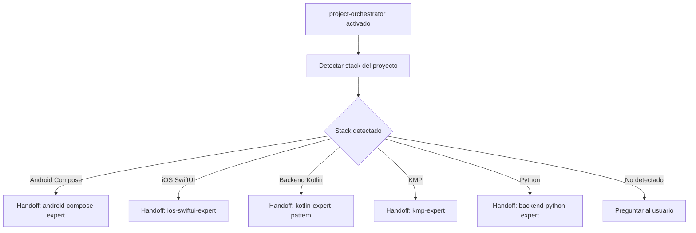

# US-010 — Crear agente project-orchestrator e instrucciones globales

## Contexto de la necesidad
Para que cualquier usuario del repo pueda ser guiado al agente o skill correcto según su stack y tarea, se necesita un agente orquestador global que detecte el contexto y delegue, y unas instrucciones globales que configuren Copilot para cualquier proyecto que importe artefactos del repo central.

## 1. Encabezado y trazabilidad
- **ID US**: US-010
- **Título usuario**: Agente project-orchestrator global e instrucciones globales
- **Descripción usuario**: Como usuario del repositorio en cualquier stack, quiero un agente orquestador que sepa delegar al agente o skill correcto según mi contexto, para no tener que saber de memoria qué skill invocar.
- **Épica relacionada**: EP-8 — Global Cross-Stack
- **Prioridad sugerida**: Alta (P0)
- **Criterios funcionales trazados**:
  - `agents/global/project-orchestrator.agent.md` detecta stack y delega
  - `agents/global/qa-testcase.agent.md` para generación de casos de prueba
  - `instructions/global.instructions.md` con reglas aplicables a todos los stacks
  - Fuente: `mycardiochef/.github/agents/project-orchestrator.agent.md` + `qa-testcase-agent.agent.md`

## 2. Cobertura funcional
- **`project-orchestrator.agent.md`** — comportamiento:
  1. Detecta el stack del proyecto activo (Android, iOS, KMP, Backend Kotlin, Python)
  2. Detecta el tipo de tarea (feature, fix, review, test, migration, MR)
  3. Delega al agente de stack correspondiente o invoca la skill adecuada
  4. Handoffs: todos los agentes de stack

- **`qa-testcase.agent.md`** — comportamiento:
  1. Recibe una US o descripción funcional
  2. Genera casos de prueba funcionales, edge cases y errores
  3. Adaptado al framework de testing del stack (JUnit, XCTest, pytest, etc.)

- **`instructions/global.instructions.md`** — contenido:
  - Reglas de nomenclatura de ficheros y commits (aplicables a todos los stacks)
  - Convenciones de MR/PR
  - Referencia al agente `project-orchestrator` para tareas complejas
  - Referencia a `skills/global/` para operaciones transversales

## 3. Dependencias y restricciones
- **Dependencias funcionales/técnicas**: US-001 (namespace global existe); US-008/009 (agentes y skills que el orquestador referencia)
- **Riesgos aplicables**: Si se añaden stacks nuevos, el orquestador debe actualizarse
- **Pendientes de validación**: ¿El orquestador necesita leer un fichero de configuración del proyecto para detectar el stack, o lo infiere del workspace?
- **Bloqueantes**: Ninguno

## 4. Solución funcional

**Detección de stack en el orquestador**:
- Buscar `build.gradle.kts` / `AndroidManifest.xml` → Android
- Buscar `Package.swift` / `.xcodeproj` → iOS
- Buscar `build.gradle.kts` con `kotlin("multiplatform")` → KMP
- Buscar `Application.kt` con `embeddedServer` o `ktor` → Backend Kotlin
- Buscar `main.py` / `pyproject.toml` / `requirements.txt` → Python
- Buscar `pom.xml` con `spring-boot` → Spring Java

**Handoffs del orquestador** (ejemplos):
```yaml
handoffs:
  - label: Android Compose Expert
    agent: android-compose-expert
    prompt: "Continúa con el contexto de Android Compose"
  - label: iOS SwiftUI Expert
    agent: ios-swiftui-expert
    prompt: "Continúa con el contexto de iOS SwiftUI"
  - label: Backend Kotlin Expert
    agent: kotlin-expert-pattern
    prompt: "Continúa con el contexto de Ktor"
```

## 5. Checklist de calidad
- **CRITICAL**
  - [ ] `agents/global/project-orchestrator.agent.md` existe con lógica de detección de stack
  - [ ] `agents/global/qa-testcase.agent.md` existe
  - [ ] `instructions/global.instructions.md` existe con contenido no vacío
- **HIGH**
  - [ ] Orquestador tiene handoffs a todos los agentes de stack disponibles
  - [ ] Detección de stack cubre los 7 casos definidos
- **MEDIUM**
  - [ ] qa-testcase adaptado a múltiples frameworks de testing
- **LOW**
  - [ ] Instrucciones globales tienen menos de 100 líneas (concisas)

## 6. Casos de prueba
- **Funcionales**:
  - Invocar orquestador en proyecto Android → delega a android-compose-expert
  - Invocar orquestador en proyecto Ktor → delega a kotlin-expert-pattern
  - Invocar qa-testcase con una US → genera casos de prueba estructurados
- **Errores**: Stack no detectado → orquestador pide al usuario que especifique el stack

## 7. Diagrama de flujo


## 8. Notas y Definition of Ready
- **Decisiones abiertas**: ¿El orquestador lee un fichero `.devtools-stack` del proyecto para bypass de detección?
- **Supuestos**: La detección por ficheros es suficientemente precisa para el 90% de los casos
- **Dependencias previas**: US-001; recomendado US-007 y US-008 completadas
- **Fuentes**:
  - `mycardiochef/.github/agents/project-orchestrator.agent.md`
  - `mycardiochef/.github/agents/qa-testcase-agent.agent.md`
- **Definition of Ready**:
  - [ ] US-001 completada
  - [ ] Lista de stacks a detectar acordada
  - [ ] Decisión sobre fichero `.devtools-stack` tomada
