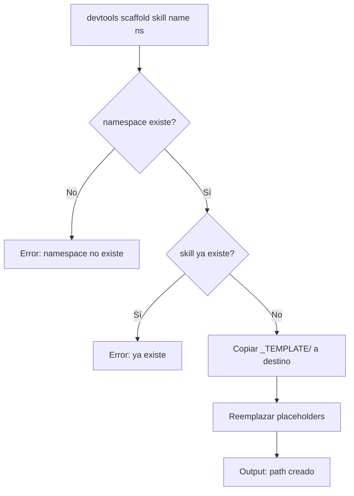

# US-015 — Comandos CLI scaffold y validate

## Contexto de la necesidad
Para que los contributors puedan crear nuevas skills con consistencia y validar las existentes desde la línea de comandos, el CLI necesita los subcomandos `scaffold` y `validate` implementados. Estos comandos automatizan los pasos manuales que actualmente requieren copiar templates y ejecutar scripts bash.

## 1. Encabezado y trazabilidad
- **ID US**: US-015
- **Título usuario**: Comandos devtools scaffold y validate completamente funcionales
- **Descripción usuario**: Como contributor del repositorio, quiero usar `devtools scaffold skill` y `devtools validate skill` desde la terminal, para crear y verificar skills sin conocer la estructura interna del repo.
- **Épica relacionada**: EP-9 — CLI Tools
- **Prioridad sugerida**: Alta (P1)
- **Criterios funcionales trazados**:
  - `devtools scaffold skill <name> <namespace>` genera la estructura completa desde template
  - `devtools validate skill <path>` valida y reporta problemas
  - `devtools validate skill <path> --fix` corrige problemas automáticos
  - Referencia: `scripts/validate-skill.sh` (US-004) se envuelve en el CLI

## Requerimientos de inicio

| ID | Requerimiento | Estado | Tipo | Evidencia/Nota |
|---|---|---|---|---|
| RQ-001 | US-005 completada (CLI base con subcomandos stub) | Necesario | Funcional | scaffold y validate son stubs en US-005 |
| RQ-002 | US-003 completada (templates existen) | Necesario | Funcional | scaffold usa `skills/_TEMPLATE/` como fuente |
| RQ-003 | US-004 completada (validate-skill.sh funcional) | Necesario | Funcional | validate CLI envuelve el script bash |

## 2. Cobertura funcional

**`devtools scaffold skill <name> <namespace>`**:
1. Verifica que `skills/_TEMPLATE/` existe
2. Verifica que el namespace destino existe en `skills/`
3. Si el nombre ya existe → error con mensaje claro
4. Copia `skills/_TEMPLATE/` a `skills/<namespace>/<name>/`
5. Reemplaza en SKILL.md: `[Name]` → `<name>`, `[namespace]` → `<namespace>`
6. Imprime path del fichero creado
7. (opcional) Abre SKILL.md en el editor por defecto

**`devtools validate skill <path>`**:
1. Llama `scripts/validate-skill.sh <path>` internamente
2. Presenta resultado en formato tabla con ✓/✗ por criterio
3. Exit 0 si válida, Exit 1 si hay errores

**`devtools validate skill <path> --fix`**:
1. Detecta problemas automáticamente corregibles:
   - Frontmatter faltante → genera stub
   - `references/overview.md` faltante → genera con Mermaid básico
2. Informa al usuario de qué se corrigió

## 3. Dependencias y restricciones
- **Dependencias funcionales/técnicas**: US-003 (templates), US-004 (script bash), US-005 (CLI base)
- **Riesgos aplicables**: Si el template cambia, scaffold puede generar skills con formato antiguo
- **Pendientes de validación**: ¿El editor que abre scaffold es configurable o usa `$EDITOR`?
- **Bloqueantes**: US-005 debe estar completada

## 4. Solución funcional

**Estructura en `cli-tools/devtools/commands/`**:
```python
# scaffold.py
def scaffold_skill(name: str, namespace: str): ...

# validate.py  
def validate_skill(path: str, fix: bool = False): ...
```

**Comandos**:
```bash
devtools scaffold skill my-skill android/compose
# → Crea skills/android/compose/my-skill/
# → Reemplaza placeholders en SKILL.md
# → Output: "✓ Skill creada en skills/android/compose/my-skill/SKILL.md"

devtools validate skill skills/global/git-workflow/
# → Tabla de resultados:
# ✓ SKILL.md existe
# ✓ Frontmatter: name, description
# ✓ Sección: When to use
# ✓ Sección: When NOT to use
# ✓ references/overview.md existe
# ✓ Bloque mermaid en overview.md
# → Skill válida

devtools validate skill skills/android/compose/my-skill/ --fix
# → "✓ Creado references/overview.md con Mermaid básico"
```

## 5. Checklist de calidad
- **CRITICAL**
  - [ ] `devtools scaffold skill <name> <namespace>` crea la estructura correcta
  - [ ] Los placeholders en SKILL.md se reemplazan correctamente
  - [ ] `devtools validate skill <path>` muestra tabla de criterios con ✓/✗
- **HIGH**
  - [ ] `--fix` crea overview.md si no existe
  - [ ] Error claro si namespace no existe
  - [ ] Error claro si skill ya existe en el namespace
- **MEDIUM**
  - [ ] Output de scaffold incluye path exacto del fichero creado
- **LOW**
  - [ ] `devtools scaffold skill --help` lista namespaces disponibles

## 6. Casos de prueba
- **Funcionales**:
  - `devtools scaffold skill test-skill global` → crea `skills/global/test-skill/SKILL.md` con name=test-skill
  - `devtools scaffold skill test-skill global` segunda vez → error "Ya existe"
  - `devtools scaffold skill test-skill unknown-namespace` → error "Namespace no existe"
  - `devtools validate skill skills/global/test-skill/` → 6 criterios ✓
  - Borrar overview.md + `devtools validate skill --fix` → crea overview.md con mermaid
- **Errores**: Namespace con `/` al final no debe causar error de path

## 7. Diagrama de flujo


## 8. Notas y Definition of Ready
- **Decisiones abiertas**: ¿Scaffold abre el editor automáticamente o solo imprime el path?
- **Supuestos**: El CLI usa el template en `skills/_TEMPLATE/` siempre (no hay templates por namespace)
- **Dependencias previas**: US-003, US-004, US-005 completadas
- **Definition of Ready**:
  - [ ] US-003 (templates), US-004 (validate-skill.sh), US-005 (CLI base) completadas
  - [ ] Decisión sobre apertura automática del editor tomada
