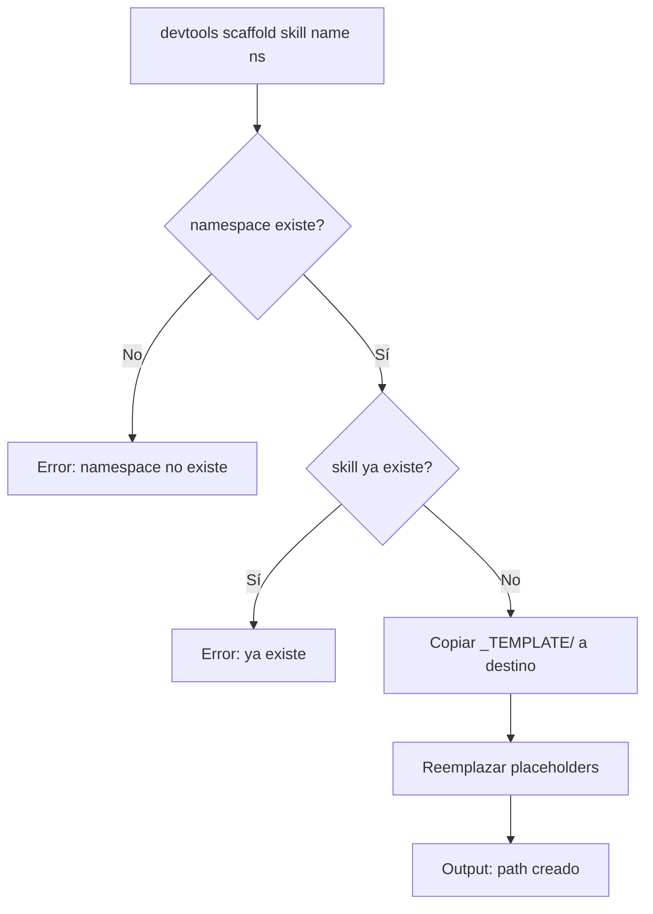

# US-015 — Automatizar creación y validación de skills

**Como** contributor del repositorio,  
**quiero** usar `devtools scaffold skill` y `devtools validate skill` desde la terminal,  
**para** crear y verificar skills sin conocer la estructura interna del repo ni ejecutar scripts bash manualmente.

---

## Requerimientos de inicio

| ID | Requerimiento | Estado | Tipo | Evidencia/Nota |
|---|---|---|---|---|
| RQ-001 | US-005 completada (CLI base con subcomandos stub) | Necesario | Funcional | scaffold y validate son stubs en US-005 |
| RQ-002 | US-003 completada (templates existen) | Necesario | Funcional | scaffold usa `skills/_TEMPLATE/` como fuente |
| RQ-003 | US-004 completada (validate-skill.sh funcional) | Necesario | Funcional | validate CLI envuelve el script bash |

## Criterios de Aceptación

1. Ejecutar `devtools scaffold skill my-skill global` crea el directorio `skills/global/my-skill/` con archivos `SKILL.md` y `references/overview.md` desde el template.
2. El comando `scaffold` reemplaza placeholders: `[Name]` → `my-skill`, `[namespace]` → `global` en el contenido de `SKILL.md`.
3. Si el nombre de skill ya existe en el namespace, el comando devuelve error descriptivo sin sobreescribir.
4. Ejecutar `devtools validate skill skills/global/my-skill/` llama internamente a `scripts/validate-skill.sh` y presenta resultado en formato tabla con ✓/✗ por criterio.
5. El comando `validate` devuelve exit code 0 si la skill es válida, exit code 1 si hay errores.
6. Ejecutar `devtools validate skill skills/global/my-skill/ --fix` corrige automáticamente: (1) frontmatter faltante genera stub, (2) `references/overview.md` faltante genera con Mermaid básico.
7. El comando `validate --fix` imprime qué se corrigió: "✓ Generado frontmatter stub", "✓ Creado references/overview.md".
8. Ambos comandos muestran ayuda útil: `devtools scaffold --help`, `devtools validate --help`.

---

## Notas Técnicas

**Dependencias de US previas**:
- US-003 (templates existen)
- US-004 (validate-skill.sh funcional)
- US-005 (CLI base con subcomandos stub)

**Decisiones abiertas**: ¿`scaffold` abre el archivo SKILL.md en el editor por defecto tras crearlo?

**Supuestos**: El template `skills/_TEMPLATE/` no cambia frecuentemente.

---

## Validación INVEST

| Criterio | ✅ / ⚠️ | Observación |
|---|---|---|
| **Independiente** | ✅ | Depende de US-003, US-004, US-005 |
| **Negociable** | ✅ | Comportamiento de `--fix` ajustable |
| **Valiosa** | ✅ | Reduce tiempo de creación de skill de 15 min manual a 30 segundos automatizado |
| **Estimable** | ✅ | Implementación de 2 subcomandos: 6-8 horas |
| **Small** | ✅ | 8 CA, cubre scaffold + validate con flags |
| **Testeable** | ✅ | Todos los CA verificables ejecutando comandos CLI |

---

## Épica Relacionada

EP-9 — CLI Tools

---

## Prioridad

**P1** (Alta) — Completa las herramientas CLI core del repositorio.

## 3. Dependencias y restricciones
- **Dependencias funcionales/técnicas**: US-003 (templates), US-004 (script bash), US-005 (CLI base)
- **Riesgos aplicables**: Si el template cambia, scaffold puede generar skills con formato antiguo
- **Pendientes de validación**: ¿El editor que abre scaffold es configurable o usa `$EDITOR`?
- **Bloqueantes**: US-005 debe estar completada

## 4. Solución funcional

**Estructura en `cli-tools/devtools/commands/`**:
```python
# scaffold.py
def scaffold_skill(name: str, namespace: str): ...

# validate.py  
def validate_skill(path: str, fix: bool = False): ...
```

**Comandos**:
```bash
devtools scaffold skill my-skill android/compose
# → Crea skills/android/compose/my-skill/
# → Reemplaza placeholders en SKILL.md
# → Output: "✓ Skill creada en skills/android/compose/my-skill/SKILL.md"

devtools validate skill skills/global/git-workflow/
# → Tabla de resultados:
# ✓ SKILL.md existe
# ✓ Frontmatter: name, description
# ✓ Sección: When to use
# ✓ Sección: When NOT to use
# ✓ references/overview.md existe
# ✓ Bloque mermaid en overview.md
# → Skill válida

devtools validate skill skills/android/compose/my-skill/ --fix
# → "✓ Creado references/overview.md con Mermaid básico"
```

## 5. Checklist de calidad
- **CRITICAL**
  - [ ] `devtools scaffold skill <name> <namespace>` crea la estructura correcta
  - [ ] Los placeholders en SKILL.md se reemplazan correctamente
  - [ ] `devtools validate skill <path>` muestra tabla de criterios con ✓/✗
- **HIGH**
  - [ ] `--fix` crea overview.md si no existe
  - [ ] Error claro si namespace no existe
  - [ ] Error claro si skill ya existe en el namespace
- **MEDIUM**
  - [ ] Output de scaffold incluye path exacto del fichero creado
- **LOW**
  - [ ] `devtools scaffold skill --help` lista namespaces disponibles

## 6. Casos de prueba
- **Funcionales**:
  - `devtools scaffold skill test-skill global` → crea `skills/global/test-skill/SKILL.md` con name=test-skill
  - `devtools scaffold skill test-skill global` segunda vez → error "Ya existe"
  - `devtools scaffold skill test-skill unknown-namespace` → error "Namespace no existe"
  - `devtools validate skill skills/global/test-skill/` → 6 criterios ✓
  - Borrar overview.md + `devtools validate skill --fix` → crea overview.md con mermaid
- **Errores**: Namespace con `/` al final no debe causar error de path

## 7. Diagrama de flujo


## 8. Notas y Definition of Ready
- **Decisiones abiertas**: ¿Scaffold abre el editor automáticamente o solo imprime el path?
- **Supuestos**: El CLI usa el template en `skills/_TEMPLATE/` siempre (no hay templates por namespace)
- **Dependencias previas**: US-003, US-004, US-005 completadas
- **Definition of Ready**:
  - [ ] US-003 (templates), US-004 (validate-skill.sh), US-005 (CLI base) completadas
  - [ ] Decisión sobre apertura automática del editor tomada
