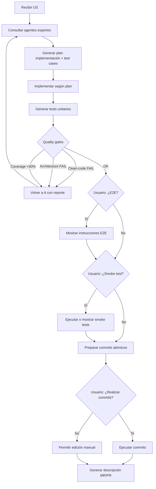

# US-016 — Agente orquestador del ciclo de desarrollo guiado con quality gates

**Como** desarrollador implementando una User Story,
**quiero** un agente que orqueste el ciclo completo de desarrollo con planificación previa, quality gates y decisiones interactivas,
**para** asegurar que cada US se implementa con calidad, trazabilidad y adaptándose al código y arquitectura existente.

---

## Criterios de aceptación

1. El agente genera un **plan de implementación detallado** consultando a los agentes expertos de arquitectura, patrones y calidad, adaptándose al código existente del proyecto.
2. El agente genera **test cases** detallados de la US y propone cuáles deben formar parte del **smoke test**.
3. El agente **implementa** según el plan generado, respetando las reglas de los agentes expertos.
4. El agente ejecuta **quality gates** obligatorios: análisis clean-code, clean-architecture y cobertura de tests ≥40%.
5. Si los quality gates fallan, el agente **vuelve a la fase de análisis** con el reporte de problemas detectados.
6. El agente pregunta al usuario si desea ejecutar **pruebas E2E** y proporciona instrucciones adaptadas (Docker, móvil, etc.).
7. El agente pregunta al usuario si desea ejecutar el **smoke test** y proporciona instrucciones o lo ejecuta automáticamente.
8. El agente prepara **commits atómicos** y pregunta al usuario antes de ejecutarlos.
9. El agente genera la **descripción de MR/PR** con trazabilidad completa.
10. Todos los artefactos se guardan en estructura persistente: `docs/quality/`, `docs/smoke-test/`, `docs/test-cases/`, `docs/plan-implementation/`.

---

## Notas Técnicas

**Dependencias de US previas**:
- US-009 — Skills globales de clean-code y git disponibles
- US-013-PLUS — Agentes de quality (clean-architecture, clean-code) disponibles
- US-007/US-008 — Agentes expertos de Backend Kotlin disponibles como referencia

**Supuestos**:
- Cada stack (Android Compose, iOS SwiftUI, Backend Kotlin, etc.) tiene su agente experto en arquitectura, patrones y calidad.
- El agente orquestador es **genérico** y delega análisis específico a los agentes expertos por tecnología.
- Las pruebas E2E y smoke tests son opcionales pero recomendadas.

**Decisiones abiertas**: 
- ¿El bucle de corrección de quality gates tiene un máximo de iteraciones antes de escalar al usuario?
- ¿Los informes de quality se versionan por intento o solo el último válido?

---

## Validación INVEST

| Criterio | ✅ / ⚠️ | Observación |
|---|---|---|
| **Independiente** | ✅ | Puede evolucionar sobre el ciclo de desarrollo actual sin bloquear otros stacks |
| **Negociable** | ✅ | La forma del formulario y el formato final del template pueden ajustarse |
| **Valiosa** | ✅ | Evita editar plantillas a mano y estandariza el ciclo de desarrollo |
| **Estimable** | ✅ | Alcance acotado a formulario + generación de template |
| **Small** | ✅ | Una sola capacidad principal con salida clara |
| **Testeable** | ✅ | Se puede validar con casos de formulario válido, inválido y default |

---

## Épica Relacionada

EP-8 — Global Cross-Stack

---

## Prioridad

**P2** (Media) — Mejora la flexibilidad del ciclo de desarrollo sin ser bloqueante para el repo base.

## 3. Dependencias y restricciones
- **Dependencias funcionales/técnicas**: US-009, US-071 y US-073 como base conceptual del ciclo de desarrollo
- **Riesgos aplicables**: Un formulario demasiado rígido puede limitar futuros ciclos o variantes por proyecto
- **Pendientes de validación**: Definir si el template se guarda como archivo, plantilla interna o ambos
- **Bloqueantes**: Ninguno; la historia puede arrancar usando el template por defecto existente

## 4. Solución funcional

**Fases del ciclo de desarrollo guiado**:

### Fase A: Planificación y análisis previo
1. **Recibir US** y confirmar alcance con el usuario.
2. **Consultar agentes expertos**:
   - Agente de arquitectura (analiza estructura existente, patrones actuales)
   - Agente de patrones (recomienda 2-3 patrones candidatos con trade-offs)
   - Agente de calidad (identifica deuda técnica relevante al alcance)
3. **Generar plan de implementación** detallado y manual (no solo para IA, debe ser ejecutable por humano).
4. **Generar test cases** y seleccionar **smoke tests** prioritarios.
5. **Persistir artefactos**:
   - `docs/plan-implementation/US-XXX-implementation-plan.md`
   - `docs/test-cases/US-XXX-test-cases.md`
   - `docs/smoke-test/US-XXX-smoke-suite.md`

### Fase B: Implementación
1. Implementar según plan generado.
2. Respetar reglas de los agentes expertos.
3. Adaptarse al código existente del proyecto.

### Fase C: Generación de tests
1. Generar tests unitarios según test cases de Fase A.
2. Apuntar a cobertura ≥40%.

### Fase D: Quality gates (obligatorios)
1. Ejecutar análisis **clean-code** → informe en `docs/quality/US-XXX-clean-code-report.md`
2. Ejecutar análisis **clean-architecture** → informe en `docs/quality/US-XXX-architecture-report.md`
3. Validar cobertura de tests ≥40%
4. **Si falla**: volver a Fase A.1.1 con reporte de problemas detectados

### Fase E: Bucle de corrección
1. Si quality gates de Fase D fallan, analizar problemas con agentes expertos.
2. Ajustar plan de implementación con correcciones necesarias.
3. Volver a Fase B.

### Fase F: Pruebas E2E (opcional, decisión del usuario)
1. Generar resumen de calidad alcanzada.
2. Preguntar al usuario: ¿Deseas ejecutar pruebas E2E?
3. **Si sí**: mostrar instrucciones adaptadas (Docker, móvil, web, etc.)
4. **Si no**: continuar a Fase G.

### Fase G: Smoke tests (opcional, decisión del usuario)
1. Preguntar al usuario: ¿Deseas ejecutar smoke tests?
2. **Si sí**: ejecutar o mostrar instrucciones según el stack.
3. **Si no**: continuar a Fase H.

### Fase H: Commits atómicos (decisión del usuario)
1. Preparar commits atómicos agrupados por responsabilidad.
2. Mostrar lista de commits propuestos al usuario.
3. Preguntar: ¿Realizar estos commits?
4. **Si sí**: ejecutar commits.
5. **Si no**: permitir edición manual.

### Fase I: Descripción de MR/PR
1. Generar descripción completa con trazabilidad: qué se hizo, por qué, cómo probar, checklist de revisión.
2. Guardar en `docs/mr/US-XXX-description.md`

**Salida esperada**:
- US implementada con calidad validada y trazabilidad completa.
- Artefactos persistentes en `docs/` para auditoría y revisión.
- Commits atómicos listos para MR/PR.

## 5. Checklist de calidad
- **CRITICAL**
  - [ ] El agente genera plan de implementación consultando agentes expertos de arquitectura, patrones y calidad
  - [ ] El agente genera test cases y propone smoke tests prioritarios
  - [ ] Quality gates (clean-code, clean-architecture, cobertura ≥40%) se ejecutan obligatoriamente
  - [ ] Si quality gates fallan, el agente vuelve a fase de análisis con reporte de problemas
  - [ ] Todos los artefactos se guardan en `docs/plan-implementation/`, `docs/test-cases/`, `docs/smoke-test/`, `docs/quality/`
- **HIGH**
  - [ ] El agente pregunta al usuario sobre pruebas E2E y proporciona instrucciones adaptadas al stack
  - [ ] El agente pregunta al usuario sobre ejecución de smoke tests
  - [ ] El agente prepara commits atómicos y pregunta al usuario antes de ejecutarlos
  - [ ] El agente genera descripción de MR/PR con trazabilidad completa
- **MEDIUM**
  - [ ] El plan de implementación es detallado y ejecutable manualmente (no solo para IA)
  - [ ] El agente se adapta al código y arquitectura existente del proyecto
- **LOW**
  - [ ] Los informes de quality incluyen fecha y versión de análisis

## 6. Casos de prueba
- **Funcionales**:
  - US con alcance claro → plan de implementación detallado generado consultando expertos
  - Plan de implementación generado → test cases y smoke tests propuestos
  - Implementación completa → quality gates ejecutados (clean-code, architecture, tests)
  - Quality gates OK → agente pregunta por E2E y smoke tests
  - Usuario acepta commits → commits atómicos ejecutados
  - Ciclo completo → descripción MR/PR generada con trazabilidad
- **Quality gates**:
  - Clean-code falla → volver a fase A.1.1 con reporte
  - Architecture falla → volver a fase A.1.1 con reporte
  - Cobertura <40% → volver a fase A.1.1 con reporte
- **Decisiones del usuario**:
  - Usuario rechaza E2E → continúa sin pruebas E2E
  - Usuario rechaza smoke test → continúa sin smoke test
  - Usuario rechaza commits propuestos → permite edición manual

## 7. Diagrama de flujo

## 8. Notas y Definition of Ready
- **Decisiones abiertas**: 
  - ¿Límite de iteraciones en bucle de corrección quality gates?
  - ¿Versionado de informes de quality (por intento o solo último)?
- **Supuestos**: 
  - Cada stack tiene agentes expertos disponibles (arquitectura, patrones, calidad)
  - El plan de implementación debe ser ejecutable manualmente
- **Dependencias previas**: US-009, US-013-PLUS completadas (agentes expertos disponibles)
- **Definition of Ready**:
  - [ ] Los agentes expertos de arquitectura, patrones y calidad están disponibles para al menos un stack (Backend Kotlin como referencia)
  - [ ] La estructura de `docs/` (plan-implementation, test-cases, smoke-test, quality) está definida
  - [ ] Existe al menos un template de informe de quality (clean-code, architecture)
