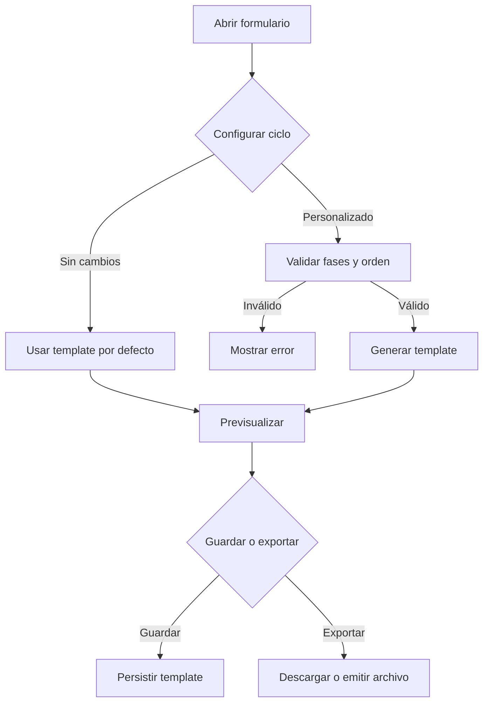

# US-016 — Definir ciclo de vida de desarrollo desde formulario

**Como** contributor o responsable de un proyecto,
**quiero** poder elegir el ciclo de vida de desarrollo desde un formulario y generar el template correspondiente,
**para** adaptar el flujo de trabajo del equipo sin editar manualmente plantillas y manteniendo un template por defecto cuando no se personaliza nada.

---

## Criterios de aceptación

1. El formulario permite seleccionar o configurar el ciclo de vida de desarrollo a partir de una lista de fases predefinidas.
2. Al confirmar el formulario, el sistema genera un template del ciclo de desarrollo con la estructura seleccionada.
3. Si el usuario no personaliza nada, el sistema genera el template por defecto actual sin cambios funcionales respecto al que ya existe.
4. El usuario puede previsualizar el template generado antes de guardarlo o exportarlo.
5. Si faltan datos obligatorios o la configuración del ciclo es inválida, el template no se genera y se muestra un error descriptivo.
6. El formulario permite volver al template por defecto en cualquier momento.
7. El template generado queda disponible en un formato persistente y reutilizable para otros flujos del repositorio.

---

## Notas Técnicas

**Dependencias de US previas**:
- US-009 — Ciclo de desarrollo genérico ya centralizado en la skill global
- US-071 — Base de workflow Git común disponible
- US-073 — Feature lifecycle consolidado como referencia funcional

**Supuestos**:
- El formulario puede implementarse como UI web o asistente interactivo, siempre que el comportamiento sea el mismo.
- El template resultante se expresa en un formato versionable, preferiblemente Markdown o YAML.

**Decisiones abiertas**: ¿El formulario vivirá en una interfaz visual o como asistente interactivo dentro del flujo existente?

---

## Validación INVEST

| Criterio | ✅ / ⚠️ | Observación |
|---|---|---|
| **Independiente** | ✅ | Puede evolucionar sobre el ciclo de desarrollo actual sin bloquear otros stacks |
| **Negociable** | ✅ | La forma del formulario y el formato final del template pueden ajustarse |
| **Valiosa** | ✅ | Evita editar plantillas a mano y estandariza el ciclo de desarrollo |
| **Estimable** | ✅ | Alcance acotado a formulario + generación de template |
| **Small** | ✅ | Una sola capacidad principal con salida clara |
| **Testeable** | ✅ | Se puede validar con casos de formulario válido, inválido y default |

---

## Épica Relacionada

EP-8 — Global Cross-Stack

---

## Prioridad

**P2** (Media) — Mejora la flexibilidad del ciclo de desarrollo sin ser bloqueante para el repo base.

## 3. Dependencias y restricciones
- **Dependencias funcionales/técnicas**: US-009, US-071 y US-073 como base conceptual del ciclo de desarrollo
- **Riesgos aplicables**: Un formulario demasiado rígido puede limitar futuros ciclos o variantes por proyecto
- **Pendientes de validación**: Definir si el template se guarda como archivo, plantilla interna o ambos
- **Bloqueantes**: Ninguno; la historia puede arrancar usando el template por defecto existente

## 4. Solución funcional

**Flujo esperado**:
1. El usuario abre el formulario de ciclo de desarrollo.
2. Selecciona fases, orden, controles o variantes del ciclo.
3. El sistema genera un template nuevo o reutiliza el default según la configuración.
4. El usuario previsualiza el resultado y decide si lo guarda o lo restablece.

**Salida esperada**:
- Template de ciclo de desarrollo generado desde la configuración del formulario.
- Template por defecto reutilizable cuando no hay personalización.

## 5. Checklist de calidad
- **CRITICAL**
  - [ ] El formulario genera un template válido al completar los campos obligatorios
  - [ ] El template por defecto se conserva como opción base
  - [ ] La configuración inválida bloquea la generación y muestra error claro
- **HIGH**
  - [ ] El usuario puede previsualizar antes de guardar
  - [ ] Existe opción de volver al default sin perder la configuración base
- **MEDIUM**
  - [ ] El template generado se puede reutilizar en otros flujos
- **LOW**
  - [ ] La nomenclatura del template es consistente con el resto del repo

## 6. Casos de prueba
- **Funcionales**:
  - Formulario completo con fases válidas → genera template personalizado
  - Formulario vacío → genera template por defecto actual
  - Fase obligatoria ausente → error y no se genera template
  - Orden de fases inconsistente → error descriptivo
- **Reglas de negocio**:
  - El template por defecto debe ser exactamente el que ya está agregado hoy

## 7. Diagrama de flujo

## 8. Notas y Definition of Ready
- **Decisiones abiertas**: confirmar si el formulario será visual, interactivo por consola o híbrido
- **Supuestos**: el template por defecto ya existe y se toma como baseline del comportamiento
- **Dependencias previas**: US-009 y US-071 completadas como referencia de ciclo y workflow
- **Definition of Ready**:
  - [ ] El formato de salida del template está definido
  - [ ] La ubicación del formulario en el flujo de producto está acordada
  - [ ] Se confirma que el template por defecto es la base funcional actual
