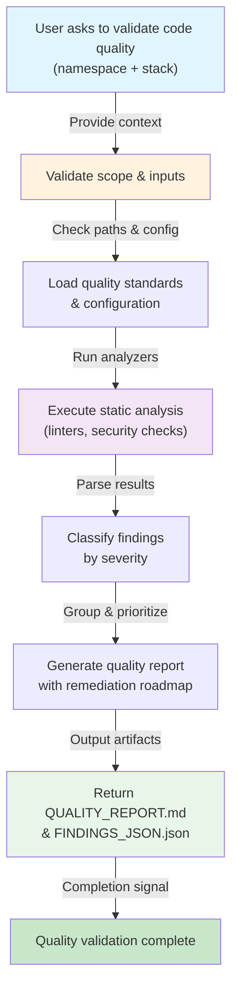

# Quality Validator Skill - Overview

## Workflow

## Process Steps

| Step | Phase | Tool/Input | Output |
|------|-------|-----------|--------|
| 1 | Validation | Config files + user context | Confirmed scope |
| 2 | Setup | Technology detection | Analysis tool selection |
| 3 | Analysis | Linters/static analyzers | Raw findings |
| 4 | Processing | Severity classification | Structured findings |
| 5 | Planning | Priority algorithm | Remediation roadmap |
| 6 | Reporting | Markdown + JSON templates | Report artifacts |

## Integration Points

### Input Requirements
- **Codebase path**: Directory to analyze
- **Technology stack**: `python`, `typescript`, `kotlin`, etc.
- **Quality standards**: `PEP8`, `ESLint`, custom configs

### Output Artifacts
- **QUALITY_REPORT.md**: Human-readable findings
- **FINDINGS_JSON.json**: CI/CD integration format
- **REMEDIATION_ROADMAP.md**: Action plan

### Success Criteria
- ✅ All directories scanned without errors
- ✅ Findings classified by severity
- ✅ Remediation roadmap provided
- ✅ Output is actionable

## Related Skills

- **Before**: `code-formatter` (optional: clean up style first)
- **After**: `refactoring-assistant` (use roadmap as input)
- **Parallel**: `security-scanner` (for deep security audit)

## Notes

- This diagram reflects the workflow in SKILL.md Steps section
- Each box represents a distinct phase in the quality validation process
- The tool maintains a balance between automation and human judgment
- Output formats support both manual review and CI/CD integration
