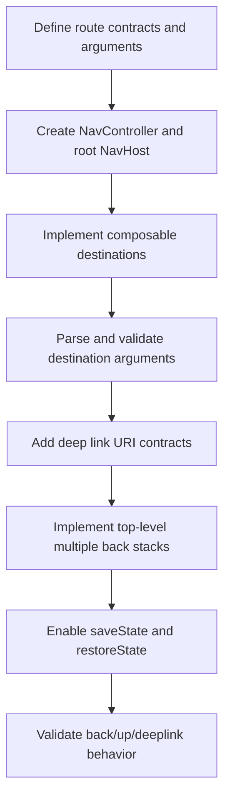

# Android Navigation Compose Overview

Origen de referencia:
- Android Skills repository: `navigation/navigation-3`

## Workflow

## Notes
- Keep route definitions centralized and explicit.
- Prefer stable destination contracts to avoid broken links.
- Validate behavior for tab switching and deep link re-entry.