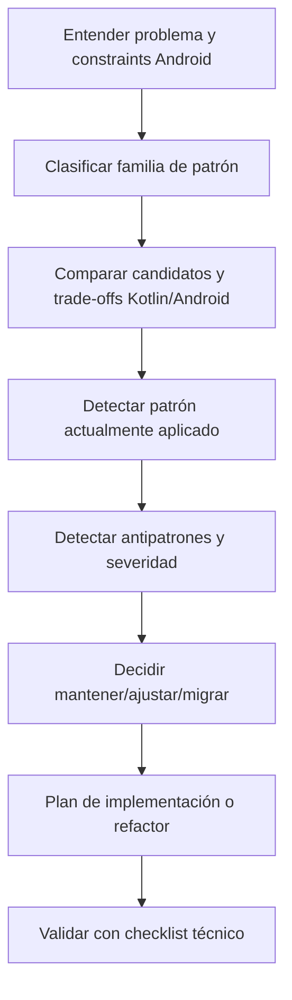

# Android Patterns Overview

Source lineage:
- /Users/manelcc/Library/CloudStorage/OneDrive-SopraSteria/mac/KMP_APPS/PRUEBA-TECNICA/ANDROID/.github/skills/android-patterns/

## Workflow

## Usage outcomes
- Patrón aplicable recomendado con código Kotlin/Compose.
- Patrón actual detectado en código.
- Antipatrones detectados con severidad CRITICAL/HIGH/MEDIUM/LOW y remediación.

## Mirrored source references
- behavioral-patterns.md
- creational-patterns.md
- structural-patterns.md
- concurrency-patterns.md
- kotlin-android-patterns.md
- anti-patterns.md
