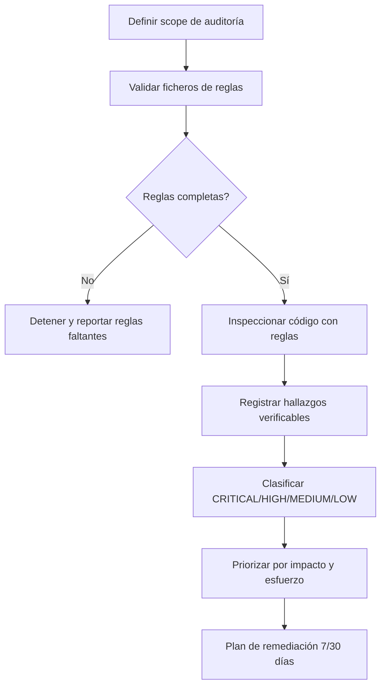

# Android Quality Overview

Source lineage:
- /Users/manelcc/Library/CloudStorage/OneDrive-SopraSteria/mac/KMP_APPS/PRUEBA-TECNICA/ANDROID/.github/skills/android-quality-skill/
- /Users/manelcc/Library/CloudStorage/OneDrive-SopraSteria/mac/KMP_APPS/PRUEBA-TECNICA/ANDROID/.github/android-quality-rules/

## Workflow

## Severity reference
- **CRITICAL**: bloquea merge. Seguridad, estado global mutable, dependencia de capas incorrecta.
- **HIGH**: corregir antes de release. God ViewModel, coroutines sin scope, leaks.
- **MEDIUM**: corregir en sprint actual. LiveData en lugar de Flow, colecciones mutables cruzando capas.
- **LOW**: corregir cuando sea posible. Estilo, magic numbers, cobertura baja.

## Rules files
- android-rules-critical.md
- android-rules-high.md
- android-rules-medium.md
- android-rules-low.md
