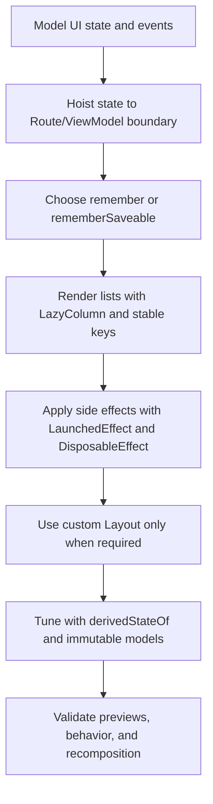

# Jetpack Compose Patterns Overview

Origen de referencia:
- Android Skills repository: `jetpack-compose/adaptive`
- Android Skills repository: `jetpack-compose/migration/migrate-xml-views-to-jetpack-compose`

## Workflow

## Notes
- Keep composables mostly stateless and pass callbacks downward.
- Side effects should be lifecycle-aware and cancelable.
- Stable immutable models are key to predictable recomposition.