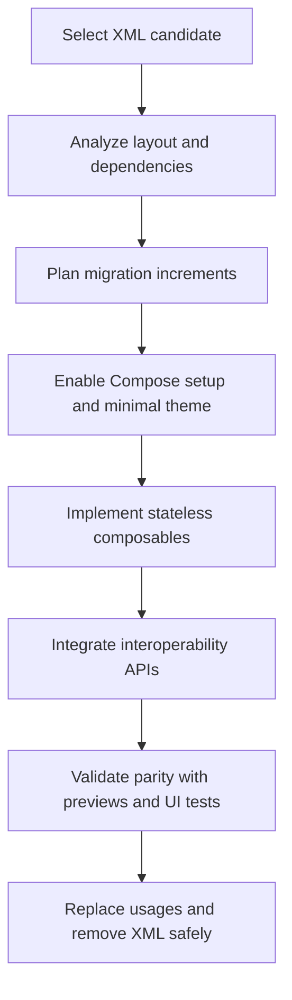

# Devkit Migrate XML To Compose Overview

Origen:
Migrada desde awesome-copilot: [link](https://github.com/github/awesome-copilot/tree/main/skills/migrate-xml-views-to-jetpack-compose)

## Flow

## Key notes
- Keep migrations incremental to avoid high-risk rewrites.
- Hoist state early to prevent tightly coupled composables.
- Remove XML only after reference checks and regression validation.
