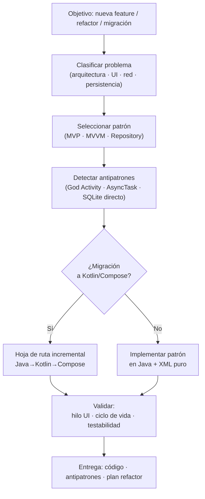

# Android XML + Java Patterns — Overview

## Workflow



## Patrones cubiertos

| Categoría | Patrón | Uso principal |
|---|---|---|
| Arquitectura | MVVM + LiveData | Separación UI / lógica / datos |
| Arquitectura | Repository | Abstracción red + persistencia |
| UI | ViewBinding | Acceso seguro a vistas sin `findViewById` |
| UI | RecyclerView + ListAdapter | Listas eficientes con DiffUtil |
| Red | Retrofit + OkHttp | Llamadas REST tipadas |
| Persistencia | Room + DAO | SQLite con type-safety y LiveData |
| Concurrencia | ExecutorService | Background threads en Java puro |
| Migración | ComposeView en XML | Compose incremental en layout existente |

## Antipatrones detectables

- **God Activity** (CRITICAL) — lógica de negocio en `onCreate`
- **AsyncTask** (CRITICAL) — deprecated en API 30, bloqueante, propenso a leaks
- **SQLite directo** (HIGH) — sin Room, sin abstracciones, sin LiveData
- **Red en hilo UI** (CRITICAL) — `NetworkOnMainThreadException`
- **`findViewById` sin ViewBinding** (MEDIUM) — propenso a NullPointerException
- **Singleton Context** (HIGH) — memory leak si se guarda Activity como static

## Hoja de ruta de migración

```
Java + XML (actual)
      ↓  Paso 1: añadir Kotlin plugin
Java + Kotlin + XML
      ↓  Paso 2: migrar modelos y DAOs
      ↓  Paso 3: migrar ViewModels
      ↓  Paso 4: migrar Activities/Fragments
Kotlin + XML
      ↓  Paso 5: ComposeView en layouts existentes
      ↓  Paso 6: migrar pantallas de menor a mayor
Kotlin + Jetpack Compose
```
