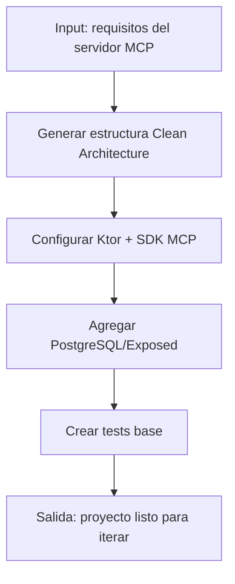

# Overview

```mermaid
flowchart TD
    A[Input: requisitos del servidor MCP] --> B[Generar estructura Clean Architecture]
    B --> C[Configurar Ktor + SDK MCP]
    C --> D[Agregar PostgreSQL/Exposed]
    D --> E[Crear tests base]
    E --> F[Salida: proyecto listo para iterar]
```
