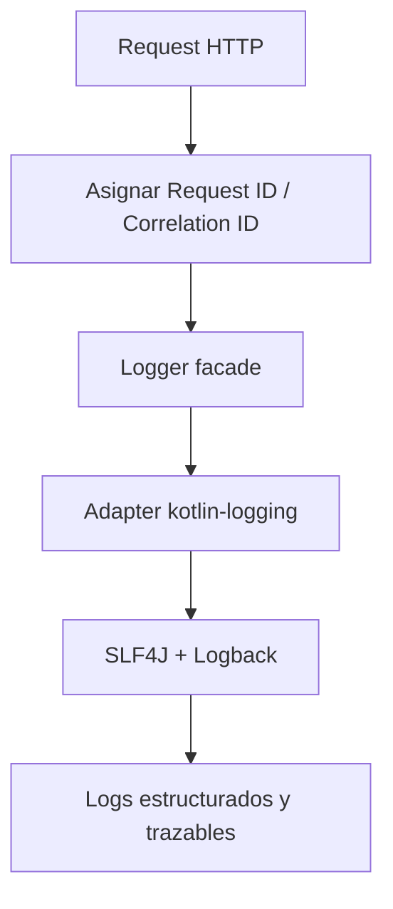

# Overview

```mermaid
flowchart TD
    A[Request HTTP] --> B[Asignar Request ID / Correlation ID]
    B --> C[Logger facade]
    C --> D[Adapter kotlin-logging]
    D --> E[SLF4J + Logback]
    E --> F[Logs estructurados y trazables]
```
