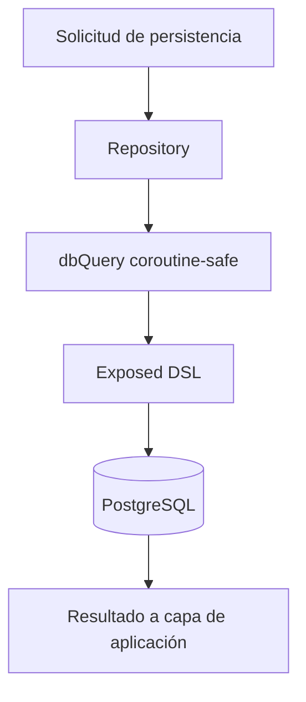

# Overview

```mermaid
flowchart TD
    A[Solicitud de persistencia] --> B[Repository]
    B --> C[dbQuery coroutine-safe]
    C --> D[Exposed DSL]
    D --> E[(PostgreSQL)]
    E --> F[Resultado a capa de aplicación]
```
