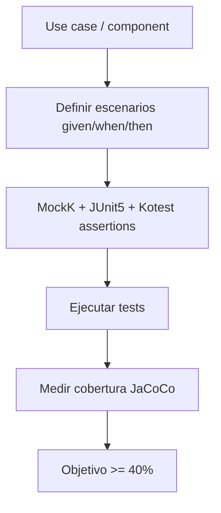

# Overview

```mermaid
flowchart TD
    A[Use case / component] --> B[Definir escenarios given/when/then]
    B --> C[MockK + JUnit5 + Kotest assertions]
    C --> D[Ejecutar tests]
    D --> E[Medir cobertura JaCoCo]
    E --> F[Objetivo >= 40%]
```
