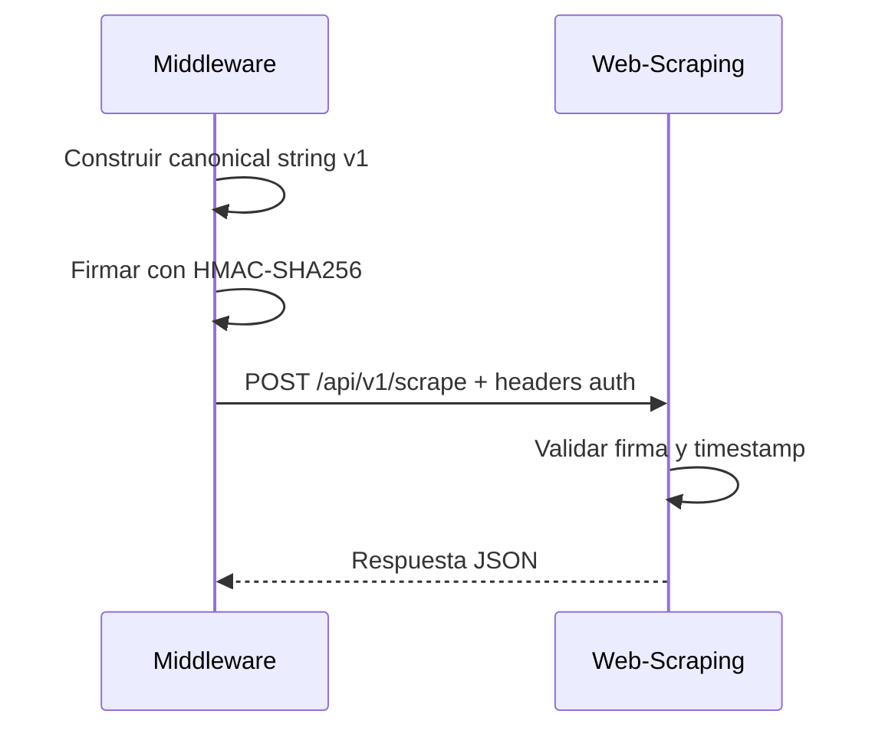

# Overview

```mermaid
sequenceDiagram
    participant MW as Middleware
    participant WS as Web-Scraping

    MW->>MW: Construir canonical string v1
    MW->>MW: Firmar con HMAC-SHA256
    MW->>WS: POST /api/v1/scrape + headers auth
    WS->>WS: Validar firma y timestamp
    WS-->>MW: Respuesta JSON
```
