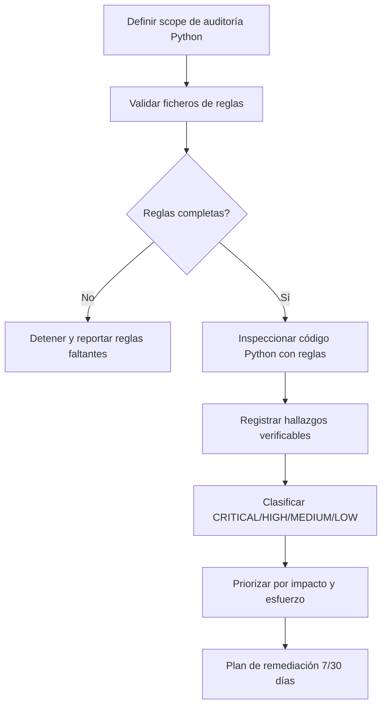

# Python Quality Overview

Source lineage:
- /Users/manelcc/Library/CloudStorage/OneDrive-SopraSteria/mac/KMP_APPS/PRUEBA-TECNICA/ANDROID/.github/skills/python-quality-skill/
- /Users/manelcc/Library/CloudStorage/OneDrive-SopraSteria/mac/KMP_APPS/PRUEBA-TECNICA/ANDROID/.github/python-quality-rules/

## Workflow

## Severity reference
- **CRITICAL**: bloquea merge. Secretos hardcodeados, SQL injection, arquitectura rota.
- **HIGH**: corregir antes de release. God object, ausencia de typing en código crítico, excepciones ocultas.
- **MEDIUM**: corregir en sprint actual. Funciones >50 líneas, falta de tests en módulos clave.
- **LOW**: corregir cuando sea posible. Estilo inconsistente, imports no usados.

## Rules files
- python-rules-critical.md
- python-rules-high.md
- python-rules-medium.md
- python-rules-low.md
