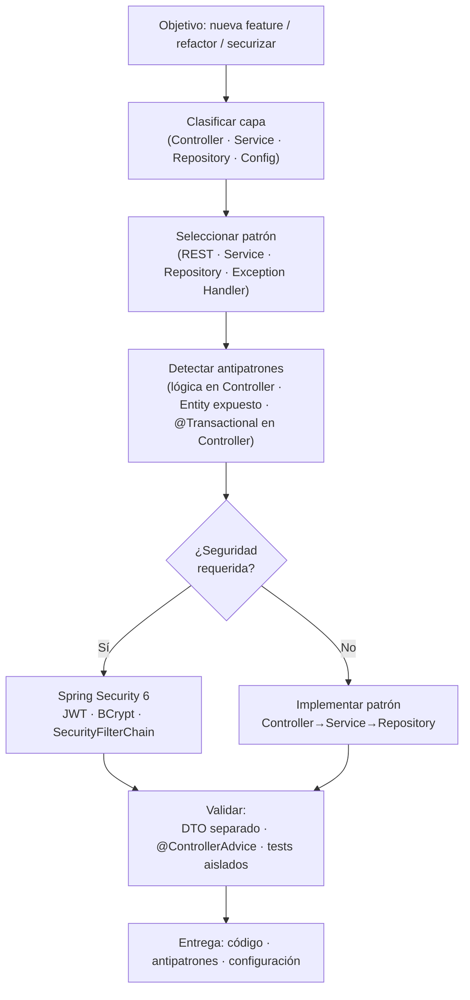
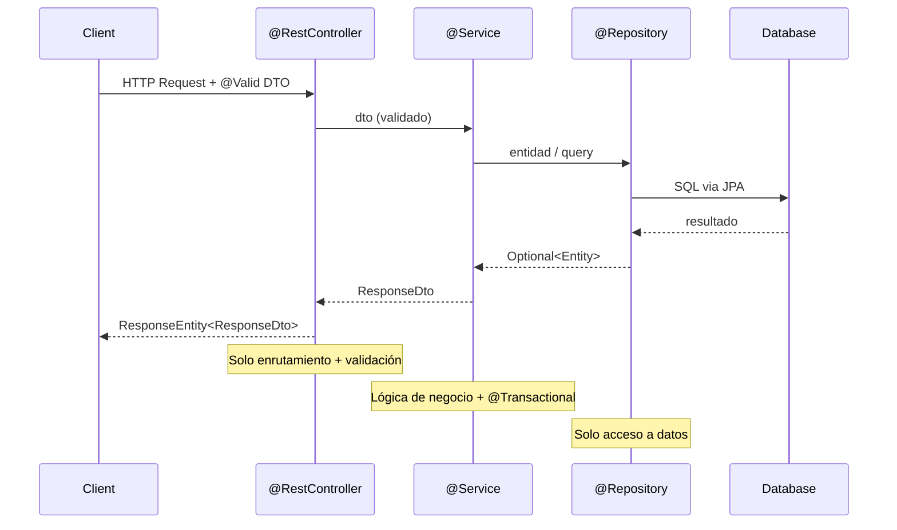

# Spring Java Patterns — Overview

## Workflow

## Flujo request → respuesta

## Patrones cubiertos

| Categoría | Patrón | Uso principal |
|---|---|---|
| Arquitectura | Controller → Service → Repository | Separación de responsabilidades |
| API | DTO separado de Entity | No exponer modelo de datos interno |
| Validación | Bean Validation + @Valid | Validar entrada en Controller |
| Errores | @RestControllerAdvice | Centralizar manejo de excepciones |
| Persistencia | Spring Data JPA + @Repository | Acceso tipado con JpaRepository |
| Transacciones | @Transactional en Service | Consistencia en operaciones compuestas |
| Seguridad | SecurityFilterChain + JWT | Autenticación stateless |
| Testing | Mockito sin contexto Spring | Tests unitarios rápidos del Service |
| Testing | @WebMvcTest | Tests del Controller con contexto web mínimo |

## Antipatrones detectables

- **Lógica en Controller** (CRITICAL) — violar SRP, dificulta tests
- **Entity expuesta en API** (HIGH) — acopla BD con contrato público
- **@Transactional en Controller** (HIGH) — debe estar en Service
- **try-catch disperso** (MEDIUM) — usar `@ControllerAdvice`
- **Secrets hardcoded** (CRITICAL) — usar variables de entorno
- **@SpringBootTest para tests unitarios** (MEDIUM) — tests lentos innecesarios
