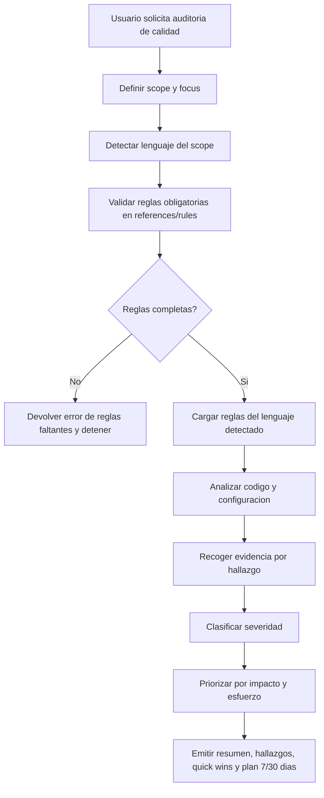

# devkit-clean-architecture-quality - Overview

## Purpose

Auditoria de calidad de arquitectura limpia y codigo en Java, Kotlin, Swift y Python con validacion estricta de reglas.

## Workflow

## Rule files

### Java
- `skills/global/devkit-clean-architecture-quality/references/rules/java-rules-critical.md`
- `skills/global/devkit-clean-architecture-quality/references/rules/java-rules-high.md`
- `skills/global/devkit-clean-architecture-quality/references/rules/java-rules-medium.md`
- `skills/global/devkit-clean-architecture-quality/references/rules/java-rules-low.md`

### Kotlin
- `skills/global/devkit-clean-architecture-quality/references/rules/kotlin-rules-critical.md`
- `skills/global/devkit-clean-architecture-quality/references/rules/kotlin-rules-high.md`
- `skills/global/devkit-clean-architecture-quality/references/rules/kotlin-rules-medium.md`
- `skills/global/devkit-clean-architecture-quality/references/rules/kotlin-rules-low.md`

### Swift
- `skills/global/devkit-clean-architecture-quality/references/rules/swift-rules-critical.md`
- `skills/global/devkit-clean-architecture-quality/references/rules/swift-rules-high.md`
- `skills/global/devkit-clean-architecture-quality/references/rules/swift-rules-medium.md`
- `skills/global/devkit-clean-architecture-quality/references/rules/swift-rules-low.md`

### Python
- `skills/global/devkit-clean-architecture-quality/references/rules/python-rules-critical.md`
- `skills/global/devkit-clean-architecture-quality/references/rules/python-rules-high.md`
- `skills/global/devkit-clean-architecture-quality/references/rules/python-rules-medium.md`
- `skills/global/devkit-clean-architecture-quality/references/rules/python-rules-low.md`
