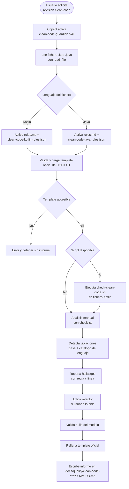

# Clean Code Guardian - Diagrama de flujo (Hybrid)

## Workflow

## Descripcion del flujo

| Paso | Descripcion |
|---|---|
| Activacion | El usuario pide revision clean code o refactor de clase. |
| Lectura | Se lee el fichero .kt/.java completo. |
| Deteccion de lenguaje | Se selecciona catalogo JSON por extension del fichero. |
| Reglas | Se aplican siempre rules.md + catalogo del lenguaje activo. |
| No mezcla | Un fichero Kotlin no usa reglas Java y viceversa. |
| Reporte | Cada hallazgo se informa con id de regla, linea y sugerencia. |
| Template | Se usa obligatoriamente `/Users/manelcc/Library/CloudStorage/OneDrive-SopraSteria/mac/onedrive-IA/COPILOT/docs/quality/_TEMPLATE-clean-code-report.md`. |
| Validacion | Se recomienda validar con build/test del modulo afectado. |
