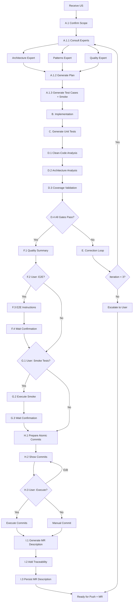
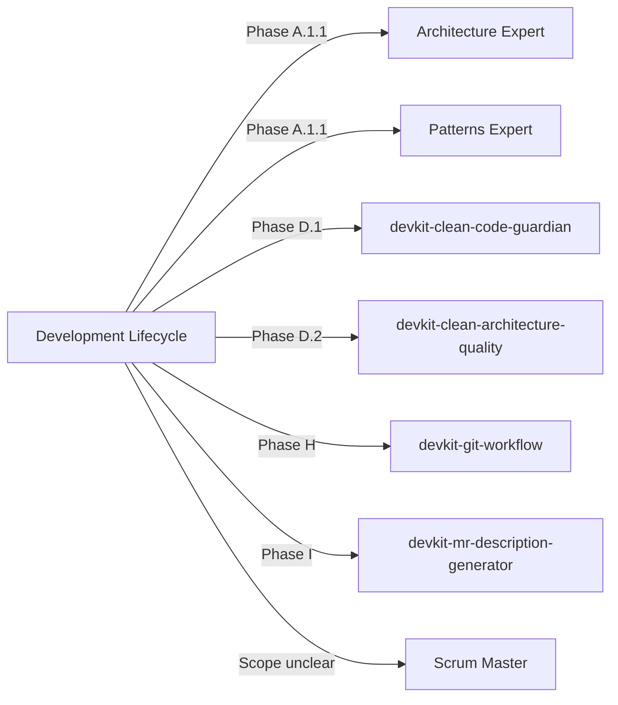

# Development Lifecycle Overview

Complete guided development cycle from planning to merge-ready state with expert consultation, quality gates, and interactive user decisions.

## Workflow Diagram



## Phase Summary

### Phase A: Planning (Pre-Implementation)
- **A.1**: Receive and confirm User Story scope
- **A.1.1**: Consult expert agents (architecture, patterns, quality)
- **A.1.2**: Generate detailed implementation plan
- **A.1.3**: Generate test cases and select smoke tests
- **Output**: Planning artifacts in `docs/plan-implementation/`, `docs/test-cases/`, `docs/smoke-test/`

### Phase B: Implementation
- Implement according to plan
- Follow expert recommendations
- Adapt to existing code and patterns
- **Output**: Code changes in project

### Phase C: Test Generation
- Generate unit tests for implemented code
- Target coverage ≥40%
- **Output**: Test files in project

### Phase D: Quality Gates (Mandatory)
- **D.1**: Clean-code analysis (score ≥7.0, 0 critical issues)
- **D.2**: Clean-architecture analysis (0 critical violations)
- **D.3**: Test coverage validation (≥40%)
- **D.4**: Decision: pass → Phase F, fail → Phase E
- **Output**: Quality reports in `docs/quality/`

### Phase E: Correction Loop
- Collect failure reports
- Consult experts with failure context
- Regenerate plan with corrections
- Return to Phase A.1.1
- **Limit**: 3 iterations max, then escalate
- **Output**: Updated plan versions in `docs/plan-implementation/`

### Phase F: E2E Tests (Optional, User Decision)
- Generate quality summary
- Ask user if E2E tests should run
- Provide instructions adapted to stack (Docker, mobile, web)
- Wait for user confirmation
- **Output**: Optional E2E instructions in `docs/quality/`

### Phase G: Smoke Tests (Optional, User Decision)
- Ask user if smoke tests should run
- Execute automated tests or show manual checklist
- Wait for user confirmation
- **Output**: Smoke test execution results

### Phase H: Atomic Commits (User Decision)
- Prepare commits grouped by responsibility
- Show proposed commits to user
- Execute or allow manual commit
- **Output**: Atomic commits in git history

### Phase I: MR/PR Description
- Generate description with traceability
- Include links to all artifacts
- Add reviewer checklist
- **Output**: MR description in `docs/mr/`

## Handoffs



## Artifacts Generated

All artifacts are persisted in the **project consuming this skill** (not in DevTools-AI repo):

```
project-consuming-skill/
  docs/
    plan-implementation/
      US-XXX-implementation-plan.md
      US-XXX-implementation-plan.md (v2)  # if correction loop
    test-cases/
      US-XXX-test-cases.md
    smoke-test/
      US-XXX-smoke-suite.md
    quality/
      US-XXX-clean-code-report.md
      US-XXX-architecture-report.md
      US-XXX-e2e-instructions.md         # optional
    mr/
      US-XXX-description.md
```

## Quality Gate Thresholds

| Gate | Threshold | Fail Behavior |
|------|-----------|---------------|
| Clean-code score | ≥7.0/10 | Enter correction loop |
| Clean-code critical issues | 0 | Enter correction loop |
| Architecture critical violations | 0 | Enter correction loop |
| Test coverage | ≥40% | Enter correction loop |

## User Decision Points

| Phase | Decision | Options |
|-------|----------|---------|
| F.2 | Execute E2E tests? | Yes, No |
| F.4 | E2E tests passed? | Confirmed, Failed |
| G.1 | Execute smoke tests? | Yes, No |
| G.3 | Smoke tests passed? | Confirmed, Failed |
| H.3 | Execute proposed commits? | Yes, No, Edit messages |

## Correction Loop Limit

- **Maximum iterations**: 3
- **After 3 failures**: Escalate to user with summary and recommendation
- **Escalation includes**:
  - All quality reports from 3 attempts
  - Persistent issues summary
  - Recommendation: manual intervention or scope reduction
