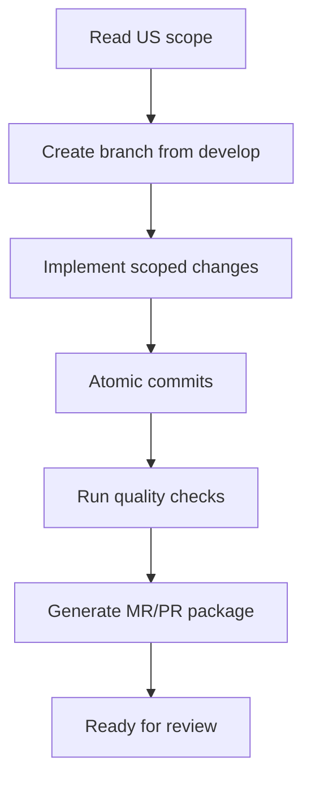

# Feature Lifecycle Overview

```mermaid
flowchart TD
  A[Read US scope] --> B[Create branch from develop]
  B --> C[Implement scoped changes]
  C --> D[Atomic commits]
  D --> E[Run quality checks]
  E --> F[Generate MR/PR package]
  F --> G[Ready for review]
```
