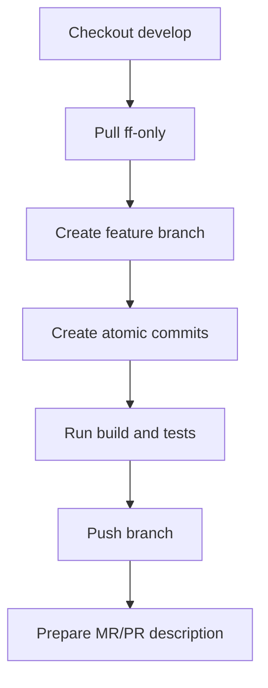

# Git Workflow Overview

```mermaid
flowchart TD
  A[Checkout develop] --> B[Pull ff-only]
  B --> C[Create feature branch]
  C --> D[Create atomic commits]
  D --> E[Run build and tests]
  E --> F[Push branch]
  F --> G[Prepare MR/PR description]
```
