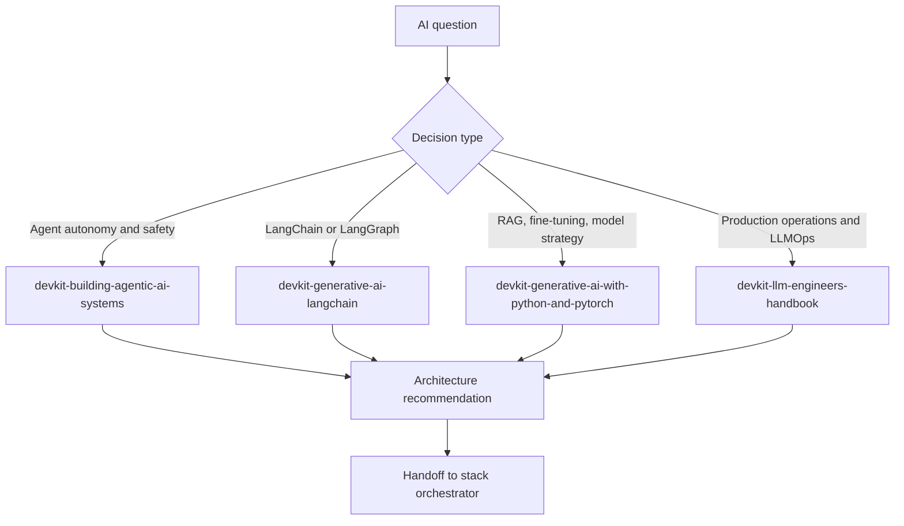

# Devkit IA Overview

```mermaid
flowchart TD
    A[AI question] --> B{Decision type}
    B -->|Agent autonomy and safety| C[devkit-building-agentic-ai-systems]
    B -->|LangChain or LangGraph| D[devkit-generative-ai-langchain]
    B -->|RAG, fine-tuning, model strategy| E[devkit-generative-ai-with-python-and-pytorch]
    B -->|Production operations and LLMOps| F[devkit-llm-engineers-handbook]
    C --> G[Architecture recommendation]
    D --> G
    E --> G
    F --> G
    G --> H[Handoff to stack orchestrator]
```

Use `devkit-ia` as the single entry point, then route to one or more specialized IA skills.
