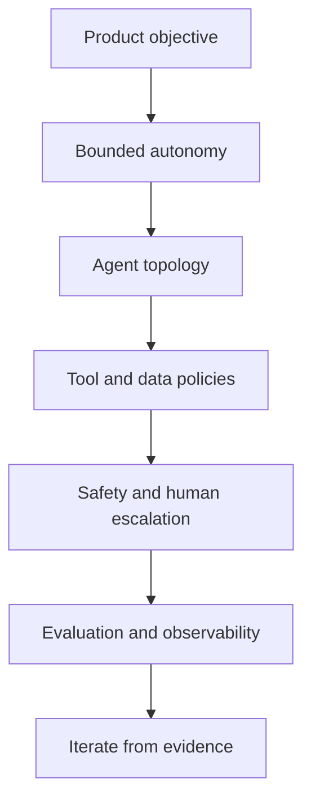

# Agentic AI Systems Overview

```mermaid
flowchart TD
    A[Product objective] --> B[Bounded autonomy]
    B --> C[Agent topology]
    C --> D[Tool and data policies]
    D --> E[Safety and human escalation]
    E --> F[Evaluation and observability]
    F --> G[Iterate from evidence]
```

Use this skill to choose safe agent boundaries before framework and implementation choices.