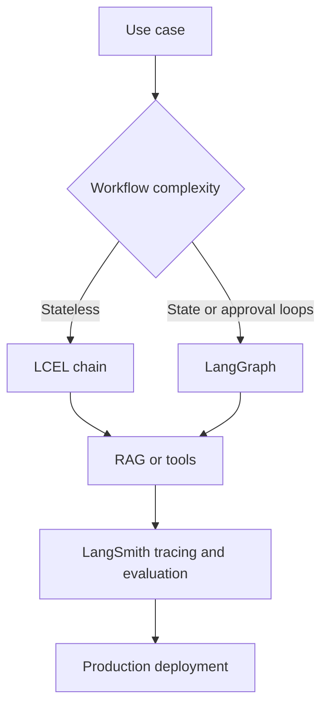

# LangChain Architecture Overview

```mermaid
flowchart TD
    A[Use case] --> B{Workflow complexity}
    B -->|Stateless| C[LCEL chain]
    B -->|State or approval loops| D[LangGraph]
    C --> E[RAG or tools]
    D --> E
    E --> F[LangSmith tracing and evaluation]
    F --> G[Production deployment]
```

Use this skill for framework-specific LangChain, LangGraph, and LangSmith decisions.