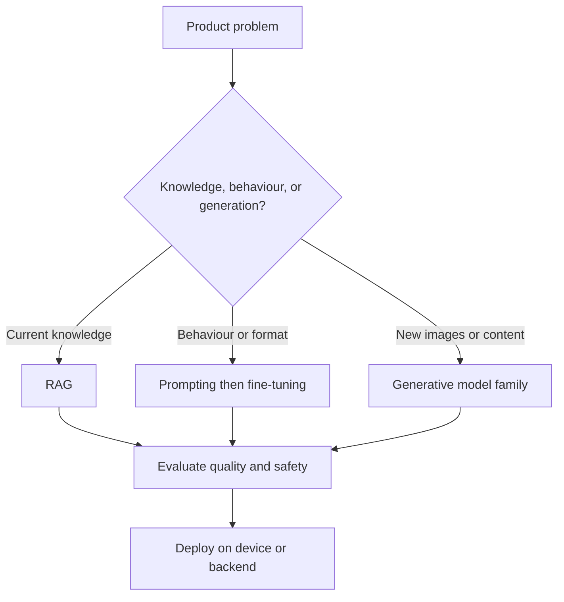

# Generative AI Decision Overview

```mermaid
flowchart TD
    A[Product problem] --> B{Knowledge, behaviour, or generation?}
    B -->|Current knowledge| C[RAG]
    B -->|Behaviour or format| D[Prompting then fine-tuning]
    B -->|New images or content| E[Generative model family]
    C --> F[Evaluate quality and safety]
    D --> F
    E --> F
    F --> G[Deploy on device or backend]
```

Use this skill to select model, adaptation, and inference strategies from product constraints.