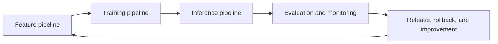

# LLM Engineering Overview

```mermaid
flowchart LR
    A[Feature pipeline] --> B[Training pipeline]
    B --> C[Inference pipeline]
    C --> D[Evaluation and monitoring]
    D --> E[Release, rollback, and improvement]
    E --> A
```

Use this skill to design the feature-training-inference lifecycle and its LLMOps controls.